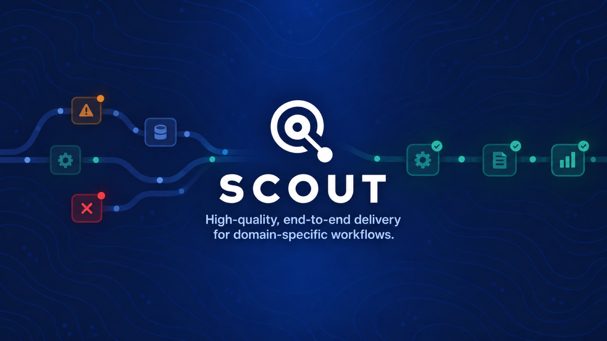
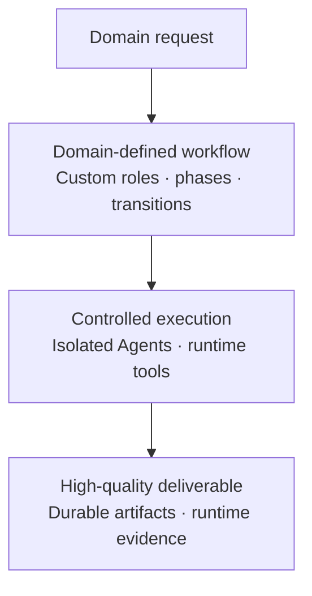

<p align="center">
  
</p>

<p align="center">
  <a href="#why-scout">Why Scout</a> ·
  <a href="#how-scout-works">How Scout works</a> ·
  <a href="#getting-started">Getting started</a>
</p>

## Why Scout

General Agent loops are good at exploring a task, but high-quality delivery also
requires stable responsibilities, bounded tools, explicit completion rules, and
artifacts that another participant can inspect. Scout provides that execution
framework for domain-specific work.

- **Domain-first** — each domain owns its workflow, terminology, tools, evidence,
  and definition of a complete delivery.
- **End-to-end** — Scout carries one request from intent through specialist work,
  runtime execution, review, correction, and final outcome.
- **Role-isolated** — every Agent receives its own mount, artifact root, log root,
  skills, tools, and filesystem boundaries.
- **Runtime-backed** — deterministic or environment-sensitive operations live
  behind host and domain tool boundaries instead of being improvised in prompts.
- **Artifact-driven** — role handoffs use durable domain artifacts rather than
  relying on conversational memory.
- **Observable and resumable** — purpose-specific telemetry explains how work was
  produced, while interrupted workflows can continue through the same lifecycle.

## How Scout works

Scout executes a domain-defined workflow to turn a request into a durable,
runtime-backed, high-quality deliverable.



The core model is intentionally small:

| Contract | Responsibility |
| --- | --- |
| Workflow profile | Declares roles, phases, transitions, resources, and model settings. |
| Domain | Owns domain lifecycle, Dynamic Tools, journal projection, and delivery semantics. |
| Role | Owns one bounded responsibility and its artifacts. |
| Skill | Teaches an Agent how to perform and hand off that responsibility. |
| Tool | Performs a concrete operation through an explicit runtime boundary. |
| Artifact | Preserves the work product exchanged between roles or inspected by people. |
| Phase outcome | Reports `completed` or `error`; workflow transitions select the next phase or finish the cycle. |

### Current reference domain

Runtime Behavioral Testing (RBT) is the current reference implementation, not the
definition of Scout itself. It demonstrates the full framework with coordinated
BDD selection, an Executor-authored evidence pack and replayable execution file,
runtime-owned execution history, independent review, and a human-readable HTML
report.

## Getting started

### Prerequisites

- Node.js and npm
- Codex configuration under `~/.codex` and the credentials required by the
  selected model provider
- Any external runtime required by the selected domain workflow

### Start a workflow

```bash
npm install
npm run tui
```

Scout builds the project, opens the terminal interface, prepares isolated Agent
environments, and starts the workflow selected in
`assets/scout/config/scout.config.json`.

### Resume an interrupted run

```bash
npm run tui -- resume <run-id-or-run-directory>
```

Runs are stored under `run/<run-id>/`. Each Agent owns independent `mount/`,
`artifacts/`, and `logs/` directories inside that run.

## Configuration

The repository-level configuration selects one workflow profile:

```json
{
  "workflow": {
    "profile": "rbt"
  },
  "restore": {
    "allowAssetResourceDrift": true
  }
}
```

Workflow profiles live in `assets/scout/workflows/`. A profile declares roles,
phase transitions, resources, filesystem access, network access, and model
settings. The selected domain supplies its lifecycle and Dynamic Tools. Scout
materializes the resolved Agent resources into each run-local mount before that
Agent starts.

## Development

```bash
npm run typecheck         # TypeScript validation without emitting files
npm test                  # Build and run the unit test suite
npm run test:integration  # Build and run real app-server integration tests
npm run check             # Typecheck, build, and run unit tests
```

Integration tests use the host Codex configuration and can exercise external
processes or services. Unit tests remain the default verification path.

## Status

Scout is under active development. The framework currently proves its
domain-specific delivery model through a real local RBT implementation. New
domains can reuse the same orchestration, isolation, interaction, persistence,
telemetry, and resume infrastructure while defining their own roles, tools,
artifacts, and completion contract.
