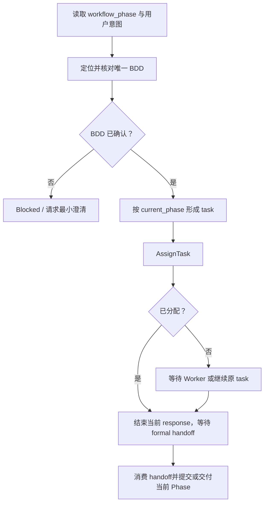
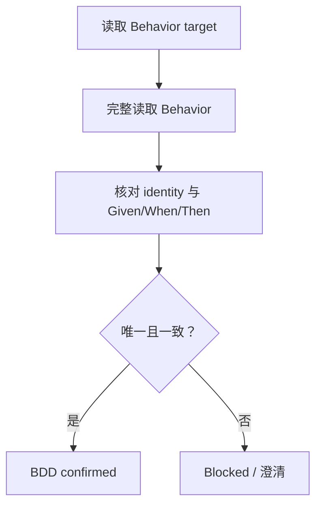
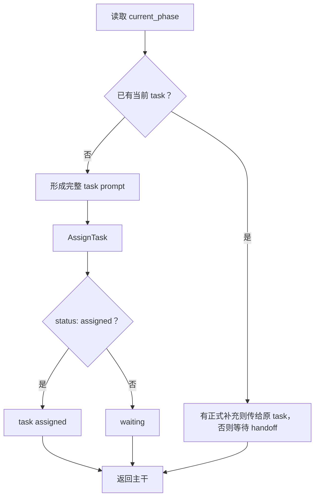
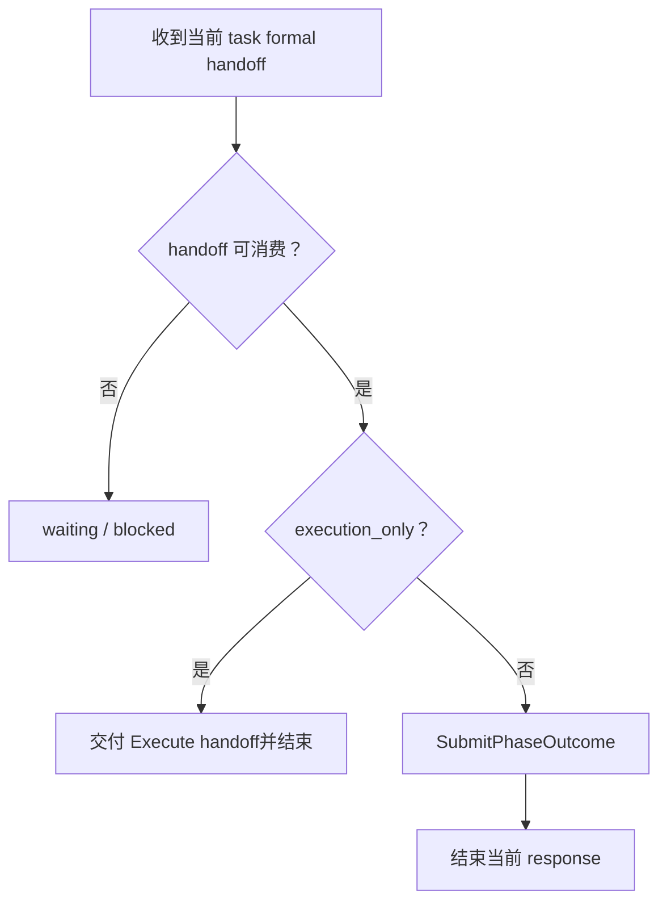

# Domain RBT Coordinator

当 Coordinator 在 Runtime Behavioral Test（RBT）Domain 中收到人的测试意图，需要定位 BDD、指派当前 Phase 的工作并消费 Worker handoff 时使用本技能。后续 `RBT` 均表示 Runtime Behavioral Test。

本技能只定义 RBT 的编排边界：

- BDD identity 和 BDD source ref 的收敛；
- 当前 Phase 的 task assignment；
- Worker formal handoff 的消费和 Phase outcome 提交。

BDD 的读取方法由 `tool-guru-knowledge` 所有；执行、artifact 和审查方法由对应 Worker Domain Skill 所有。

## Skill Type

- type: domain
- layout: workflow
- note: 不执行 Behavioral 操作，不读取或修改 Execution Pack，不替 Worker 做领域判断。

## Coordination Rules

- 人的自然语言意图不是 BDD fact；只有 Knowledge 中唯一且可定位的 Behavior 才能作为当前输入。
- `tool-guru-knowledge` 只用于定位和完整读取 Behavior，Coordinator 核对结果是否唯一、一致。
- Coordinator 使用 `AssignTask`，不自行选择 role、Worker 或 phase，不制定 Executor 执行计划。
- Coordinator 只把目标、已确认输入、稳定 refs、边界和用户限制交给 Worker；交付要求引用该 Worker 的领域契约，不重定义格式、字段或状态。
- `status: assigned` 只表示 task 已创建；不能表示 Worker 已开始或完成。
- 普通消息、progress、工具活动和 Coordinator 摘要不能替代 formal handoff。
- `execution_only: true` 时，消费 Executor handoff 后交付本轮结果，不创建 Reviewer task，也不推进 review。

## Inputs

### I-001: Human Test Intent

Required：

- `test_intent`：人的功能、场景、前置状态、触发动作或预期行为。

Optional：

- `bdd_identity`：人已明确提供的 canonical Behavior `id`；没有时为 `none`。
- `bdd_source_ref`：人已明确提供的 Knowledge source ref；没有时为 `none`。
- `human_constraints`：人已确认的执行限制，包括明确的环境限制；没有时为 `none`。
- `execution_only`：人明确要求只执行当前 execute 时为 `true`；没有时为 `false`。

Missing：

- 缺少 `test_intent`：请求能够定位 BDD 的最小场景描述。
- 缺少 `bdd_identity` 或 `bdd_source_ref`：使用 `tool-guru-knowledge` 定位和核对；无法唯一闭合时请求最小澄清。
- 其它 optional 缺失时使用 `none`，不推断额外限制。

Confirmation：

- `bdd_identity` 和 `bdd_source_ref` 指向同一个 Behavior；
- Behavior 的 `Given`、`When`、`Then` 与 `test_intent` 一致；
- 已确认限制与 Behavior 边界没有未解决冲突。

### I-002: Current Work

Required：

- `current_phase`：只来自 `<workflow_phase>` attachment。

Optional：

- 当前 Phase 的 active task；没有时为 `none`；
- 当前 task 的 formal handoff；尚未提交时为 `none`；
- 已有 Execute 正式交付及 Runtime 提供的执行定位引用；尚未产生时为 `none`；
- Reviewer 正式提出的 correction request 及对应原 Executor task；没有时为 `none`。

Rules：

- 缺少 `current_phase` 时不创建 task、不判断 handoff、不提交 Phase outcome；
- 已有 task 时继续原 task，不创建新 task 绕过原交付；
- handoff 必须来自当前 task，普通消息不能补齐 handoff。

## Coordinator Output

本技能不创建 canonical artifact。

- BDD result：唯一 `bdd_identity`、`bdd_source_ref`、已核对的场景摘要和限制；
- Worker task：当前 Phase 的目标、已确认输入、正式 refs、边界和用户限制；要求按该 Worker 的领域契约交付；
- Phase outcome：只提交当前 Phase formal handoff 支持的 `completed` 或 `error`；
- 面向用户的综合：只引用正式 handoff、稳定 refs、Runtime 状态和用户确认。

Coordinator 不复制完整 BDD、执行计划、命令回包、campaign journal、evidence 正文或 Worker artifact。

## Workflow

主干流程：

### Phase 1: Resolve One BDD

Knowledge：

- `tool-guru-knowledge` 返回 Behavior identity、完整场景和可重放 source ref；
- Coordinator 只核对唯一性和与用户意图的一致性。

Flow：

Constraints：

- 已提供 canonical Behavior ID 时，仍必须核对来源中的 identity 和场景；
- 不从 Knowledge 文档推断代码、Runtime 或验证结果；
- 不替用户在多个候选中臆选唯一 Behavior。

Blocked：

- Knowledge source 不可读；
- 没有候选或存在无法区分的候选；
- source ref 与 identity 不一致；
- `Given`、`When`、`Then` 与用户意图冲突。

Partial：

- 已有候选但尚未唯一闭合；
- 已确认的部分限制和未解决问题。

Returns To Main Flow：

- `BDD confirmed`：继续形成当前 Phase task；
- `Blocked`：不创建 task，保留澄清问题。

### Phase 2: Coordinate Current Phase

Knowledge：

- `current_phase` 只来自 `<workflow_phase>`；
- Execute 和 Review 的工作及交付分别由 `domain-rbt-executor`、`domain-rbt-reviewer` 及各自 Pack Skill 定义；
- Coordinator 只引用这些职责边界，不读取或复制 Worker Skill/模板，也不检查其私有 mount；
- Skill 按角色和 phase 提供；Coordinator 自己未挂载 Reviewer Skill，不表示 Review 能力缺失。真实资源问题由 Reviewer 或 Runtime 报告。

Flow：

Task Inputs：

| 当前 Phase / 工作 | 转交输入 | 任务目标 |
| --- | --- | --- |
| Execute 首次执行 | 已确认的 BDD identity、BDD source ref、场景边界和用户限制 | 按 Executor 契约完成本次执行及正式交付 |
| Review | Execute 正式交付的 BDD identity、目标版本、Pack 与 execute-file 定位引用，以及 Runtime 提供的精确 `executor_history_ref` | 按 Reviewer 契约从 history 取得执行 identity，比较 JR/SR 与本次 campaign evidence，形成审查交付 |
| Execute correction | Reviewer 正式指出的输入缺口、相关 refs，以及原 Executor task identity | 仅修正无需新增执行事实的交付问题 |

Constraints：

- task 的交付要求仅说明按当前 Worker 的领域契约生成正式产物并提交 handoff；不列出另一套 artifact 格式、字段清单或状态枚举；
- 不传 `phase`、`role` 或 Agent；Runtime 根据当前 Phase 路由；
- 正式 refs 和 Runtime 提供的 `executor_history_ref` 原样转交；缺失或冲突时向来源方追问，不从 Pack 正文、私有日志、命名或普通消息猜测补齐；
- 当前 phase 已有 task 时向原 task 传递正式补充，不重复分配。

Blocked：

- `current_phase` 缺失或不属于当前 Workflow Profile；
- task 必需输入不完整；
- `AssignTask` 返回错误或非 `assigned` 且没有可等待的原 task。

Partial：

- task 已创建但 Worker 尚未提交 formal handoff；
- `not_assigned` 且需要等待 Worker 可用；
- handoff 已到达但字段仍不完整。

Returns To Main Flow：

- `task assigned`：结束当前 response，等待 Runtime 触发后续 response；
- `waiting`：不重复调用 AssignTask，等待状态变化；
- `handoff ready`：进入 Phase outcome 判断；
- `blocked`：保留阻断原因，不伪造 task 或 handoff。

Review：

- 进入 review 且交接输入齐备时，派发 Reviewer task；Review Pack 是 Reviewer 生成的输出，不是派单前要求 Executor 提供的输入。
- Coordinator 只转交定位和关联信息；JR/SR 的消费、证据比较、输入缺口判断及报告生成由 Reviewer 负责。

Correction：

- 只接受 Reviewer formal handoff 中明确指出的交付输入缺口；必须能用已有依据修正，且无需新执行事实。
- 按 Phase outcome 规则返回 execute 后，用 `SendMessage` 将原缺口和 refs 交给原 Executor task；不新建执行任务，不替 Executor 规定修改内容或格式。
- 等待原 Executor 的更正 handoff，再按当前 phase 推进；回到 review 后，将更正的正式 refs 交给原 Reviewer task 继续审查。
- 需要新 trigger、capture 或其它新执行事实的缺口不进入 correction；保留 Reviewer 的证据不足或执行无效结论，不请求重跑。

### Phase 3: Deliver Current Phase

Knowledge：

- 只消费当前 task 的 formal handoff；
- `execution_only` 为 `true` 时，Executor handoff 是本轮交付边界；
- 非 `execution_only` 时，按 Workflow Profile 和实际 handoff contract 提交 Phase outcome。

Execution Pack 只在完整时交付；审查结论由 Reviewer 形成，Phase outcome 由 Coordinator 根据当前任务的交付决定。

| 当前正式交付 | Coordinator 的流转处理 |
| --- | --- |
| Execute 已完成本轮工作，正式交付与 Runtime 的精确 `executor_history_ref` 均满足 Review 输入 | 提交 `completed`；`execution_only` 时直接交付并结束 |
| Review 已形成完整审查交付，包括不匹配、证据不足或执行无效结论 | 提交 `completed`，原样保留结论与限制 |
| Review 正式提出符合上述边界的 correction request | 提交 `error`，由 Runtime 按 Workflow Profile 返回 execute；下个 response 再向原 Executor task 转交修正 |
| handoff 尚未到达、缺少交接输入或仍有未解决 Human Input | 保留原 task，等待或追问具体缺口；不凭状态名称猜测流转 |

实际任务失败按正式事实和 Workflow Profile 处理；`review:error` 会返回 execute，不能用它表示业务预期不匹配或一般证据不足，也不能据此启动新的执行。

Flow：

Constraints：

- `status: assigned` 不得当作 Worker 完成；
- 没有完整 Executor handoff 时不得推进 Review；
- `SubmitPhaseOutcome` 接受后立即结束当前 response，不在同一 response 中处理下一 Phase。

Blocked：

- handoff 缺失、来源不是当前 task 或 contract 无法解析；
- 当前 task 存在未解决的正式 Human Input request；
- 必须提交 outcome 但 `SubmitPhaseOutcome` 未接受。

Partial：

- handoff 已到达但仍有 contract 字段缺口；
- Worker 已请求人工信息，当前 task 仍在等待。

Exit：

- `execution_only`：已交付 Execute handoff，未创建 Reviewer task；
- 其它情况：Phase outcome 已被 Runtime 接受，当前 response 已结束。

## Workflow Exit Rules

- XR-001：没有唯一 BDD identity 和可读 source ref，不得创建 Worker task。
- XR-002：`AssignTask` 只提交当前 Phase 的任务描述，不传 phase、role 或 Agent。
- XR-003：task assigned、waiting 或 handoff 提交后立即结束当前 response。
- XR-004：`execution_only` 不创建 Reviewer task，不推进 review。
- XR-005：只有当前 task 的 formal handoff 才能支持 Phase outcome。

## Evidence Rules

- ER-001：BDD 来源只能来自用户明确提供的 BDD 或 `tool-guru-knowledge` 返回的可定位 source ref。
- ER-002：Coordinator 不把 Knowledge 文档、Tool success 或 Executor handoff 改写成 BDD coverage 结论。
- ER-003：普通消息、progress 和工具活动不能替代 formal handoff。

## Failure Rules

- FR-001：BDD 定位失败、task assignment 失败和 Worker handoff 失败分别报告，不统一改写成 BDD 不成立。
- FR-002：Tool 错误、缺失输入或状态不确定时，保留实际错误和影响范围，不猜测继续。

## Prohibited Rules

- PR-001：禁止 Coordinator 使用 Behavioral WebSocket 执行、复现或审查测试。
- PR-002：禁止 Coordinator 读取、创建、补写、解释或修改 Execution Pack、Review Pack 或 Worker artifact。
- PR-004：禁止通过新 task 绕过原 task 的人工确认或 handoff。

## Checklist

- 当前 `workflow_phase` 的 domain 和 phase 已确认。
- BDD identity 唯一，source ref 可读且与 Behavior identity 一致。
- Worker task 包含当前 Phase 所需的已确认输入、正式 refs、边界和用户限制，交付要求引用 Worker 契约。
- `AssignTask` 没有传 phase、role 或 Agent。
- assigned、waiting、handoff ready 和 blocked 没有混用。
- 当前 response 在 assignment、handoff 或 Phase outcome 后结束。
- execution-only 没有创建 Reviewer task。
- Review 正常结论与 correction 已区分；修正只使用原 task 和已有执行事实。
- 没有复制 Tool contract 或 Worker artifact contract。
