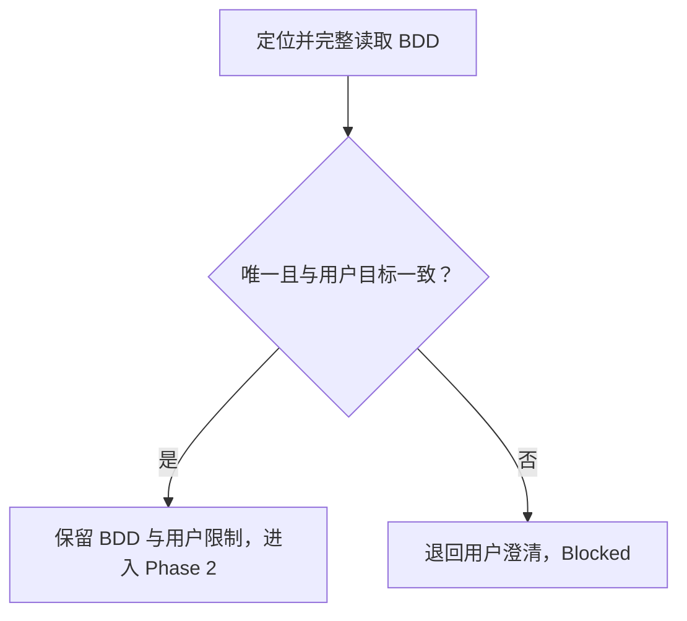
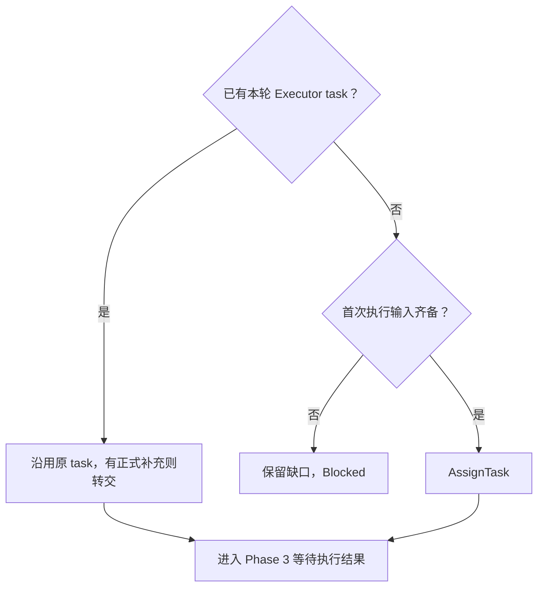
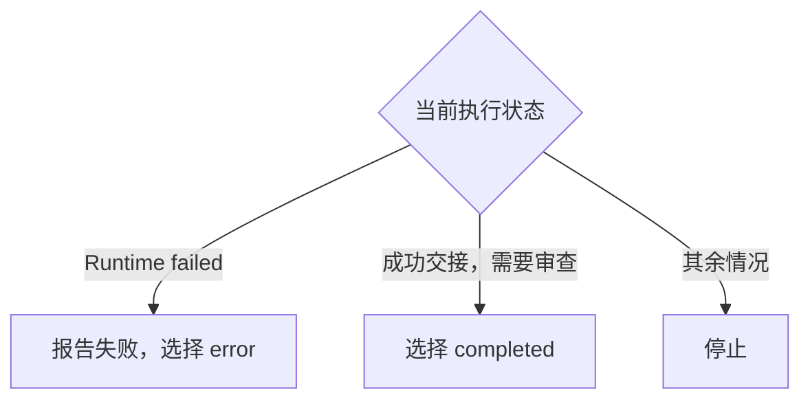
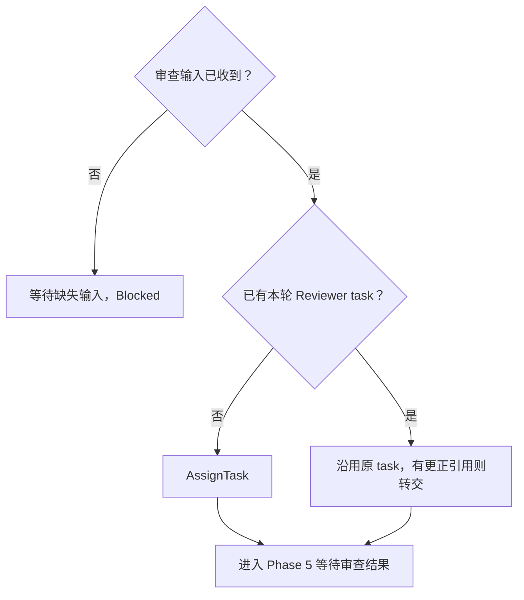
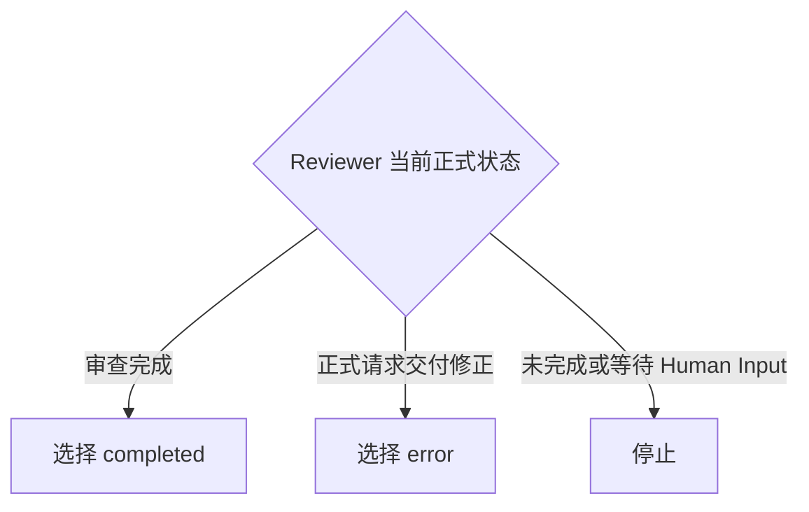

# Domain RBT Coordinator

在 Runtime Behavioral Test（RBT）中，将用户的测试目标交给 Executor 执行，再交给 Reviewer 审查。

Coordinator 负责确认目标、派发任务、消费正式状态和交付结果。

## Skill Type

- type: domain
- layout: workflow
- note: 按执行与审查的先后顺序，决定分配、等待、退回或结束。

## Core Use

- 确认唯一 BDD。
- 分别派发 Executor 和 Reviewer 任务。
- 根据正式状态处理两类任务的结果。
- 向用户交付结论、限制和正式 refs。

## Workflow Exits

- RBT Workflow 的阶段是 `execute` 和 `review`，每个阶段都有 `completed`、`error` 两个出口。
- Coordinator 通过 `SubmitPhaseOutcome`（`tool-scout-submit-phase-outcome`）选择出口，Runtime 按 Workflow 的 edge 决定去向。
- “停止”表示不提交 outcome，结束当前 response，保持当前 Workflow 阶段。它不是第三种 outcome 值。

## Inputs

### I-001: Test Request
---

Required：

- 测试目标：用户提供的 BDD identity、source ref 或场景描述。

Optional：

- 用户限制：用户明确提出的范围和执行要求；没有时为 `none`。
- `execution_only`：用户明确要求只执行时为 `true`；否则为 `false`。

Missing：

- 测试目标缺失、为空或无法辨认时，请求最小澄清。
- 未提供用户限制时按 `none` 处理。
- 未指定 `execution_only` 时按上述缺省语义处理。

Confirmation：

- 测试目标及已有的限制均来自用户，且彼此没有未解决冲突。

### I-002: Workflow Context
---

Required：

- `current_phase`：Runtime 当前 `<workflow_phase>` attachment 中的 `execute` 或 `review`。

Optional：

- 本轮 task、formal handoff 和 Runtime 执行结果：使用 Runtime 提供的上下文；尚未到达的项为 `none`。

Missing：

- `current_phase` 缺失或无效时，等待 Runtime 明确阶段。
- task 缺失时在相应派单阶段处理；handoff 或结果尚未到达时在相应结果协调阶段等待。

Confirmation：

- 当前阶段来自有效 attachment；已有任务和消息属于本轮工作。

## Workflow Overview

以下五个 Phase 是 Coordinator 的线性处理步骤；Phase 1–3 服务 `execute`，Phase 4–5 服务 `review`。首次按顺序推进，等待后的新消息从当前步骤继续。

Phase 说明：

- Phase 1：Resolve One BDD — 找到唯一 BDD，否则退回用户澄清。
- Phase 2：Submit Task to Executor — 决定是否分配执行任务。
- Phase 3：Coordinate Executor Outcome — 根据执行状态决定等待、退回或进入审查。
- Phase 4：Submit Task to Reviewer — 决定是否分配审查任务。
- Phase 5：Coordinate Reviewer Outcome — 根据审查交接决定等待、退回修正或结束。

## Coordinator Output

- 任务输入：确认后的目标、用户限制和正式 refs。
- 阶段结果：当前正式状态支持的 `completed` 或 `error`。
- 用户交付：正式结论、限制和结果 refs。

## Phase 1: Resolve One BDD
---

Main Flow：

Knowledge：

- 通过 `tool-guru-knowledge` 定位并完整读取 BDD，核对 identity、source ref、场景与用户目标。
- 本轮确认后的 BDD 和用户限制供后续阶段复用。

Flow：

Blocked：

- BDD 来源不可读。
- BDD 无法唯一确定。
- BDD identity 与 source ref 不一致。
- BDD 场景与用户目标或限制冲突。

Partial：

- `none`

Exit：

- 唯一 BDD 已确认，source ref 与用户限制已保留。

## Phase 2: Submit Task to Executor
---

Main Flow：

Knowledge：

- 本阶段要求 Runtime 的 `current_phase` 为 `execute`。
- 首次任务输入是已确认的 BDD identity、source ref 和用户限制；目标是完成执行并正式交接。
- 使用 `AssignTask`（`tool-scout-assign-task`）派发新任务。
- 退回修正时，用 `SendMessage`（`tool-scout-send-message`）向原 Executor task 转交 Reviewer 的正式修正请求和 refs。

Flow：

Blocked：

- Runtime 尚未处于 `execute`。
- 首次派单输入不齐。
- 修正请求无法关联原 Executor task。
- 派单或补充投递未成功。

Partial：

- `none`

Exit：

- 本轮 Executor task 已存在，或 `AssignTask` 返回 `assigned`。
- 本次需要转交的正式补充已投递，或没有补充。

## Phase 3: Coordinate Executor Outcome
---

Main Flow：

Knowledge：

- `RBT Execution History Ready` 的 `status` 是本次 Runtime 执行结果；通知中的 `executor_history_ref` 留给 Phase 4 转交。
- Executor 正式交接表示交付已返回；其 refs 原样保留。handoff 不替代 Runtime 执行结果。
- “成功交接”表示 Runtime 为 `completed`、Executor 已正式交接且没有待处理 Human Input。
- `execution_only` 成功交接后，交付执行结果并选择停止。
- 已有交付的修正沿用原 Runtime 执行结果。

Flow：

Blocked：

- 没有可确认的本轮 Runtime 执行状态。
- 执行成功，但 Executor 尚未正式交接。
- 执行成功，但仍有未解决的正式 Human Input。
- 阶段提交未被 Runtime 接受。

Partial：

- 已收到的状态与 refs，保留在当前协调上下文中。

Exit：

- 适用的阶段结果已被接受，或 `execution_only` 执行结果已交付。

## Phase 4: Submit Task to Reviewer
---

Main Flow：

Knowledge：

- 本阶段要求 Runtime 的 `current_phase` 为 `review`。
- 审查目标是完成本轮审查并正式交付结果；输入引用按下表原样转交。
- 首次审查使用 `AssignTask`（`tool-scout-assign-task`）；修正后继续审查使用 `SendMessage`（`tool-scout-send-message`），向原 Reviewer task 转交更正后的 refs。

| 输入来源 | 转交内容 |
| --- | --- |
| Executor formal handoff | `bdd_id`、`target_version`、`pack_ref`、`execute_file_ref`。 |
| 本轮 Runtime 执行通知 | 精确 `executor_history_ref`。 |

Flow：

Blocked：

- Runtime 尚未处于 `review`。
- 正式审查输入未收到。
- 派单或更正引用投递未成功。

Partial：

- `none`

Exit：

- 本轮 Reviewer task 已存在，或 `AssignTask` 返回 `assigned`。
- 本次需要转交的更正引用已投递，或没有更正。

## Phase 5: Coordinate Reviewer Outcome
---

Main Flow：

Knowledge：

- 只根据 Reviewer formal handoff 区分审查完成和退回修正。审查不通过、证据不足或执行无效也属于完整审查结果。
- 退回依据是 Reviewer 正式提出、明确无需重新执行的交付修正请求；原请求与 refs 保留给 Phase 2。
- 有待处理的正式 Human Input 时，选择停止；完整审查结论及 refs 原样交付用户。

Flow：

Blocked：

- Reviewer 尚未形成正式交接。
- Reviewer 的交接未明确完成结论或修正请求。
- 仍有未解决的正式 Human Input。
- 阶段提交未被 Runtime 接受。

Partial：

- 已收到的审查状态与 refs，保留在当前协调上下文中。

Exit：

- 本轮审查的阶段结果已被 Runtime 接受。

## Workflow Exit Rules (Enforcement)

- XR-001：前一阶段未通过时，不进入依赖它的下一阶段。
- XR-002：派单或补充投递成功后结束当前 response，等待正式结果。
- XR-003：阶段结果被接受后立即结束当前 response；新 Runtime response 再处理后续阶段。
- XR-004：Phase 5 退回修正后，从 Phase 2 继续原任务；修正不产生新的执行。
- XR-005：本轮结束后的迟到交接仅补充交付，不重新启动流程。

## Prohibited Rules (Enforcement)

- PR-001：禁止 Coordinator 打开 artifact 正文检查格式、内容或证据；artifact 校验由 Runtime 负责，Coordinator 只消费正式状态和交接 refs。

## Checklist

- 任务对应唯一且已确认的 BDD。
- Executor 与 Reviewer 的派单和结果协调各在自己的阶段处理。
- 退回修正沿用原任务，审查不通过没有被当作重跑理由。
- 用户已收到正式结果、限制和 refs。
