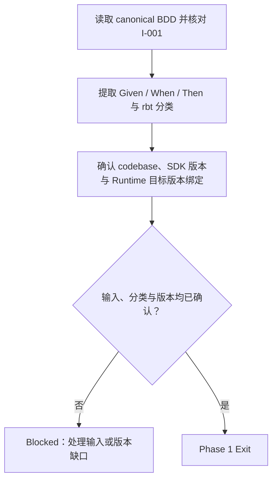
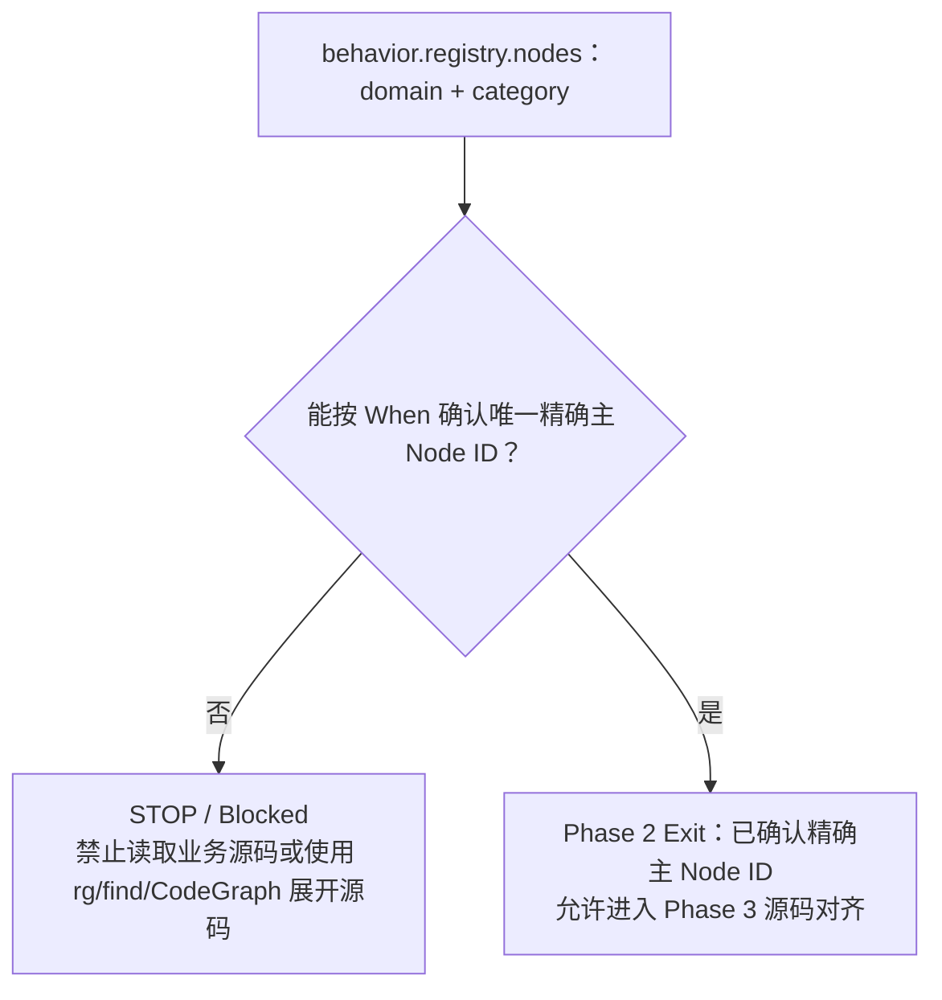
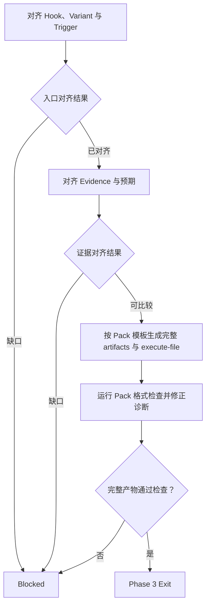
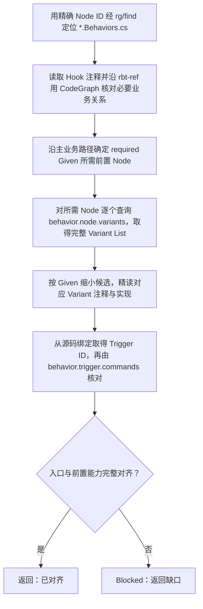
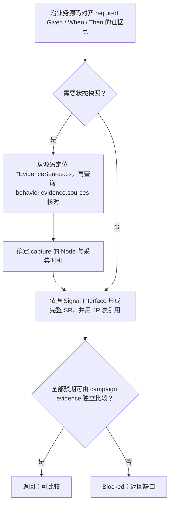
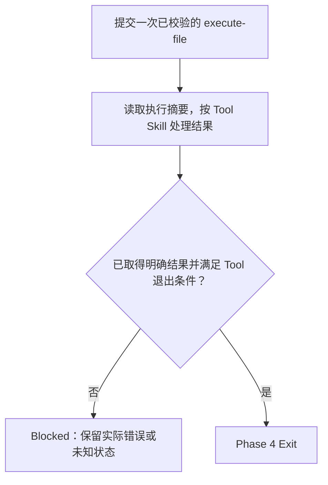
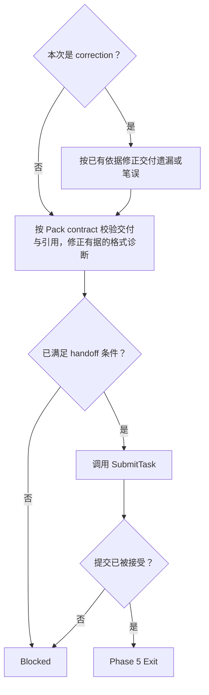

# Domain RBT Executor

从 BDD 和当前业务源码对齐 RBT Hook、声明 JR/SR，并提交一次受控执行时使用本技能。

Executor 拥有 BDD、源码到 Hook 与预期的语义映射和覆盖完整性。交给 Reviewer 的 JR/SR 必须包含其仅凭 campaign evidence 独立比较所需的业务含义与条件。

## Skill Type

- type: domain
- layout: workflow
- note: 拥有执行前业务对齐、预期充分性和正式交付；artifact 格式与工具操作引用对应 Skill。

## Core Use

- 对齐 BDD、当前源码与 Runtime 可用能力，识别业务缺口。
- 形成覆盖 required Given、When、Then 的执行计划与 JR/SR。
- 完成一次受控执行并提交正式 handoff。

## Inputs

### I-001: BDD 验证任务
---

Required：

- `bdd_identity`：Coordinator 在当前 task 中提供的 canonical BDD identity。
- `bdd_source_ref`：Coordinator 在当前 task 中提供的 canonical Behavior 来源。

Optional：

- `human_constraints`：当前 task 或已确认 Human Input 中的执行限制；缺失时为 `none`。

Missing：

- `bdd_identity` 缺失、为空或不唯一：交由 Coordinator 修正。
- `bdd_source_ref` 缺失、为空、不可读或指向多个来源：交由 Coordinator 修正。
- `human_constraints` 缺失不阻塞输入确认，不自行补出限制。

Confirmation：

- 来源唯一可读，canonical Behavior 的 frontmatter `id` 与 `bdd_identity` 完全一致；不一致时保留差异并交由 Coordinator 修正。
- Given、When、Then 与已确认的 `human_constraints` 一致；冲突未解决前输入不通过。

## Workflow Overview

Phase 说明：

- Phase 1：确认 BDD、查询分类与目标源码版本。
- Phase 2：从 Runtime 确认唯一精确主 Node，满足源码查询前置条件。
- Phase 3：对齐 Hook 与证据，形成并校验完整执行计划和 JR/SR。
- Phase 4：提交一次受控执行并保留明确结果。
- Phase 5：交付正式 handoff，或按已有依据完成 correction。

## Delivery Contract

- 正式输出为完整 Pack 与 `execute-file`；artifact 内容、格式检查与 handoff 引用使用 `domain-rbt-execution-pack`。
- 交付只引用已有正式产物；实际命令结果、trace、campaign journal 与 cleanup 记录由 Runtime 保存。
- Executor 的交付完成与执行状态均不代表 BDD 的最终 pass/fail。

## Phase 1: 确认 BDD 与版本
---

Main Flow：

Knowledge：

- `tool-guru-knowledge` 提供 canonical BDD；本阶段按 `I-001` 确认输入。
- BDD frontmatter 的 `rbt` 使用 `domain:category` 字符串，只声明 When 主入口的分类；原样拆分，不从 tags、capability 或 Description 推导。
- When 的业务对象、操作、输入与返回类型用于匹配主 Node；BDD 明确涉及的业务 symbol 用于后续定点对齐。
- `tool-jarvis-codebase` 提供 codebase 与 SDK 版本确认方式。本阶段只使用版本与路径信息；SDK 与 Runtime 的目标版本绑定不能用 Unity Editor 版本代替。

Flow：



Blocked：

- `I-001` 未通过确认。
- BDD 的 `rbt` 缺失。
- BDD 的 `rbt` 格式无效。
- 目标 SDK 版本与 Runtime 的绑定无法确认。
- 目标 SDK 版本与 Runtime 冲突。

Partial：

- `none`

Exit：

- `I-001` 已通过确认。
- Given、When、Then 与查询分类已明确。
- codebase、目标 SDK 版本及 Runtime 版本绑定已确认。

## Phase 2: 从 Runtime 锁定主 Node
---

Main Flow：

Knowledge：

- 按 `tool-rbt-behavior` 调用 `behavior.registry.nodes`，同时传入 BDD 已声明的 `domain` 和 `category`，禁止空 payload。
- 从当前返回的 Node descriptors 匹配 When 的业务对象、操作、输入与返回类型；Description 只缩小候选。
- **本阶段只查询 Runtime 能力；精确主 Node ID 必须来自本次查询结果，不能从源码反推。**

Flow：



Blocked：

- Runtime 查询未取得有效结果；按 `tool-rbt-behavior` 处理。
- 无法从返回结果唯一确定 When 对应的主 Node。

Partial：

- `none`

Exit：

- 已从 Runtime 返回结果确认 When 对应的唯一精确主 Node ID。

## Phase 3: 对齐业务与证据并形成 Pack
---

Main Flow：

Knowledge：

- BDD 验证业务承诺；RBT 基础设施负责执行与取证。源码读取只覆盖本次 BDD 的业务 Hook/Variant/Trigger、直接业务实现、EvidenceSource 及直接证据数据来源。
- `tool-jarvis-codebase` 提供当前版本源码检索；`tool-rbt-behavior` 提供 Runtime 能力核对。descriptor 与参数 schema 确认 identity、参数和 availability；用途、状态语义与证据边界来自业务源码和注释。
- `domain-rbt-execution-pack` 提供 artifacts、execute-file 和格式检查 contract；所有业务事实闭合后才生成完整产物。

以下路径相对于 codebase 根目录，禁止读取或搜索，包含 `rg/find` 与 CodeGraph；查询前限定允许范围，不得先扫描后过滤：

```text
gurusdk-unikit/**
gurusdk-framework/com.guru.sdk.framework.core/Runtime/Behavioral/**
gurusdk-framework/com.guru.sdk.framework.core/Runtime/Websocket/**
gurusdk-framework/com.guru.sdk.framework.core/Tests/Runtime/Behavioral/**
gurusdk-framework/com.guru.sdk.framework.core/Tests/Runtime/Websocket/**
gurusdk-framework/com.guru.sdk.framework.core/SourceGenerator~/Behavior*.cs
gurusdk-framework/contracts/schemas/behavioral/**
gurusdk-framework/contracts/schemas/websocket/**
**/BehaviorGeneratedRegistry.g.cs
**/*.Behaviors.g.cs
```

业务模块内的 `*.Behaviors.cs`、`*Behaviors.cs`、`*EvidenceSource.cs` 是允许的接触点。`gurusdk-framework/com.guru.sdk.framework.utils/**` 不整包禁读，但仅定点读取直接业务实现或证据来源，不沿依赖无限展开。RBT 用法依据 Tool Skill 与 Runtime 公开契约，不能进入禁读范围补齐说明。

Flow：



Blocked：

- “对齐 Hook、Variant 与 Trigger”返回“缺口”。
- “对齐 Evidence 与预期”返回“缺口”。
- Pack 格式诊断无法根据已确认事实修正。

Partial：

- `none`

Exit：

- 业务入口与所需能力已对齐。
- 全部预期仅凭 JR/SR 与 campaign 查询结果即可比较。
- 完整 Pack 与 execute-file 已通过格式检查。

Subflow — 对齐 Hook、Variant 与 Trigger：

Knowledge：

| 业务映射 | Runtime 索引 | 源码接触点 |
| --- | --- | --- |
| When 主动作 | Phase 2 已确认的主 Node | `*.Behaviors.cs` 中对应 `BehaviorHook` 与业务方法 |
| required Given 前置状态 | `behavior.node.variants` | `*Behaviors.cs` 的 `BehaviorVariantHook` 与业务注释 |
| When 调用入口 | `behavior.trigger.commands` | `*.Behaviors.cs` 的 Trigger 绑定与 `*Behaviors.cs` 的 Trigger 声明 |

- `rbt-hook`、`rbt-evidence`、`rbt-example` 说明业务用途；`rbt-ref` 指向需要核对的业务方法与直接状态来源。
- Node ID 用于精确定位主 Hook；`node.id + variant.id` 用于精读对应 Variant，避免遍历无关实现。

Flow：



Constraints：

- 每个所需 Node 都必须在当前 Runtime 中可用。
- 前置状态准备与目标业务动作分别映射，Variant 的作用以源码契约为准。
- Trigger 必须唯一，并与目标 Node、params/result schema 一致；其 descriptor 的相关 Source IDs 只作交叉核对。

Blocked：

- 所需 Node 不可用。
- 所需 Variant 无法唯一对齐。
- Trigger 无法唯一对齐。
- 必需业务注释无法确认。
- 必需实际实现无法确认。
- 必需 `rbt-ref` 无法确认。
- 源码与 Runtime 的 identity 冲突。
- 源码与 Runtime 的参数冲突。
- 源码与 Runtime 的业务边界冲突。
- 任一 required Given 只能部分表达。

Partial：

- `none`

Returns To Main Flow：

- `已对齐`：主 Hook、前置 Node、所需 Variant 与唯一 Trigger 均已确认，required Given 可完整表达。
- `缺口`：任一局部 Blocked 条件成立；主干进入 Blocked。

Subflow — 对齐 Evidence 与预期：

Knowledge：

- `general Signal list`：`signal-rbt-evidence`，仅使用 Interface；完整 SR 的声明方式由该 contract 定义。
- Hook/Variant 的 `rbt-evidence` 与业务源码确定实际证据点；需要状态快照时由 `*EvidenceSource.cs` 提供来源，`behavior.evidence.sources` 核对 Source ID、kind、fields 与 query capabilities。
- `E-CODE-*` 保存 `rbt-ref` 指向的业务方法和直接状态来源；入口绑定不能代替业务 claim。

Flow：



Constraints：

- 每个 capture 绑定 `nodeId` 与 `timing`；只有必须限定某个 Variant 时才填写 `variantId`。
- 沿源码确认字段实际进入 campaign evidence；在完整 SR 中声明业务含义、观察范围、定位条件与断言。
- 同一 record 的公共字段与业务字段组成完整 SR；涉及多个 record 的结论分别声明，并保留必要关系。
- JR 表以业务依据确定 order 和关键 identity，引用完整 SR；独立 absent SR 仍保留。

Blocked：

- 所需 EvidenceSource 无法唯一对齐。
- 必需字段无法由 campaign evidence 核验。
- 必需观察边界无法由 campaign evidence 核验。
- 无法从证据区分“未采集”和“已采集但结果为空”。

Partial：

- `none`

Returns To Main Flow：

- `可比较`：全部预期已完整映射，只给 Reviewer JR/SR 与 campaign 查询结果即可判断。
- `缺口`：任一局部 Blocked 条件成立；主干进入 Blocked。

## Phase 4: 执行一次
---

Main Flow：

Knowledge：

- `tool-rbt-behavior` 定义 `JarvisBehavior` 的调用、结果、失败与退出语义；Executor 自己完成预检与正式调用，不转交其它 role 或 child，失败、未知状态与重试边界沿用该 Tool Skill。
- 一个 workflow 只提交一次 `execute_file`，文件内只包含一个 Scenario 和一次 trigger；不复用仍 active 的 Scenario。
- 平台准备、命令执行与 cleanup 由 Runtime 推进；执行成功仅表示执行完成，明确失败按 Tool Skill 处理，不改变已经完成的 Pack。

Flow：



Blocked：

- 执行结果未知。
- 工具要求的外部准备仍未完成。

Partial：

- `none`

Exit：

- 本次 execute-file 调用已有明确完成或失败结果。
- `tool-rbt-behavior` 的相应退出条件已满足。

## Phase 5: 正式交付与 correction
---

Main Flow：

Knowledge：

- `domain-rbt-execution-pack` 定义正式 handoff；只引用已存在的完整产物，不补交 Runtime 结果。
- correction 只使用已有依据修正交付遗漏或笔误，并按 Pack contract 校验修订后的产物。
- `tool-scout-submit-task` 定义 SubmitTask 的提交与失败处理；提交失败或状态未知时保留原始状态。

Flow：



Blocked：

- 无法根据已有依据满足 Pack 交付 contract。
- correction 缺少既有依据。
- SubmitTask 未确认接受本次 handoff。

Partial：

- `none`

Exit：

- 完整交付已通过格式检查。
- 正式 handoff 已由 SubmitTask 接受。

## Workflow Exit Rules (Enforcement)

- XR-001：初次执行按 Phase 1 至 Phase 5 推进，前一阶段全部 Exit 条件成立后才能进入下一阶段。
- XR-002：Phase 2 未通过时，禁止搜索或读取业务源码，包括 `rg/find` 与 CodeGraph。
- XR-003：收到 correction 时只进入 Phase 5，不重新执行 Phase 1 至 Phase 4。

## Evidence Rules (Enforcement)

- ER-001：每个用于建立 required Given 的 activation 必须有对应 Variant 的 present `behavior_trace` SR，并断言 `result`。
- ER-002：每个计划中的 capture 和 trigger 必须有对应 present SR。
- ER-003：所有 present SR 必须由 JR 引用。
- ER-004：来源链接、执行计划和命令成功不能代替实际 campaign 命中证据。
- ER-005：absence 必须能从查询证据确认观察发生且范围完整。

## Failure Rules (Enforcement)

- FR-001：工具失败或状态未知时保留实际错误与限制，不自行补造 Runtime 状态。
- FR-002：Runtime 执行失败不改变已经完成的 Pack，也不形成 Executor 的最终业务 pass/fail。

## Blocking Rules (Enforcement)

- BR-001：输入缺口按 `I-001` 交由 Coordinator 修正；未解决前停止依赖工作。
- BR-002：执行前业务或版本缺口进入 Blocked 时，立即按 `tool-scout-request-human-input` 请求 Human Input。
- BR-003：存在未解决阻断时，不创建或修改 Pack、execute-file 或 handoff。

## Prohibited Rules (Enforcement)

- PR-001：禁止以相似 Hook、未声明默认路径或 RBT 内部机制猜测来补齐能力缺口。
- PR-002：禁止补发 mutation 或另起执行来确认结果。
- PR-003：禁止查询 campaign evidence 或形成最终业务 pass/fail。
- PR-004：禁止根据实际执行值改写执行前预期。
- PR-005：correction 禁止调用 Behavioral Tool 或产生新的执行事实。

## Checklist

- BDD identity、目标源码版本和人已确认输入一致。
- 业务源码查询发生在 Runtime 精确主 Node 确认之后。
- required Given/When/Then 均已对齐到真实可用的 Hook 与业务源码。
- JR/SR 在执行前完整声明，Reviewer 仅凭声明和 campaign 查询即可比较。
- 正式执行只提交一次；失败或不匹配后未补发 mutation、重跑或修改预期。
- Pack 与正式 handoff 已完成，执行状态和业务结论保持区分。
