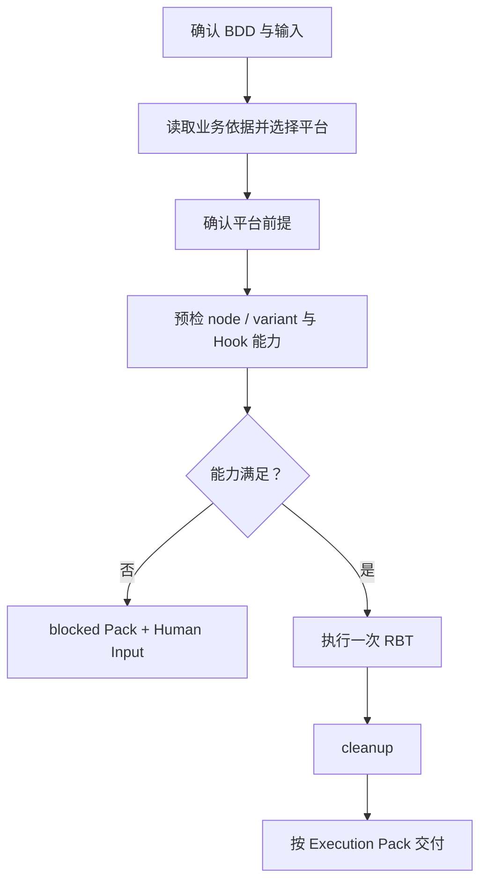
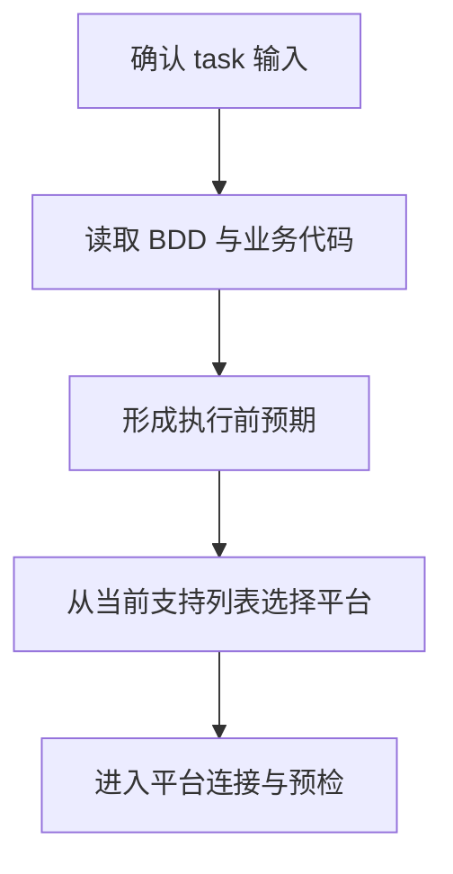
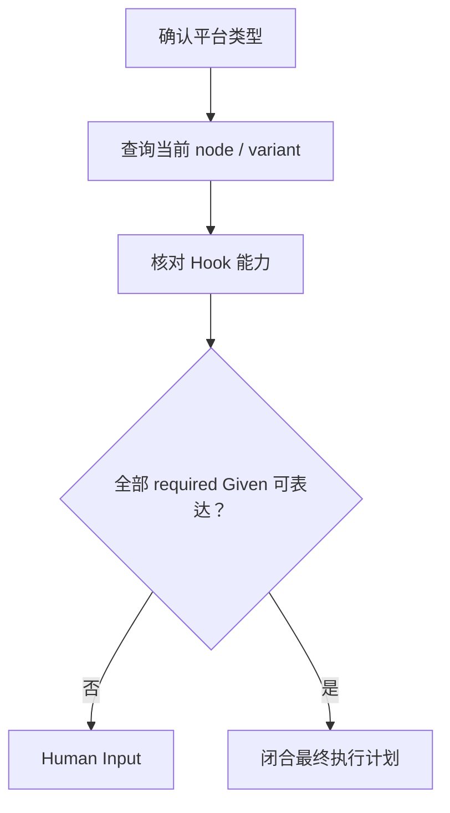
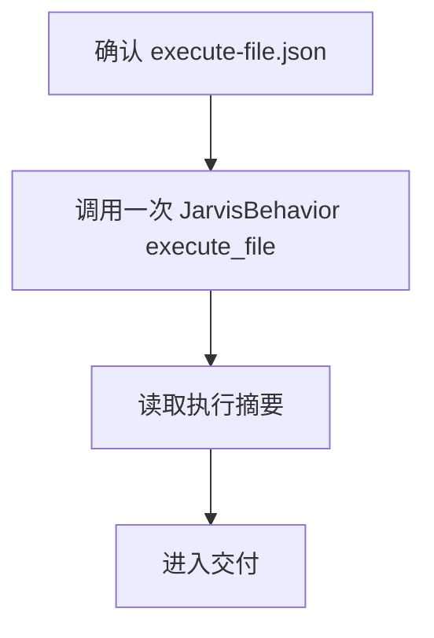
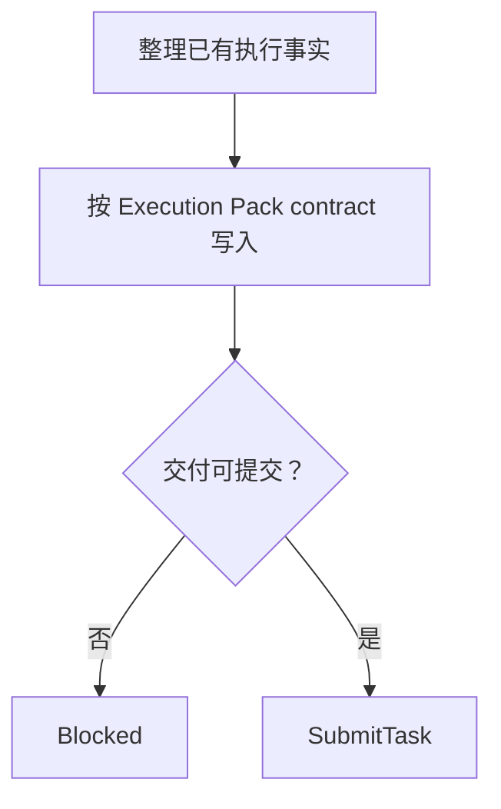

# Domain RBT Executor

当 Executor 在 Runtime Behavioral Test（RBT）Domain 中收到唯一 BDD，需要在人工已准备的平台环境中完成一次受控 Behavioral 执行并向 Execution Pack 交付时使用本技能。后续 `RBT` 均表示 Runtime Behavioral Test。

本技能只定义执行顺序、一次执行边界、Human Gate 和交付边界。Knowledge、代码、Behavioral dynamic tool 和 Execution Pack 的具体操作分别由对应 Skill 所有。

## Skill Type

- type: domain
- layout: workflow
- note: 本技能不拥有 Tool contract、Pack contract、Runtime journal 或独立审查结论。

## Core Rules

- Executor 只处理 Coordinator 交付的唯一 BDD 和已确认输入。
- 一次 Scout workflow 只使用一个人工准备并可连接的平台实例。
- 一个执行实例同时只允许一个 active Scenario；正式执行只提交一次 `execute_file`，其中只包含一次 trigger。
- `behavior.node.variants` 必须在任何 campaign mutation 前完成，用于确认当前 Runtime 能力；候选 identity 不能直接用于 mutation。
- BDD required Given 无法被当前 Runtime Hook 完整表达时，在 `campaign.start` 前阻断并请求 Human Input。
- Tool Skill 负责命令参数、返回值解释、成功判定、重试和退出条件；本技能只规定命令的业务顺序和使用目的。
- Executor 不把实际命令结果、trace、evidence、campaign journal 或 cleanup 正文复制进 Execution Pack。
- Executor 不形成最终 RBT pass/fail，不自判业务结果。

## Inputs

### I-001: BDD Execution Task

Required：

- `bdd_identity`：canonical Behavior 文档 frontmatter 中的完整 `id`；
- `bdd_source_ref`：该 Behavior 的稳定可读 source ref。

Optional：

- `human_constraints`：人已经确认且会限制本次执行范围的条件；没有时为 `none`。

Missing：

- 缺少 `bdd_identity` 或 `bdd_source_ref`：向 Coordinator 报告缺失字段，不开始平台选择或执行；
- 缺少 `human_constraints`：按 `none` 处理，不推断额外限制。

Confirmation：

- `bdd_source_ref` 可读，且 frontmatter `id` 与 `bdd_identity` 完全一致；
- Behavior 的 Given、When、Then 与已确认输入没有未解决冲突；
- 只能定位到多个 Behavior 或 source ref 不一致时，等待 Coordinator 修正。

### I-002: Platform Constraints

Required：

- 无。平台实例由人在执行前准备。

Optional：

- `platform_type`：人已明确的平台类型；没有时从当前支持列表选择；
- `platform_constraints`：人已明确的平台限制；没有时为 `none`。

Confirmation：

- 提供的 `platform_type` 必须存在于当前支持列表；
- `platform_constraints` 与 BDD 执行边界不冲突；
- 冲突时报告实际值，不自行改换平台。

## Execution Overview

## Stage 1: Prepare Execution

Knowledge：

| 当前动作 | 负责的 Skill |
| --- | --- |
| 读取并核对 BDD | `tool-guru-knowledge` |
| 读取与 BDD 业务路径直接相关的当前代码 | `tool-jarvis-codebase` |
| 解释并声明所需 Signal 预期 | 对应 Signal Interface 与 Via Skill |
| 记录正式执行交付 | `domain-rbt-execution-pack` |
| 明确平台交互 | `tool-unity-pipeline` |

Flow：

Constraints：

- BDD、Knowledge 和业务代码只提供执行候选，不能证明当前 Runtime 已注册对应 Hook。
- 只读取与当前 BDD 业务路径、状态变化和预期值直接相关的代码；不扫描整个 codebase，不阅读 RBT 基础设施实现来替代业务事实。
- `family:signal.local.unity.rbt.**` 是可选发现范围，只读取当前 BDD 需要的 Signal Interface/Via。
- 平台类型只能从当前支持列表选择，不写入 Execution Pack。
- 预期、Human Input 和其它正式交付按 `domain-rbt-execution-pack` 执行，不在本技能复制模板或字段规则。

当前支持的平台：

| platform | platform Skill | 执行前提 |
| --- | --- | --- |
| Unity Editor | `tool-unity-pipeline` | 存在唯一、人工已准备并可连接的 Editor |

Blocked：

- BDD identity 不唯一或 source 不可读；
- 业务代码无法定位到当前 BDD 所需的关键路径；
- 指定或选择的平台不在当前支持列表；
- Execution Pack Skill 不可用。

Partial：

- BDD、业务代码或平台候选已确认，但执行前预期尚未闭合；
- 缺口交给 Execution Pack 按其 contract 记录。

Exit：

- BDD identity 和 source ref 已确认；
- 业务代码证据范围已确定；
- 平台类型已选择；
- 执行前预期已按 Execution Pack 要求进入可继续处理的状态。

## Stage 2: Platform Gate And Preflight

Knowledge：

- 平台实例必须由人在执行前准备并保持可连接。
- `tool-rbt-behavior` 是当前主流程的唯一执行与查询入口；Executor 不为启动、停止或确认 Play Mode 单独调用平台 Tool。
- `tool-unity-pipeline` 仅保留给明确的平台交互；当前主流程没有这类步骤。

当前支持的平台：

| platform | platform Skill | 执行前提 |
| --- | --- | --- |
| Unity Editor | `tool-unity-pipeline` | 存在唯一、人工已准备并可连接的 Editor |

Flow：

Constraints：

- Executor 只通过自己的 `JarvisBehavior` dynamic tool 提交预检查询和正式执行；不得转交给 child 或其它 role 执行。
- `JarvisBehavior` 返回 `unity_editor_unavailable` 或 `unity_editor_ambiguous` 时，保留失败结果并请求 Human Input，不自行启动、搜索或改换 Editor。
- `behavior.node.variants` 是 campaign mutation 前的只读预检；它必须覆盖所有 required Given 和最终计划使用的 node。
- 预检必须确认当前 Runtime 返回的 node、variant 和计划参数能够表达每一条 required Given；部分表达不算满足。
- Runtime identity、参数和 effect 只以当前 Runtime 返回为准；不使用历史结果、相似名称或代码声明替代。
- dynamic-tool 参数、返回值和调用失败语义由 `tool-rbt-behavior` 说明，本技能不重复定义。
- Hook 能力缺失时不得启动 campaign、activate Scenario 或 trigger；先按 Pack contract 写入阻断事实并请求 Human Input。

Blocked：

- `JarvisBehavior` 返回平台不可用、不唯一或状态无法确认；
- Behavioral Tool 无法使用；
- `behavior.node.variants` 查询失败、状态未知或能力不完整；
- 任一 required Given 没有当前 Runtime Hook 的完整映射；
- 无法按 Execution Pack 闭合执行前计划和预期。

Partial：

- 平台类型已确认，但预检仍有未解决缺口；
- Human Input 已发起，等待人工补齐 Hook 或运行前提。

Returns To Main Flow：

- `能力满足`：进入 Stage 3；
- `能力缺失` 或 `检查失败`：结束本次 response，等待 Human Input。

## Stage 3: Execute Once And Cleanup

Knowledge：

- 进入本阶段前，Stage 2 已确认最终 node、variant、参数和 required Given 能力。
- `execute-file.json` 已按 Execution Pack contract 写入 `<bdd-id>/<version>/execute-file.json`。
- 具体 Dynamic Tool 输入、返回值、成功判定和退出条件遵循 `tool-rbt-behavior`。
- 观察点和 Signal 预期遵循 Interface/Via 与 Execution Pack；没有声明的观察点不临时加入。

Flow：

Constraints：

- 一个 workflow 只提交一次 `execute_file`；不得由 Executor 将文件拆成多次 mutation 调用。
- 执行文件只包含一个 Scenario 和一次 `behavior.trigger.invoke`，不复用仍 active 的 `scenarioId`。
- 只有 Execution Pack 已声明的观察点才写入 `behavior.evidence.capture`。
- execute-file 的失败、cleanup 和退出语义遵循 `tool-rbt-behavior`，Executor 不自行补发单条 mutation 命令。
- Executor 只读取 Dynamic Tool 返回的执行摘要，不用第二次执行确认结果。

Blocked：

- Behavioral Tool 不可用；
- execute-file 校验、campaign、Scenario、capture、trigger 或 cleanup 失败或状态未知；
- 执行计划要求第二个平台运行实例、第二个 active Scenario 或第二次 trigger；

Partial：

- 已发起的 Human Input 由 Pack 按 contract 记录。

Exit：

- `execute_file` 已返回完成或明确失败；
- Dynamic Tool 已返回终态；
- 未形成自判的 RBT pass/fail 结论。

## Stage 4: Deliver Execution Pack

Knowledge：

- `domain-rbt-execution-pack` 拥有 artifact、ID、字段、模板、状态、完整性和 handoff contract。
- Executor 只提供最终有效计划、BDD/代码来源、Signal 预期、Agent 观察和 Human Input 申请。

Flow：

Constraints：

- 正式交付只按 Execution Pack Skill 的模板和 handoff contract 完成；不自定义替代格式。
- 执行结果与预期不一致时，记录事实和限制，不自行改写为通过或重新 trigger。
- correction 只修正既有事实支持的交付内容；不得重新连接平台、再次提交 execute-file 或改变执行前预期。

Blocked：

- Execution Pack Skill 不可见；
- Pack contract 所需输入或 artifact 不完整；
- correction 需要新的 Runtime 事实；
- `SubmitTask` 失败或状态未知。

Partial：

- 已确认但尚未闭合的执行事实或交付缺口，按 Pack contract 记录。

Exit：

- 已按 Execution Pack contract 完成 artifact 和 handoff；
- Executor task 已正式提交。

## Workflow Exit Rules

- XR-001：BDD、业务代码范围、平台和执行前预期未闭合，不得进入 Behavioral mutation。
- XR-002：required Given 未被当前 Runtime Hook 完整表达，不得启动 campaign。
- XR-003：正式 mutation 只通过一个 execute-file 一次提交；文件内 trigger 不得超过一次。
- XR-004：执行失败或状态未知时遵循 Tool 返回的退出状态，不自行重试或补发 mutation。
- XR-005：只有按 Execution Pack contract 完成交付后才能提交 Executor task。
- XR-006：correction 只进入 Pack 交付，不重新进入平台或 Behavioral 执行链。

## Evidence Rules

- ER-001：执行计划中的 identity 和参数只能来自当前 BDD、Knowledge、业务代码、Tool contract 或当前 Runtime 预检结果。
- ER-002：Runtime 命令结果只能证明命令及其直接返回，不能证明 BDD 已通过。
- ER-003：Hook 和 Signal capability 只依据当前 Runtime/Signal contract 的实际结果，不能用代码声明或历史结果替代。
- ER-004：预期必须在执行前形成；不得根据执行后的 evidence 修改预期匹配条件。

## Failure Rules

- FR-001：平台预检失败时停止；execute-file 内命令失败时遵循 `tool-rbt-behavior` 的失败与退出语义。
- FR-002：命令状态未知时按未确认处理，不猜测成功。
- FR-003：execute-file 失败或状态未知后只消费 Dynamic Tool 返回的状态，不自行再次执行 cleanup。
- FR-004：Hook 缺失是当前 Runtime 能力缺口，不是 BDD 未通过。

## Blocking Rules

- BR-001：BDD identity 或 source ref 未确认时阻塞执行。
- BR-002：平台运行链路不能唯一发现时先请求 Human Input。
- BR-003：平台状态无法确认或 Behavioral Tool 不可用时阻塞执行。
- BR-004：`behavior.node.variants` 未解决时阻塞 campaign。
- BR-005：任一 required Given 无法由当前 Hook 完整表达时，在 campaign 前写入 blocked Pack 并请求 Human Input。
- BR-006：Execution Pack 不可见或无法完成正式 handoff 时阻塞提交。

## Retry Rules

- RR-001：工具重试严格遵守对应 Tool Skill；Executor 不因平台失败、预期未出现或结果不匹配而连接第二个平台运行实例、再次 trigger 或创建新的有效 attempt。

## Prohibited Rules

- PR-001：不得让其它 role 或 child 代替 Executor 提交本次 Behavioral 预检或正式执行。
- PR-002：Executor 不调用 campaign/evidence query 来替代 Runtime 记录，也不形成独立审查结论。
- PR-003：Hook 缺失时不得改用相似 node、variant、fallback 或未声明默认路径继续执行。
- PR-004：不得把 trace、evidence journal、命令回包或 campaign lifecycle 复制进 Execution Pack。
- PR-005：同一 workflow 不得连接第二个平台运行实例、提交第二次 execute-file、激活第二个 Scenario 或调用第二次 trigger。
- PR-006：correction 路径不得调用 Behavioral Tool。

## Checklist

- BDD identity、source ref 和业务代码范围已确认。
- 平台类型在当前支持列表中。
- Behavioral 预检与正式执行均由 Executor 自己通过当前 Phase 的 Dynamic Tool 提交。
- 每条 required Given 都有当前 Runtime Hook 的完整能力结论，或已在 campaign 前阻断并请求 Human Input。
- 执行前 Signal 预期已按 Interface/Via 和 Pack contract 形成。
- execute-file 已按 Pack contract 保存唯一 Scenario、计划 capture、唯一 trigger 和 cleanup，并且只提交一次。
- Execution Pack 没有复制实际命令、返回值、trace、evidence 或生命周期正文。
- 正式交付和 handoff 完全遵循 Execution Pack contract。
- Executor 没有自判 RBT pass/fail。
