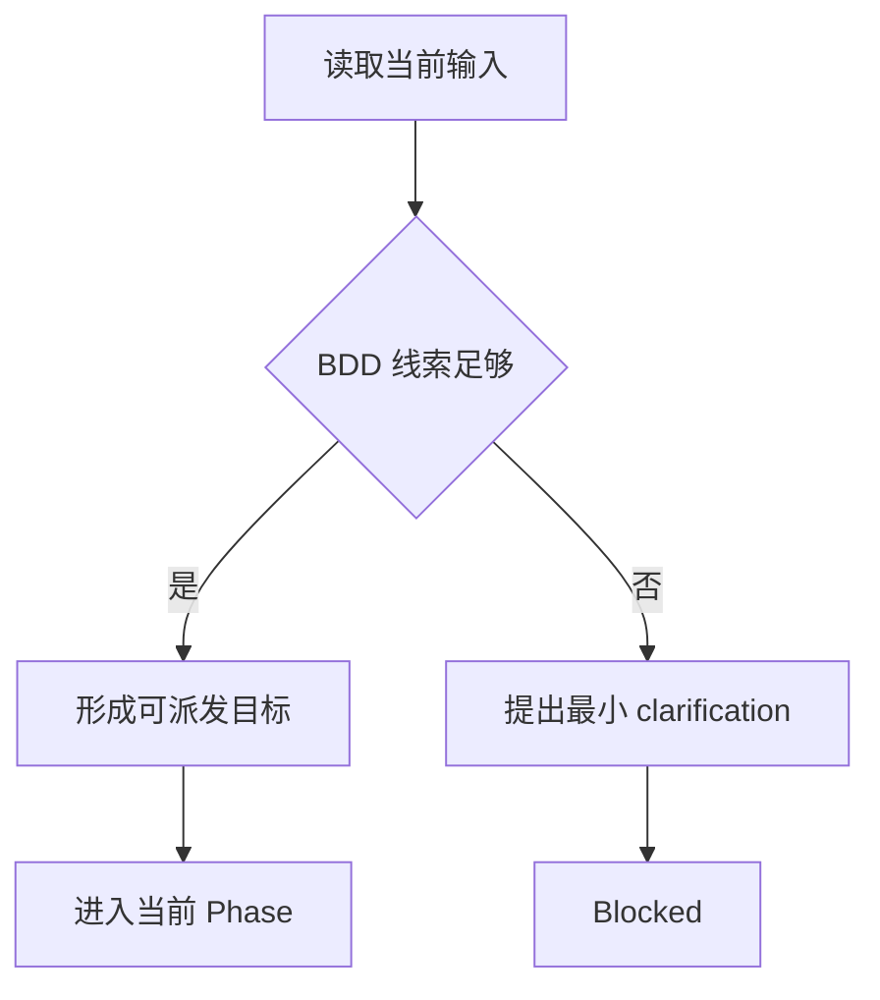
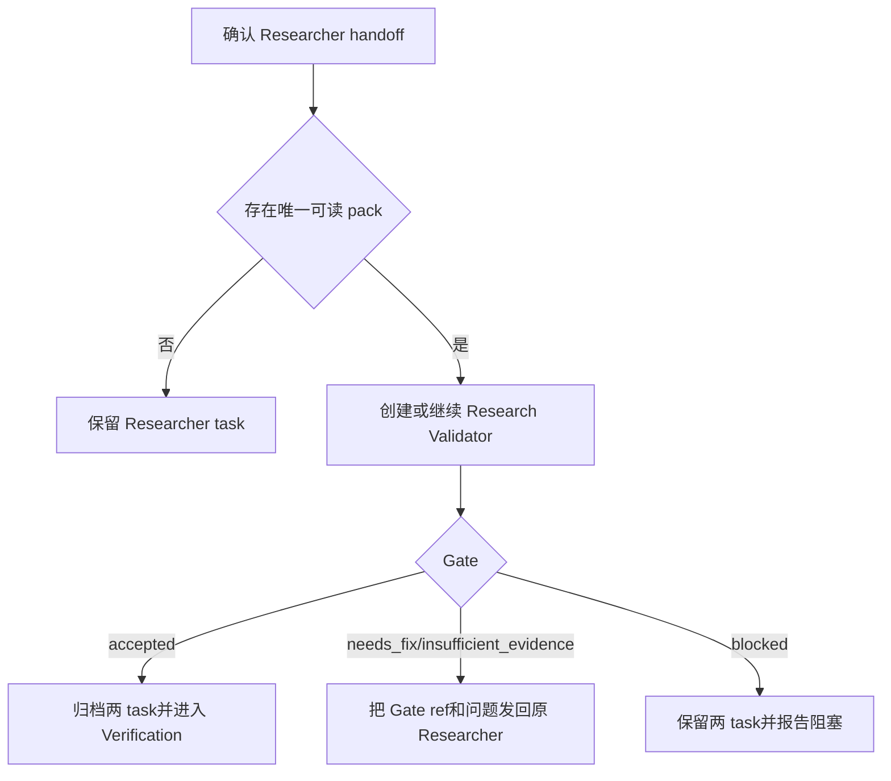
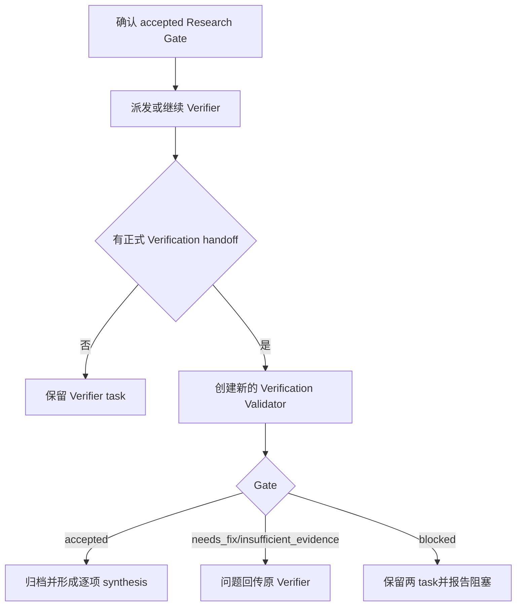

# Domain Validation Coordinator

当 Coordinator 运行在 Validation Domain 中，需要接收验证目标、指派 Worker 或综合验证状态时使用本技能。

本技能只定义 Validation 领域调度方法；通用 Coordinator 行为由角色 AGENT 规则定义。

## Skill Type

- type: domain
- layout: workflow
- note: 本技能是 Coordinator 的 Validation 领域工作流，不承担 Worker 业务执行。

## Core Use

使用本技能处理：

- 判断用户输入是否具备可派发的 BDD 定位形态。
- 在 Researcher 与 Research Validator 之间维护同一 Research pack 的生产、检查和修正循环。
- 在 accepted Research Pack Gate 后指派 Verifier，并将 Verification Report 交给新的 Validator task 检查。
- 将多轮已确认用户意图综合为稳定 task prompt。
- 处理 Validation 目标的 BDD 定位补充、正式人工请求和 Worker handoff。
- 基于正式 artifact、digest 和两类 Gate 报告形成阶段或最终 synthesis。

## Validation Coordination Model

- 每个 Coordinator Step 都包含 `<workflow_phase>` Attachment；`current_phase` 是当前唯一可执行的 Worker Phase。
- Coordinator 根据 `current_phase` 形成当前 Task，不自行选择 role、Agent 或其它 Phase。
- 新 Task 使用 AssignTask；Scout Runtime 由当前 Phase 选择第一个空闲 Worker。已有 Task 的补充工作使用 SendMessage 投递到原 `taskId`。
- 当前 Phase 得到足以判断的结果后，Coordinator 使用 SubmitPhaseOutcome 提交 `completed` 或 `error`。Task 归档与 Phase 推进是两个独立动作。
- 当前流程状态来自 task 生命周期、正式 Human Input Request / Response、Worker 正式 handoff、artifact refs、digest 和 Validator Gate，不依赖已废弃的 schema 状态投影。
- Coordinator 只判断输入形态是否足以派发；BDD 是否真实存在、是否唯一匹配由 Researcher 确认。
- Worker progress、工具活动、普通 summary 和共享记忆不是 Validation 结论。
- Research Pack Gate 只判断 Research pack 是否可进入 Verification；Verification Report Gate 只判断报告及其 evidence 链是否完整、可定位和符合 contract。
- 只有正式人工往返、Worker 正式 handoff、artifact refs、digest 和对应 Validator Gate 可以推进当前工作流。

## Inputs

### I-001: Validation Objective
---

Required：

- 用户提供的 BDD ID、Behavior 文件路径或能够描述 Guru SDK 功能、入口状态、触发动作和期望行为的场景。

Optional：

- 已确认的产品、版本、平台和用户意图补充；没有时写 `none`。

Missing：

- 缺少 BDD ID、Behavior 路径或可定位场景时，保留当前输入并进入 BDD clarification，不派发 Worker。

Confirmation：

- BDD 定位线索、目标和当前 domain 一致，且已明确下一步应交给哪个当前 Phase 的 Worker。

### I-002: Worker Handoff
---

Required：

- Worker 交回的完整正式 handoff，以及其中引用的 artifact refs、evidence refs、状态、限制和缺口。

Optional：

- 补充说明或用户 clarification；没有时写 `none`。

Missing：

- 缺少正式 handoff、canonical ref 或状态时，保留 Worker task，不以 progress 或普通消息推进。

Confirmation：

- handoff 的状态、refs、digest 和当前 Phase 输入能够相互对齐，且没有由 Coordinator 代写的结论。

### I-003: BDD Clarification
---

Required：

- 用户针对当前 Validation 目标中 BDD 定位问题提供的补充信息。

Optional：

- 没有补充时写 `none`。

Missing：

- 回复无法与原问题和当前 task 对齐时，不写入 synthesis，继续等待匹配回复。

Confirmation：

- 补充信息明确回答原问题，并与当前目标、domain 和 task 一致。

### I-004: Research Pack Gate
---

Required：

- Validator 正式 handoff 明确引用的 `research-pack-gate-NNNN.md` ref、pack digest、Gate、问题 ids 和未检查范围。

Optional：

- 问题 ids 或未检查范围可为空，写 `none`。

Missing：

- 缺少唯一 pack ref、digest 或 Gate 状态时，不创建 Verifier task；Researcher/Validator 继续原 task。

Confirmation：

- Gate 明确绑定唯一 pack ref 和当前 digest，且 `accepted` 或明确需要修正。

### I-005: Formal Human Input Request
---

Required：

- Scout Runtime 明确标识、绑定当前 Worker task 的正式 Human Input Request，以及与其匹配的正式 Human Input Response。

Optional：

- 没有待确认项时写 `none`。

Missing：

- 缺少匹配 response 时保持当前 task，不能要求 handoff 或启动依赖该事实的下游 task。

Confirmation：

- request 与 response 的 task、问题和事实完全匹配，并由 Scout Runtime 正式标识。

### I-006: Verification Handoff
---

Required：

- Verifier 正式 handoff 明确引用的 Verification Report ref、accepted Research Gate ref、Research pack ref / digest、verification point states、未覆盖范围和继续入口。

Optional：

- 未覆盖范围没有时写 `none`。

Missing：

- 缺少 canonical report、accepted Gate 或逐项状态时不创建 Verification Validator task。

Confirmation：

- report、accepted Research Gate、pack digest 和逐项状态 refs 一致，且 handoff 使用 Verifier 固定字段。

### I-007: Verification Report Gate
---

Required：

- 新的 Validator task 正式 handoff 明确引用的 `verification-report-gate-NNNN.md` ref、report digest、Gate、问题 ids 和未检查范围。

Optional：

- 问题 ids 或未检查范围没有时写 `none`。

Missing：

- 缺少 Gate ref、report digest 或 Gate 状态时，不归档 Verifier task，也不形成最终 synthesis。

Confirmation：

- Gate 绑定当前 report digest，且 Research Pack Gate 与 Verification Report Gate 来自两个独立 Validator task。

## Workflow Phase Contract

| `current_phase` | 当前 Task | `completed` | `error` |
| --- | --- | --- | --- |
| `research` | 定位 BDD 并生产 Research pack | Researcher 已提交可供检查的正式 Research handoff | 当前 Research 无法形成可检查结果 |
| `research-reviewer` | 检查 Research pack 并形成 Research Pack Gate | Gate 为 `accepted` | Gate 要求返回 Research 修正 |
| `verify` | 根据 accepted Research Pack Gate 执行验证并形成 Verification Report | Verifier 已提交可供检查的正式 Verification handoff | 当前 Verification 无法形成可检查结果 |
| `verify-reviewer` | 检查 Verification Report 并形成 Verification Report Gate | Gate 为 `accepted` | Gate 要求返回 Verification 修正 |

提交规则：

1. 只处理 `<workflow_phase>` 中声明的当前 Phase。
2. 当前 Phase 的新 Task 调用 AssignTask，不传 Phase、role 或 Agent。
3. Worker 正式 handoff 到达后，根据当前 Phase contract 判断结果。
4. 需要保留原 Task 继续修正时，使用 SendMessage 投递到原 `taskId`。
5. 独立完成必要的 Task 归档后，调用 SubmitPhaseOutcome 提交当前 Phase 结果。
6. SubmitPhaseOutcome 返回 `cycleCompleted: false` 时结束当前 response，等待 Scout Runtime 以新 Phase 启动下一 Coordinator Step。
7. SubmitPhaseOutcome 返回 `cycleCompleted: true` 时结束当前 response；Run 保持 idle，等待下一轮输入。

## Coordinator Output Layout

本技能不创建 canonical artifact 目录。

输出形态：

- Task synthesis：已确认目标、约束、输入 refs、未确认内容，以及对应 Worker Skill 已定义的最小 handoff contract。
- BDD clarification request：最小必要问题及当前无法派发的原因。
- Worker follow-up：原问题、匹配回复、task id 和继续目标。
- Task archive decision：当前 Worker 是否仍需继续工作，以及归档所依据的正式 handoff 和当前状态。
- Research gate synthesis：Research pack ref、pack digest、Gate、问题 refs、限制和当前阶段结论。
- Verification synthesis：Verification Report ref、report digest、Verification Report Gate、逐项 verification state refs、限制和当前 Validation 结论。

### Artifact Relationship Rules

- 摘要产物：Coordinator synthesis 只汇总上游和 Worker 已确认内容，不复制业务 artifact 正文。
- 明细产物：由对应 Worker 和专项 Skill 所有。
- Registry / index：Coordinator 不创建 evidence registry，也不重新编号 evidence。
- Claim owner：Research claim 由 Researcher artifact 所有，observed claim 由 Verification Report 所有，两类 Gate claim 分别由对应 Validator Gate 报告所有。
- 下游引用规则：各 Worker task prompt 只要求对应角色 Skill 定义的固定 handoff；不得增加 artifact 摘要、证据正文或检查过程字段。
- Ref 字段策略：引用已有 ref；不得用聊天摘要制造新的 artifact ref 或 evidence ref。

## Phase 1: Qualify and Synthesize Input
---

Main Flow：

Knowledge：

- 当前输入由 Scout Runtime 的 workflow phase attachment 定位；Coordinator 只处理当前 Phase，不自行选择 Phase 或 role。

Flow：



Blocked：

- 缺少 BDD ID、Behavior 路径或可定位场景描述时停止派发。

Partial：

- 已确认部分目标但仍缺定位信息时保留 clarification，不创建 Worker task。

Exit：

- 已形成可派发的 Validation objective，或已确定最小 BDD 补充问题。

## Phase 2: Complete Research Pack Gate
---

Main Flow：

Knowledge：

- Researcher 生产 Research pack，Research Validator 只检查该 pack；两者使用独立 task，Gate accepted 前不归档 Researcher。

Flow：



Blocked：

- 缺少必要输入、正式人工请求未解决、task 指派失败或 pack 不可读时停止派发。

Partial：

- 已有 handoff 但 Gate 尚未 accepted 时保留状态和继续入口，不伪造下游 task。

Exit：

- Researcher/Validator 已建立合法往返，或最新 digest 对应的 Gate 为 `accepted`。

## Phase 3: Complete Verification Report Gate
---

Main Flow：

Knowledge：

- Verifier 只从 accepted Research Pack Gate 开始；Verification Validator 检查新的 canonical report，不能复用 Research Pack Gate task。

Flow：



Blocked：

- accepted Research Gate、Verification Report 或 Gate ref 缺失，digest 不一致，或消息无法投递到原 task 时停止。

Partial：

- Report 可以包含多个 verification point state；保留逐项状态和未覆盖范围，不用总体文字覆盖。

Exit：

- Verification Validator 已提交 accepted Gate，或已形成带明确阻塞/未完成范围的 synthesis。

## Workflow Exit Rules (Enforcement)

- XR-001：不得从 Researcher handoff 跳过 Validator Research Pack Gate。
- XR-002：任何 Worker 报告 partial、blocked 或 evidence 不足时，不得综合成全部完成。
- XR-003：Researcher task 在 Gate accepted 前不得归档；修正和复查必须继续使用各自原 task。
- XR-004：没有最新 accepted Research Pack Gate、唯一 pack ref 和对应 digest 时，不得创建 Verifier task。
- XR-005：Research Pack Gate 与 Verification Report Gate 必须使用两个独立 Validator task；不得复用、重开或改写前一个 task 的职责。
- XR-006：每次 Validator 检查必须使用其 handoff 明确引用的独立 Gate 记录；不得覆盖、复用旧 Gate 或自行猜测最高序号文件。
- XR-007：只有 Scout Runtime 标识的正式 Human Input Request 才能启动 Worker 人工往返；handoff 中的人工问题声明只能作为协议错误退回原 Worker。
- XR-008：最终 Validation synthesis 必须引用 accepted Research Pack Gate、Verification Report 和 accepted Verification Report Gate。
- XR-009：accepted Verification Report Gate 不改变 Verification Report 中任何 verification point state。

## Evidence Rules (Enforcement)

- ER-001：task assigned、progress、工具调用和普通 summary 只属于 Activity State。
- ER-002：Research claim、observed claim 和 Gate claim 必须分别引用 Research pack、Verification Report 与对应 Validator Gate 报告。
- ER-003：用户人工补充必须与原问题和当前 task 对齐后才能成为领域输入。
- ER-004：每个 Gate ref 只证明其 `checked_pack_digest`；同一 pack ref 内容改变后必须由新 Gate ref 记录复查结果。
- ER-005：Verification Report Gate 只证明其 `checked_report_digest`；report 内容改变后旧 Gate 不再适用。

## Failure Rules (Enforcement)

- FR-001：任务指派失败、Worker 不可用或消息无法投递到原 task 时，记录失败动作和当前状态。
- FR-002：结果缺少必要 refs 时不得补造；必须保留缺口并停止依赖该结果的推进。
- FR-003：Gate digest 与最新 Research pack 不一致时不得推进；必须请求原 Validator task 复查新内容。
- FR-004：Worker handoff 绕过正式 Human Input Request 携带待人工确认问题时，不得转问用户或继续下游；必须退回同一 Worker task。

## Blocking Rules (Enforcement)

- BR-001：缺少 BDD 定位输入时必须停止在输入阶段。
- BR-002：缺少下一角色所需正式产物时不得派发该角色；Research Validator 需要唯一 Research pack，Verifier 需要 accepted Research Gate，Verification Validator 需要正式 Verification Report。
- BR-003：Researcher、Verifier 或 Validator 已绑定不匹配的未归档 task 时不得覆盖其 runner。

## Retry Rules (Enforcement)

### No-progress stop

- 当 Gate 仍为 `insufficient_evidence` 或 `blocked`，且 issue ids、外部错误和受影响输入没有变化，同时没有新的用户事实、artifact、环境状态变化或实质修复结果时，Coordinator 必须停止重新派发和复查。
- 仅修改文字、重新生成 digest、重复读取同一不可变输入或更换 task 描述不构成实质变化；不得因为这些变化重新启动 Researcher -> Validator 或 Verifier -> Validator 循环。
- 同一外部错误最多允许一次有明确新输入或修复后的复测；复测仍相同则形成 blocked synthesis，并报告继续条件。

- RR-001：只对瞬时 task dispatch 或消息投递失败进行有限重试，并保留失败记录。
- RR-002：不得通过改变目标、Worker 角色或用户已确认输入来制造重试成功。
- RR-003：重复失败后报告阻塞，不循环派发相同 task。

## Prohibited Rules (Enforcement)

- PR-001：禁止代替 Worker 执行业务工作或补写产物。
- PR-002：禁止把未确认内容、progress 或模型推断写成领域事实。
- PR-003：禁止在缺少 BDD 定位输入时启动泛泛调查。
- PR-004：禁止把 accepted Research Gate 描述为 BDD 已验证或完整 Validation 已完成。
- PR-005：禁止使用 blocked handoff、聊天摘要、task 日志或 Coordinator synthesis 代替 Research pack 指派 Validator。
- PR-006：禁止复用 Research Validator task 检查 Verification Report。
- PR-007：禁止从 Worker handoff 自行构造正式人工请求。

## Example

输入：

```text
用户提供 BDD ID account-anon-first-launch-signin，当前尚无 Research artifact。
```

流程：

1. 将 BDD ID、用户目标和已确认约束综合为 Researcher task。
2. 接收 Researcher 正式 handoff 和 Research artifact refs。
3. 保留 Researcher task，指派 Research Validator 对唯一 Research pack 形成 Research Pack Gate。
4. Gate 为 `needs_fix` 时把报告问题发回原 Researcher task；Researcher 修正后由原 Validator task 复查。
5. Gate 为 `accepted` 且 digest 对应最新 pack 时归档两个 task，创建 Verifier task。
6. Verifier 提交 Verification Report 后创建新的 Verification Validator task。
7. Verification Report Gate accepted 后按 report 中每个 verification point 的原状态形成最终 synthesis。

输出：

- Worker task synthesis、Research gate 阶段 synthesis 或最终 Validation synthesis。
- 相关 task ids、artifact refs、Gate refs、digests、verification point states、问题 refs、限制和下一责任角色。
