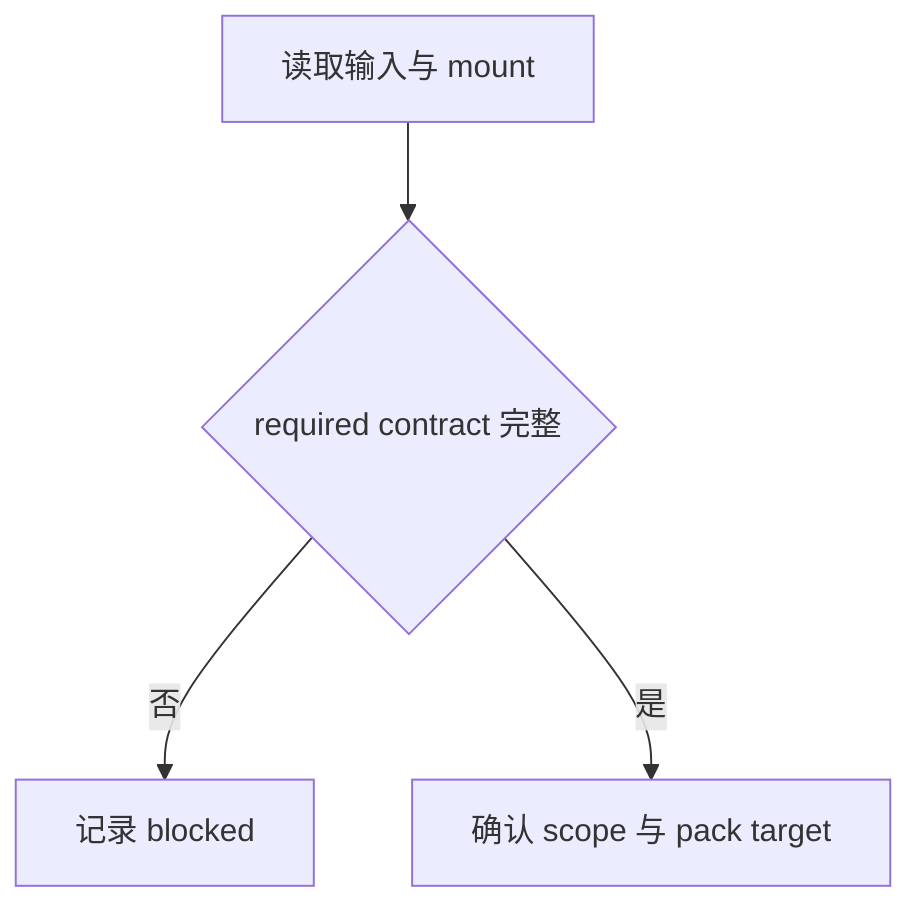
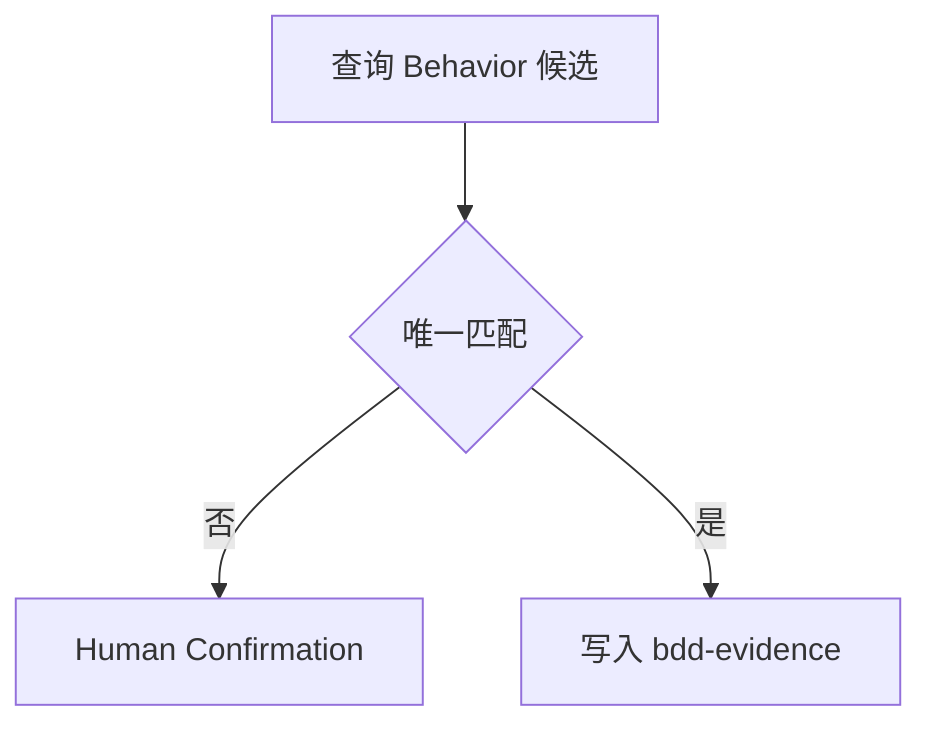
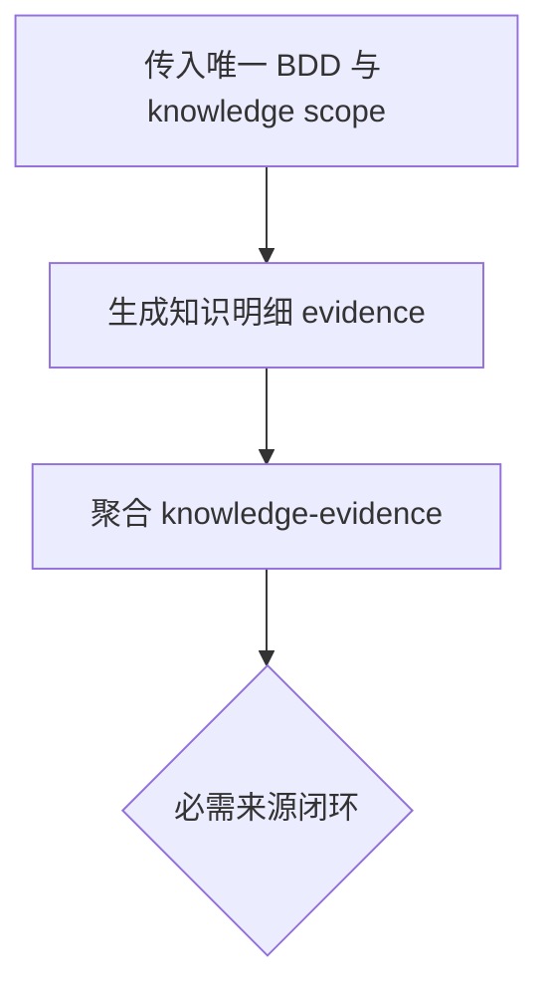
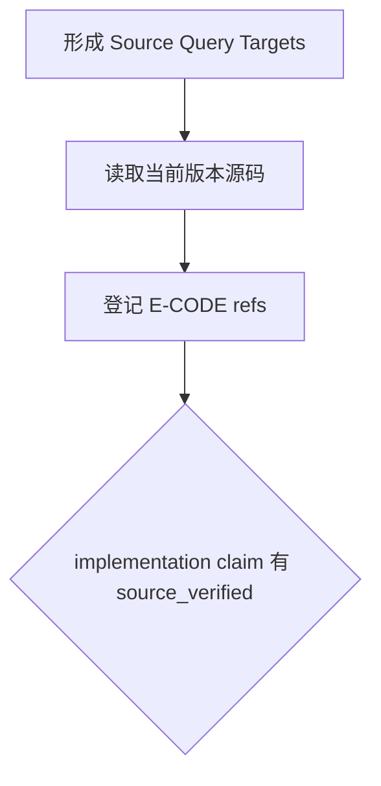
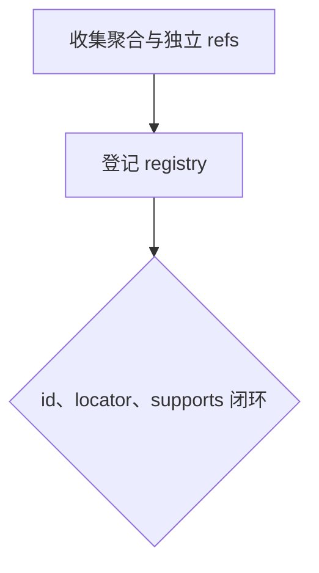
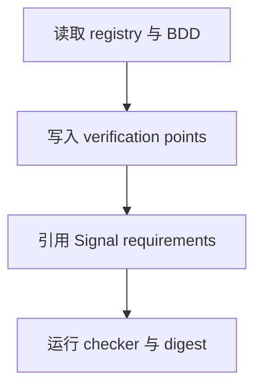

# Domain Validation Research Pack

当 Scout Researcher 需要把已确认的 Validation 目标收敛成唯一 Research Pack，并为后续 Validator 和 Verifier 提供稳定输入时使用本技能。

本技能拥有 Research Pack 的编排、聚合、状态和 handoff contract。Guru Knowledge 与当前版本代码的具体采集方法分别由 `tool-guru-knowledge` 和 `tool-jarvis-codebase` 拥有；具体信号语义由对应 Signal Skill 拥有。

模板文件的 `scout.resource` frontmatter 只描述 Scout Runtime 如何物化和提供模板资源。生成 Research artifact 时不得复制该运行时 metadata；checker 会拒绝 artifact frontmatter 中的 `scout.resource`。`evidence-registry.md` 的 `Human Confirmation Evidence` section 只有在 pack 实际包含 `E-HUMAN-*` 时才需要保留；无人工确认 evidence 时可以省略整个 section。

## Skill Type

- type: domain
- layout: workflow
- note: 本技能是多阶段 research workflow，必须使用完整 Inputs、Workflow、Output Layout、Artifact Relationship Rules、Phase 和规则分层。

## Core Use

使用本技能处理：

- 将上游目标收敛为唯一 BDD，并在无法唯一选择时进入人工确认 Gate。
- 编排 `tool-guru-knowledge` 和 `tool-jarvis-codebase` 两个 producer contract。
- 为所有证据分配稳定 evidence id。
- 将 producer artifacts 聚合为唯一 Research Pack。
- 构建 `knowledge-evidence.md`、`code-evidence.md` 和 `evidence-registry.md`。
- 生成 `verification-manual.md`，按 verification point 写清用户画像、Given / When / Then、支持证据编号和需要收集的信号。
- 对 Manual 中选择的 Signal 按对应 contract 定义业务匹配要求。
- 运行 Research artifact checker、计算 digest 并形成正式 Research handoff。

## Evidence Model

knowledge 和 code 都是 producer evidence，不是最终验证结论。

- `tool-guru-knowledge` 产生 Behavior 候选和 `E-CAP-*`、`E-AVAIL-001`、`E-PLATFORM-001` 知识明细证据。
- `tool-jarvis-codebase` 产生当前版本 `E-CODE-*` 源码明细证据。
- 本技能拥有 `E-BDD-001`、`E-KB-001`、聚合文件、registry 和 manual 的关系。
- runtime / log / UI / test / device signal 才能证明 behavior observed claim。
- Research 阶段只形成 candidate evidence、source-verified implementation evidence 和 verification manual。
- Research 产物不得写 `passed`、`failed`、`verified` 作为最终业务结论。

Evidence ID 使用稳定前缀：

- `E-BDD-001`：当前 Pack 唯一的 Behavior / BDD 聚合证据，由顶层 `bdd-evidence.md` 自身拥有。
- `E-KB-001`：当前 Pack 唯一的 Guru knowledge 聚合证据，由顶层 `knowledge-evidence.md` 自身拥有。
- `E-CAP-*`：每个相关 Capability 的身份、范围和 11 个 Specifications 维度。
- `E-AVAIL-001`：当前 Pack 唯一的跨 Capability Availability 聚合证据。
- `E-PLATFORM-001`：当前 Pack 唯一的跨 Capability Platform 聚合证据。
- `E-PERSONA-*`：由 BDD、knowledge 或人工确认 evidence 支撑的独立用户画像事实。
- `E-CODE-*`：current version source code symbol evidence。
- `E-RUNTIME-*`：runtime / device / build / test / log signal，占位时只能写入 verification manual 的 Signals To Collect。
- `E-HUMAN-*`：用户在初始输入或正式人工回复中明确确认的任意事实记录。

## Research State Model

Research workflow 和聚合 artifact 只允许以下状态组合：

- `status: draft` + `completion_state: partial`
- `status: ready` + `completion_state: complete`
- `status: blocked` + `completion_state: blocked`

状态规则：

- `ready + complete` 只表示 Research pack 已完整形成，不表示 BDD 已通过验证。
- 任何 artifact 都不得使用 `ready + partial`、`draft + complete` 或其它组合。
- Research pack 不保存独立顶层状态 artifact；`scout-research-artifact-check` 根据五个必需聚合 artifact 的状态派生 Pack 状态。
- 五个必需聚合 artifact 全部为 `ready + complete` 时，Pack 才是 `ready + complete`；任一为 `blocked + blocked` 时 Pack 为 `blocked + blocked`；其它组合派生为 `draft + partial`。
- Pack 为 `ready + complete` 时，所有 implementation claim 必须有 `source_verified` 的 `E-CODE-*`。
- 模板中未注明 `Nice to Have，可不填写` 的事实字段必须取得确切信息；现有输入、证据和工具结果都无法确认时，识别后必须立即发起人工求证、停止后续阶段并保持 `draft + partial`。
- 明确注明 `Nice to Have，可不填写` 的字段有可靠信息时填写；缺失不阻塞完成，也不单独触发人工求证。
- 由人工确认闭环的事实必须登记为 `E-HUMAN-*`；knowledge 候选或 Researcher 推断不能替代用户确认。
- task handoff 必须使用英文标题 `Research Handoff State`，在标题下用中文传递 `complete | partial | blocked` 状态、唯一 pack ref、digest、evidence registry ref、verification manual ref、问题或限制、人工确认状态和继续入口；不得复制 artifact 中的证据或验证点详情。存在待人工确认的必需事实时不得提交 handoff，artifact 为其它原因部分完成时不得在 handoff 中描述为 Research 已完成。

## Pack Source Model

- `knowledge-evidence.md` 聚合 `tool-guru-knowledge` 提供的 knowledge repository、knowledge root 和 knowledge source refs。
- `code-evidence.md` 聚合 `tool-jarvis-codebase` 提供的 managed codebase 名称、版本、路径、CodeGraph 状态和 `E-CODE-*` refs。
- Domain Skill 不重新解释 producer source contract，也不把本地路径提升为 canonical locator。
- Pack 中任何 producer evidence 失效时，相关聚合 claim、registry 和 manual refs 必须同步修正。

## Native Subagent Orchestration

- native subagent 的通用委派、父 Worker 责任和结果消费规则遵守 `worker.AGENTS.md`。本技能只允许把独立的 Knowledge 或 Code producer 工作作为候选委派范围；具体输入、只读边界和返回结构分别遵守 `tool-guru-knowledge` 与 `tool-jarvis-codebase`。

必须由父 Researcher 保留的责任：

- 唯一 BDD 选择、Human Confirmation Gate 判断和人工请求。
- 两个 producer 的共同 BDD、版本、平台和 artifact scope 对齐。
- evidence id 分配、交叉引用消歧、聚合 artifact、registry、manual 和正式 Research Pack 写入。
- checker、digest、Scout Dynamic Tool 调用和正式 Research handoff。

父 Researcher 按 artifact 的真实数据依赖写 canonical Research Pack；依赖 producer 结果的内容必须等待相应结果返回并被消费。全部 artifact 稳定并完成人工事实闭环后才能执行最终 checker 和 digest。

## Inputs

### I-001: Verification Target

---

Required：

- 上游提供的 BDD ID、Behavior 文件路径、Guru SDK 场景描述或明确验证目标。
Optional：

- issue / PR / 用户描述；没有时写 `none`。

Missing：

- 缺少可定位 BDD 或目标不唯一时，停止后续 evidence 生产并进入人工确认。

Confirmation：

- Research 必须收敛到唯一可定位 BDD fact 后再继续整理 knowledge 和代码证据。
- 无法唯一定位 BDD fact 时，记录为需人工确认项。

### I-002: Mount Capability

---

Required：

- 当前 mount 可见本技能、`internal-runtime-inspector`、`tool-guru-knowledge`、`tool-jarvis-codebase`、角色 Domain Skill 已按 Signal 完整读取规则准备的 contract、`scout-research-artifact-check` 和 `scout-artifact-digest`。

Optional：

- 可选 producer、Signal 或 MCP 能力；没有时写 `none`。

Missing：

- 缺少任一 required Skill/Tool 或 artifact target 不可用时，保持 `blocked`，不得猜测替代能力。

Confirmation：

- 当前 mount 可读取所有必需 contract，且角色已完成适用 Signal 集合的 readiness gate。
- 当前 mount、Skill 和 Tool 的定位与可见性已按 `internal-runtime-inspector` 确认；producer 自己确认其能力。

### I-003: Producer Scope

---

Required：

- 传给 `tool-guru-knowledge` 的产品、knowledge boundary 和知识查询目标。
- 传给 `tool-jarvis-codebase` 的 managed repository、版本和 Source Query Targets。

Optional：

- scope expansion candidate；没有时写 `none`。

Missing：

- 任一 producer scope 缺少产品、BDD 或版本边界时，暂停对应阶段并记录阻塞。

Confirmation：

- 两个 producer 的 BDD、产品版本、平台和验证范围完全一致，且候选扩展已由父 Researcher 明确接受或拒绝。
- Domain Skill 只负责 scope 对齐，不复制 producer 的来源解析方法。

### I-004: Target Context

---

Required：

- 当前产品版本和 SDK version。
- 当前验证目标平台及形成 Verification Manual 所需的目标上下文。

Optional：

- 用户画像线索或其它上下文；没有时写 `none`。

Missing：

- 版本或平台缺失且影响必需 evidence 时，进入 Human Confirmation；不得选 `latest` 或猜测平台。

Confirmation：

- 版本、平台、BDD 和 producer scopes 能共同解释当前 Research 范围。
- producer 对版本、平台和来源状态的具体处理遵守各自 Skill。

### I-005: Artifact Target

---

Required：

- 当前 Researcher 私有 artifact root 下的唯一 Research pack 目录：

```text
${SCOUT_ARTIFACT_ROOT}/<bdd-id>-research-pack/
```

Optional：

- 已存在的 pack refs；没有时写 `none`。

Missing：

- 目录不可写或无法按唯一 BDD 建立时，停止并记录阻塞，不创建临时副本。

Confirmation：

- artifact root、BDD 目录、写入权限和当前 run 一致；后续修正复用同一 pack ref。
- `<bdd-id>` 使用 Phase 2 唯一收敛的 BDD id；Gate 修正原地更新，不创建版本副本。

## Research Workflow

本节只列阶段顺序；具体命令、模板、注意事项和证据要求见各 Phase。

- Phase 1：确认边界、输入和当前 mount 能力。
- Phase 2：收敛到唯一 BDD fact。
- Phase 3：收集 Guru knowledge evidence。
- Phase 4：收集当前版本代码 evidence。
- Phase 5：构建 Evidence Registry。
- Phase 6：准备 Verification Manual。

## Research Output Layout

Research pack 固定写入：

```text
${SCOUT_ARTIFACT_ROOT}/<bdd-id>-research-pack/
  bdd-evidence.md
  knowledge-evidence.md
  code-evidence.md
  evidence-registry.md
  verification-manual.md
  evidence/
    E-CAP-001.md
    E-AVAIL-001.md
    E-PLATFORM-001.md
    E-PERSONA-001.md
    E-HUMAN-001.md
    E-CODE-001.md
```

模板目录索引：

```text
templates/template-index.md
```

创建产物文件时必须复用本技能模板：

```text
templates/bdd-evidence.md
templates/knowledge-evidence.md
templates/user-persona-evidence.md
templates/human-confirmation-evidence.md
templates/code-evidence.md
templates/evidence-registry.md
templates/verification-manual.md
```

知识明细 evidence 模板由本 Domain Pack 拥有；producer Skill 只提供事实来源和定位：

```text
domain-validation-research-pack/templates/capability-evidence.md
domain-validation-research-pack/templates/availability-evidence.md
domain-validation-research-pack/templates/platform-evidence.md
tool-jarvis-codebase/templates/source-code-evidence.md
```

模板读取规则：

- Phase 1 必须先读取 `templates/template-index.md`，再读取其中标记为“是”的模板。
- 进入某类条件 evidence 的收集或写入前，必须读取 `template-index.md` 中对应的条件模板。
- Phase 3 必须读取 `tool-guru-knowledge/SKILL.md` 及本目录的 `templates/template-index.md` 和条件 evidence 模板。
- Phase 4 必须读取 `tool-jarvis-codebase/templates/template-index.md` 和 `source-code-evidence.md`。
- 不得凭记忆缩减模板章节、字段或状态规则；不适用字段使用 `none`、`irrelevant` 或 limitation 明确表达。
- `scout-research-artifact-check` 只检查弱 Markdown 的结构、状态、来源字段和引用闭环，不判断业务事实是否正确。

文件职责：

- `bdd-evidence.md`：自身即唯一 `E-BDD-001`，记录 Behavior ref、Given / When / Then、claim、status、匹配理由和排除候选。
- `knowledge-evidence.md`：自身即唯一 `E-KB-001`，摘要聚合 BDD、Capability、Specifications、Availability 和 Platform evidence refs；不嵌完整 evidence block。
- `code-evidence.md`：登记 implementation claim、managed codebase 名称、版本、路径和 CodeGraph 状态，并聚合当前版本 `E-CODE-*` artifact refs、locator、claim_supported 和 limitations。
- `evidence-registry.md`：所有证据编号的集中索引。
- `verification-manual.md`：验证手册，只引用 evidence id，不粘贴证据正文；verification point 通过 `E-PERSONA-*` 引用独立用户画像 evidence。
- `evidence/*.md`：除 `E-BDD-001` 和 `E-KB-001` 外，每条 research evidence 的独立 artifact 文件，文件名必须和 evidence id 对齐。
- `evidence-registry.md` 的 `Human Confirmation Evidence` 是条件 section：没有 `E-HUMAN-*` 时省略；登记任何 `E-HUMAN-*` 时必须保留并填写对应 registry entry。

### Artifact Relationship Rules

- `${SCOUT_ARTIFACT_ROOT}/<bdd-id>-research-pack/` 是当前 run/BDD 的唯一 Research pack；修正只改变其中内容和 digest，不改变 pack ref。
- pack 顶层只允许五个聚合文件和 `evidence/`；Gate follow-up、修订说明或临时文件不得写入 pack 顶层。
- `E-BDD-001` 只由顶层 `bdd-evidence.md` 拥有并登记到 registry，禁止创建 `evidence/E-BDD-001.md` 或其它 `E-BDD-*`。
- `E-KB-001` 只由顶层 `knowledge-evidence.md` 拥有并登记到 registry，禁止创建 `evidence/E-KB-001.md` 或其它 `E-KB-*`。
- 除 `E-BDD-001` 和 `E-KB-001` 外，所有 research evidence 都必须是独立 evidence artifact 文件；`E-CAP-*`、`E-AVAIL-001`、`E-PLATFORM-001`、`E-PERSONA-*`、`E-HUMAN-*`、`E-CODE-*` 都不能只存在于聚合文件中。
- `bdd-evidence.md` 同时拥有候选收敛过程和 `E-BDD-001` claim；`knowledge-evidence.md`、`evidence-registry.md` 和 `verification-manual.md` 只引用该 evidence id，不复制正文。
- `domain-validation-research-pack/templates/capability-evidence.md` 是单条 `E-CAP-*` 模板；每个相关 Capability 必须有独立 artifact，并在该 artifact 内完整登记 11 个规格维度。
- 本目录的 Availability 和 Platform 模板分别只生成一份 `E-AVAIL-001` 和 `E-PLATFORM-001`，跨全部相关 `E-CAP-*` 聚合版本与平台事实。
- `templates/bdd-evidence.md` 是顶层 BDD 聚合证据模板；`user-persona-evidence.md` 和 `human-confirmation-evidence.md` 是本 Domain Skill 拥有的条件 evidence 模板。
- API Index 和 API 文档只登记为对应 `E-CAP-*` 的 `CAPSRC-*`，其语义写入“数据与接口”规格维度；不得生成 `E-API-*`。
- `E-PERSONA-*` 使用 `user-persona-evidence.md` 独立表达用户画像，并通过 `Source Evidence` 引用支撑画像字段的 `E-BDD-001`、`E-KB-001`、`E-CAP-*` 或 `E-HUMAN-*`；不得把用户画像字段写入 `E-HUMAN-*`。
- `E-HUMAN-*` 只记录一个经用户明确确认的事实、原始输入或回复定位及其适用对象，不拥有被确认事实所属的业务模板。
- `tool-guru-knowledge` 生成或返回知识明细 artifact refs，Phase 3 将它们汇总进 `knowledge-evidence.md`。
- `tool-jarvis-codebase/templates/source-code-evidence.md` 是单条代码 evidence artifact 模板；Phase 4 生成或引用 `E-CODE-*` artifact，Phase 5 再汇总进 `code-evidence.md` 和 `evidence-registry.md`。
- `implementation claim` 只登记在 `code-evidence.md`，不得登记在 `knowledge-evidence.md` 或 `verification-manual.md`。
- `evidence-registry.md` 只登记索引，不定义 claim 事实。
- `verification-manual.md` 只引用 evidence id，不定义 claim 事实。
- `knowledge-evidence.md` 的 ref field policy：`E-BDD-001` 的 `artifact_ref` 固定为 `bdd-evidence.md`，`E-KB-001` 的 `artifact_ref` 固定为 `knowledge-evidence.md`；其它条目的 `artifact_ref` 必须指向独立 evidence artifact，来源定位保存在对应明细证据中。
- `code-evidence.md` 的 ref field policy：`E-CODE-*` 来自 `tool-jarvis-codebase` 产物，必须登记 `artifact_ref`。
- 聚合文件不复制大段来源正文或完整 evidence block；只记录摘要字段和必要 refs。
- knowledge repository、knowledge root 和 source refs 由 `knowledge-evidence.md` 所有；managed codebase 名称、版本、路径和 CodeGraph 状态由 `code-evidence.md` 所有，单条 `E-CODE-*` 仍必须保存可重放源码 locator 和 CodeGraph 查询信息。

## Phase 1: Confirm Boundary and Inputs
---

Main Flow：

Knowledge：

- 确认 product、domain、BDD、version、platform、producer scopes、Signal readiness 和唯一 pack target。

Flow：



Blocked：

- 缺少 required Skill/Tool、输入边界或 artifact target 不可写时停止。

Partial：

- 只能确认输入和 mount 边界时不创建空 pack，保留 task 状态。

Exit：

- Required capabilities、producer scopes、Signal readiness 和 artifact target 已确认。

## Phase 2: Converge to One BDD Fact
---

Main Flow：

Knowledge：

- 使用 `tool-guru-knowledge` 的候选定位结果，由父 Researcher 选择唯一 Behavior identity；本阶段不写 producer 的正式证据正文。

Flow：



Blocked：

- 无可重放候选或多个有效候选无法消歧时停止并保留人工问题。

Partial：

- 已有候选但尚未完成其它 evidence 时可保留 `bdd-evidence.md` 草稿。

Exit：

- 唯一 BDD fact、selected reason、Given/When/Then 和 `E-BDD-001` 已记录。

## Phase 3: Collect Guru Knowledge Evidence
---

Main Flow：

Knowledge：

- 调用 `tool-guru-knowledge` 形成 Capability、Availability 和 Platform evidence，再聚合 `E-KB-001`。

Flow：



Blocked：

- producer blocked、关键 artifact 缺失、scope 不一致或来源冲突影响必需事实时停止。

Partial：

- 非关键知识缺失时保留 producer refs 和 limitation，不标记完成。

Exit：

- `E-CAP-*`、`E-AVAIL-001`、`E-PLATFORM-001` 和 `E-KB-001` refs 完整聚合。

## Phase 4: Collect Current Version Code Evidence
---

Main Flow：

Knowledge：

- 使用 `tool-jarvis-codebase` 将 BDD/knowledge claims 转为 Source Query Targets，并聚合当前版本 `E-CODE-*`。

Flow：



Blocked：

- 无法形成当前版本 `E-CODE-*` 或 locator 不可重放时停止，不把 knowledge 写成实现事实。

Partial：

- 只有 CodeGraph 候选时保留查询缺口，不能生成完成态 Manual。

Exit：

- `code-evidence.md` 已聚合版本、路径、CodeGraph 状态和每个 implementation claim 的 `source_verified` refs。

## Phase 5: Build Evidence Registry
---

Main Flow：

Knowledge：

- Registry 只索引 evidence id、source、locator、supports 和 limitations，不复制证据正文或形成最终结论。

Flow：



Blocked：

- evidence id 重复、source/locator 缺失或 supports 无法闭环时停止。

Partial：

- 存在人工确认缺口时可保留 registry 草稿，Manual 只能引用已闭环 refs。

Exit：

- Registry 覆盖 `knowledge-evidence.md`、`code-evidence.md` 的全部 refs，且无孤立 supports。

## Phase 6: Prepare Verification Manual
---

Main Flow：

Knowledge：

- Manual 锁定 verification points、persona ref、Given/When/Then、supporting evidence 和 Signal requirements；Signal Skill 拥有信号语义，Manual 只拥有本任务匹配 requirement。

Flow：



Blocked：

- 缺少唯一 BDD、`E-CODE-*`、persona、Signal contract 或 registry 闭环时停止受影响 Manual。

Partial：

- 允许在无必需人工确认时保留 Manual 草稿，并记录缺口、checker 结果和继续条件。

Exit：

- 每个 verification point 有 persona、Given/When/Then、supporting refs 和完整 Signal requirement；pack checker 与 digest 均通过。

## Workflow Exit Rules (Enforcement)

- XR-001：不得跳过会影响 claim、evidence registry 或 verification manual 的前置 Phase。
- XR-002：任何阻塞项未关闭时，不得把 Research 输出标记为 `ready` 或 `complete`。
- XR-003：不存在待人工确认的必需事实时，`partial` 状态才能用于交接已定位证据和其它缺口；不得把 `partial` 产物写成完整 verification manual。
- XR-004：Knowledge evidence、code evidence、registry 和 manual 必须遵守 `### Artifact Relationship Rules` 中的 claim owner 和 ref field policy。
- XR-005：最终 Research 输出必须包含闭环 evidence ids、source / locator、limitations、failed_commands、retry_log，以及已闭环人工确认记录或 `none`。
- XR-006：verification manual 只能引用 evidence id，并定义适用 Signal 的业务匹配 requirement；不得重新定义 evidence claim、复制证据正文或制定 runtime 执行策略。
- XR-007：完整 Research pack 必须通过 `scout-research-artifact-check`，并由 checker 派生为 `ready + complete`，才能提交标题为 `Research Handoff State`、内容为中文的 complete handoff。
- XR-008：checker 将 Research pack 派生为 `draft + partial` 或 `blocked + blocked`，且不存在待人工确认的必需事实时，handoff 必须使用对应的 `partial` 或 `blocked`；存在待人工确认的必需事实时不得提交 handoff。
- XR-009：task handoff 必须包含 Verification Manual ref；manual 尚未形成时必须说明停留阶段和原因。不得用 artifact 列表或复制验证点详情替代正式 ref。
- XR-010：同一 run/BDD 的首次提交和 Gate 修正必须使用同一个 `<bdd-id>-research-pack/` ref；每次提交都必须携带 `scout-artifact-digest` 计算的当前 `scout-directory-sha256-v1` digest 和算法名。
- XR-011：完成态 verification manual 及其引用的 `E-PERSONA-*` 中所有未注明可不填写的事实字段必须闭环；通过人工求证确认的字段必须有已登记到 registry 的 `E-HUMAN-*`，并由其 `applies_to` 定位该字段。

## Evidence Rules (Enforcement)

- ER-001：Knowledge 和 Code producer artifacts 都是 evidence，不是最终验证结论。
- ER-002：`tool-guru-knowledge` 的 evidence 只能支撑 intent、spec、behavior、availability 和 platform claim。
- ER-003：`tool-jarvis-codebase` 的 current version evidence 才能支撑 implementation claim。
- ER-004：runtime evidence 才能支撑 behavior observed claim。
- ER-005：每类 producer evidence 必须符合其所有者 Skill 的来源、状态和模板 contract；本技能不得放宽 producer 规则。
- ER-006：API Index 和 API 文档只能作为 `E-CAP-*` 的 `CAPSRC-*` 及“数据与接口”规格来源；当前版本 API symbol 由 `E-CODE-*` 支撑，禁止生成 `E-API-*`。
- ER-007：Availability evidence 不能替代当前有效业务规则。
- ER-008：Platform evidence 只能说明平台差异或共享契约，不能替代 runtime 观察。
- ER-009：工具命令和查询输出属于 Activity State；只有整理进 evidence registry 并和可定位来源闭环后，才能支撑 claim。
- ER-010：Research artifact 可以记录本次读取的本地 source path 或命令输出摘要；evidence locator 必须优先使用 product-relative knowledge path，或 source version、source-relative code path、symbol 和行号。
- ER-011：本机绝对路径不得写入 canonical knowledge 或对外事实；codebase 绝对路径只允许标识本次 Scout run 实际读取的 source root。
- ER-012：事实字段默认要求确切信息；只有模板说明中明确写出 `Nice to Have，可不填写` 的字段允许缺失。结构字段按中文填写说明由 workflow 生成或由 contract 校验。
- ER-013：每个 Pack 只允许 `knowledge-evidence.md` 拥有 `E-KB-001`，并且必须恰有一份 `E-AVAIL-001` 和一份 `E-PLATFORM-001`。
- ER-014：Signal Skill 拥有信号结构与解释语义，Manual 拥有当前 verification point 的匹配 requirement；两者都不证明 runtime behavior 已发生。

## Failure Rules (Enforcement)

- FR-001：`tool-guru-knowledge` 返回失败、冲突、不可重放 locator 或不完整 artifact 时，不得把相关 knowledge aggregate 标为完成。
- FR-002：BDD 候选多个、无候选、Given / When / Then 缺失或任一默认需要求证的事实未闭环时，不得继续写成完成态 verification point；必须记录需人工确认项。
- FR-003：`tool-jarvis-codebase` 返回失败、不可重放 locator 或不完整 artifact 时，不得生成 implementation claim。
- FR-004：Evidence Registry 中出现孤立 evidence id、重复 id、缺 locator 或 supports 无法闭环时，不得生成完成状态的 verification manual。
- FR-005：artifact 写入失败、模板缺失或模板字段无法填充时，必须记录阻塞项并向上游报告。
- FR-006：`scout-research-artifact-check` 发现状态组合、模板章节、source identity、evidence id 或 registry/manual 引用不闭环时，不得提交完成态 handoff。

## Blocking Rules (Enforcement)

- BR-001：缺少 `internal-runtime-inspector`、`tool-guru-knowledge`、`tool-jarvis-codebase`、`scoutAssets`、`scoutResearchArtifactCheck` 或 `scoutArtifactDigest` 时必须停止。
- BR-002：无法唯一定位 BDD fact 时必须停止在 Phase 2，不得进入 Phase 3-6。
- BR-003：任一 producer 无法确认自己的产品或 repository boundary 时，父 Researcher 必须保留其阻塞事实，不得绕过。
- BR-004：产品版本缺失且当前任务需要 current version code evidence 时必须记录需人工确认项，不得主动选择 `latest`。
- BR-005：当前版本代码证据无法形成 `E-CODE-*` 闭环时，不得把 knowledge evidence 写成 implementation fact。
- BR-006：artifact target 不可写时，不得进入完成状态。
- BR-007：Manual 选择的 Signal contract 不可见时，不得完成受影响 verification point。

## Retry Rules (Enforcement)

- RR-001：producer 内部查询和副作用重试分别遵守 `tool-guru-knowledge` 与 `tool-jarvis-codebase`。
- RR-002：checker 或 digest 的瞬时失败最多重试一次，并记录 retry log。
- RR-003：重试不得扩大 product、domain、BDD、repo、version 或 platform 范围来规避唯一性问题。
- RR-004：重试后仍无法唯一定位或 evidence 仍不闭环时，必须固定为需人工确认项、阻塞项或 limitation。

## Prohibited Rules (Enforcement)

- PR-001：禁止读取、整理或依赖 `synaptic`。
- PR-002：禁止绕过、复制或弱化 producer Skill 的采集和 evidence contract。
- PR-003：禁止把 Research 产物写成 pass / fail 结论或 runtime 执行策略。
- PR-004：禁止创建带 `-vN` 后缀的 Research Pack、复制 Pack 形成隐式版本管理，或在 Pack 顶层创建 contract 外文件。
- PR-005：Research artifact 和 handoff 的 Markdown 标题必须保留模板中的英文标题；标题下的自然语言内容必须使用中文，字段 key、evidence id 和状态值保持 contract 原值。
- PR-006：禁止把模板中的 `<填写...>` 说明写入提交的 artifact；所有填写说明必须替换为当前事实或按模板规则填写 `none`、`irrelevant`。
- PR-007：禁止创建独立 `evidence/E-BDD-*.md`、`E-BDD-002+`、`evidence/E-KB-*.md`、`E-KB-002+`、`E-API-*`、`E-AVAIL-002+` 或 `E-PLATFORM-002+`。

## Example

输入：

```text
验证匿名登录首次启动兜底行为，用户画像可能是免费男性新用户。
```

流程：

1. 使用 `tool-guru-knowledge` 的候选模式收敛到唯一 Behavior，并记录匹配理由和需人工确认项。
2. 分别消费 `tool-guru-knowledge` 和 `tool-jarvis-codebase` 的正式 evidence artifacts。
3. 写入 evidence registry。
4. 使用 `templates/verification-manual.md` 生成 verification manual。
5. 执行 `scout-research-artifact-check pack <research-pack-dir>` 检查状态、模板、source identity 和 evidence refs。

输出：

- `bdd-evidence.md`：作为 `E-BDD-001` 锁定 `account-anon-first-launch-signin` Behavior，记录候选收敛、Given / When / Then 和 claim。
- `knowledge-evidence.md`：作为 `E-KB-001` 聚合 `E-BDD-001`、Account / AnonymousLogin 的 `E-CAP-*`、`E-AVAIL-001` 和 `E-PLATFORM-001`；API 文档登记为对应 Capability 的 `CAPSRC-*`。
- `code-evidence.md`：记录当前版本匿名登录入口、fallback 逻辑和相关 symbol evidence。
- `evidence-registry.md`：集中列出 `E-BDD-001`、`E-KB-001`、`E-CAP-*`、`E-AVAIL-001`、`E-PLATFORM-001` 和 `E-CODE-*`。
- `verification-manual.md`：只用 BDD、`E-PERSONA-*`、其它 evidence ids 和待采集信号描述验证点。
- task handoff：使用英文标题 `Research Handoff State`，在标题下用中文传递 pack 的 `complete | partial | blocked` 状态、唯一 pack ref、digest、evidence registry ref、verification manual ref、问题或限制、人工确认状态和继续入口；不复制 artifact 内容，存在待人工确认的必需事实时不生成 task handoff。
- `verification-manual.md`：列出 VP-001，通过 `persona_evidence_ref` 引用独立用户画像 evidence，并包含 Given / When / Then、supporting evidence ids 和按 Signal contract 填写的 requirements。

边界示例：

- 多个 Behavior 候选：停在 Phase 2，通过当前 task 发起最小人工求证，不创建空 Research pack，也不生成 `verification-manual.md`。
- CodeGraph 不可用：按 `tool-jarvis-codebase` 规则记录 `code-evidence.md` 的阻塞项；不得把 `knowledge-evidence.md` 写成 implementation fact。
- 默认需要求证的事实未确认：识别后立即停止当前研究并请求一次最小人工确认，不继续处理后续阶段；等待期间保持当前 task 为 `running`，不提交任何状态的 handoff，收到回复后登记 `E-HUMAN-*` 并从当前阶段继续完成同一 pack。
