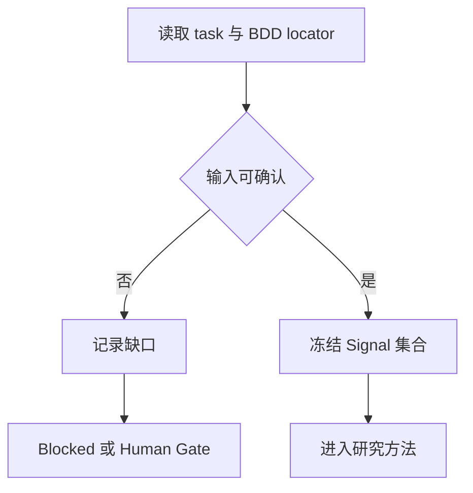
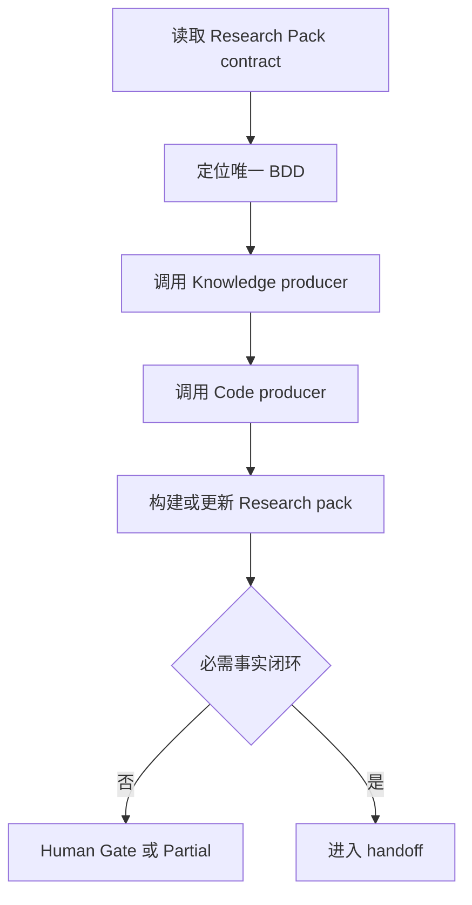
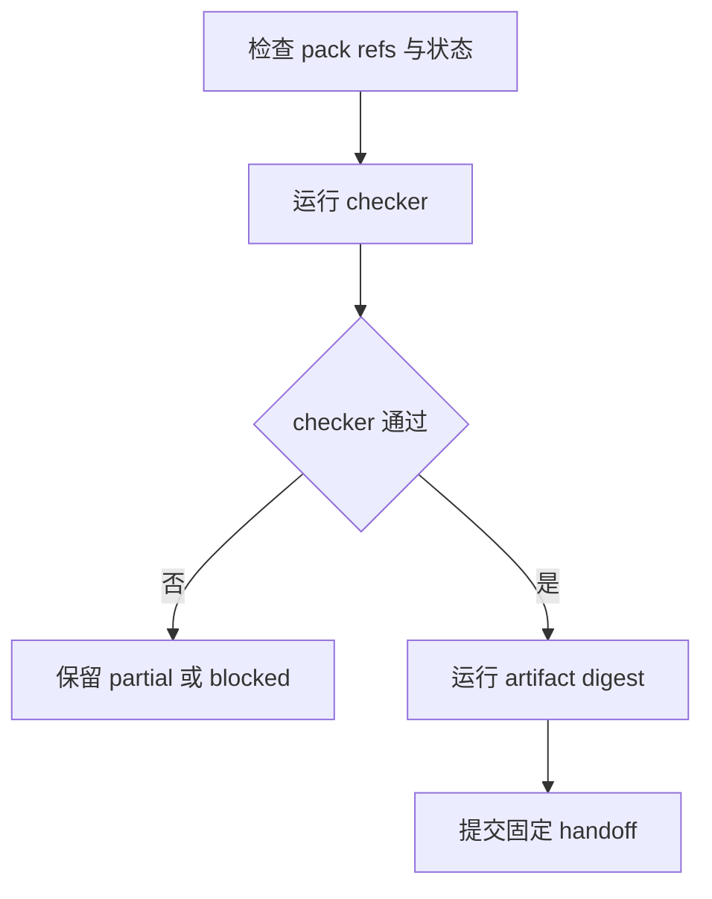

# Domain Validation Researcher

当 Researcher 需要把 Coordinator 提供的目标收敛为唯一 BDD，并交付可供 Gate 检查的 Research pack 时使用本技能。

本技能拥有 Researcher 的输入确认、研究编排和 handoff；Research Pack 的 artifact contract 由 `domain-validation-research-pack` 定义，知识与代码采集方法由各自 Tool Skill 定义。

## Skill Type

- type: domain
- layout: workflow
- note: 本技能拥有 Validation Research 的角色流程和交接，不复制 producer 的采集 contract。

## Core Use

使用本技能处理：

- 核对当前 task 的 BDD 定位、版本和研究边界。
- 冻结当前可见的通用及 Capability Signal Skill 集合，完整读取其 contract。
- 选择适用的 Knowledge/Code producer，并将结果交给 Research Pack 编排。
- 在人工事实未闭环时保留 Human Confirmation Gate。
- 按固定字段提交 Research handoff。

## Signal Consumption

Research 阶段先冻结当前可见 Signal 集合，再理解可用于 Manual 的 interface 和 requirement；不选择 runtime acquisition。

```bash
scout-assets family signal.local.unity.general --phase <phase>
```

对已确认的 Capability `<capability>`，使用：

```bash
scout-assets family signal.local.unity.general.<capability> --phase <phase>
```

按 `internal-runtime-inspector` 的 family 规则逐级查询返回的完整点分隔 `family-path`；到达叶节点后冻结返回的 Skill 列表，并按列表顺序对每个入口完整执行 `internal-skill-consumption`。查询失败、没有下级或任一成员未通过 readiness gate 时，停止依赖该集合的研究并报告缺口；不得凭名称拼接路径或跳过成员。

## Research Model

- Coordinator 的输入只是定位线索；唯一 BDD fact 必须由 Researcher 通过 `tool-guru-knowledge` 确认。
- Knowledge evidence 支撑意图和规格；当前版本 Code evidence 支撑 implementation claim；Research 不形成运行通过结论。
- 同一 run/BDD 只维护一个 `<bdd-id>-research-pack/`，Gate 修正原地更新并重新计算 digest。
- Researcher 父 Agent 拥有 BDD 唯一选择、人工请求、evidence id、artifact 写入、checker、digest 和 handoff；child 只能返回 producer 结果。

## Inputs

### I-001: Research Task
---

Required：

- Coordinator task id、Validation 目标、已确认用户意图、当前 workflow phase 和交付入口。

Optional：

- issue/PR 线索、补充说明或已存在的 artifact refs；没有时写 `none`。

Missing：

- 缺少 task、目标或当前 phase 时，停止研究并将缺口交回 Coordinator。

Confirmation：

- task 属于当前 Researcher，且目标、phase、交付入口和禁止越权边界彼此一致。

### I-002: BDD Locator
---

Required：

- BDD ID、Behavior 文件路径，或足以定位 Behavior 的场景描述。

Optional：

- 关键词、来源 ref 或候选列表；没有时写 `none`。

Missing：

- 无候选、多个未消歧候选或场景语义不完整时，保留候选并进入人工确认，不自行选择。

Confirmation：

- 通过 `tool-guru-knowledge` 得到一个可重放的 Behavior identity 与 scenario，且与目标一致。

### I-003: Product and Version Boundary
---

Required：

- 产品、当前版本、目标平台以及已确认的 research boundary。

Optional：

- 用户画像线索、Capability 线索和来源 refs；没有时写 `none`。

Missing：

- 版本或平台缺失时，按 Research Pack 和 producer contract 判断；影响必需事实时记录 Human Confirmation Gate，不选择 `latest` 或扩大范围。

Confirmation：

- 两个 producer 使用同一产品、版本、平台和唯一 BDD，且 scope 可写入同一 pack。

## Research Handoff Output

正式 handoff 使用固定字段，英文标题和 key 保持原样，字段内容使用中文：

```markdown
# Research Handoff State

- task_id: <当前 Researcher task id>
- handoff_state: <complete | partial | blocked>
- research_pack_ref: <唯一 pack ref>
- digest_algorithm: scout-directory-sha256-v1
- digest: <当前 pack digest>
- evidence_registry_ref: <evidence-registry.md ref>
- verification_manual_ref: <verification-manual.md ref>
- issues_or_limitations: <问题或限制；没有时写 none>
- human_confirmation_state: <resolved | not_required>
- continuation_entry: <下一步消费入口>
```

handoff 只传递状态、refs、digest、问题和继续入口，不复制 evidence 正文、BDD 细节、源码定位或 checker 全量输出。`complete` 只表示 Research 交付完整，不表示 BDD 已通过。

## Phase 1: Confirm Research Boundary
---

Main Flow：

Knowledge：

- 当前 task 的 workflow phase attachment 是唯一流程入口；Researcher 只消费已提供的目标和边界。

Flow：



Blocked：

- task 不属于当前 Researcher、required Skill 不可见或没有可定位 BDD 输入时停止。

Partial：

- 目标可定位但版本、平台或其它必需边界未闭环时，保留已确认范围和缺口。

Exit：

- Research scope、唯一输入来源、适用 producer 和 Signal 列表已确认。

## Phase 2: Execute Research Method
---

Main Flow：

Knowledge：

- `domain-validation-research-pack` 编排 BDD、Knowledge、Code、Registry 和 Manual；Researcher 只按其 contract 提供输入并消费结果。

Flow：



Constraints：

- producer 只在自己的 scope 内工作；Researcher 不把 knowledge 候选写成代码事实，也不把工具活动当 evidence。
- BDD、版本、平台和 artifact scope 必须在两个 producer 间保持一致。

Blocked：

- producer contract、模板、artifact target 或必需来源不可用，导致 pack 无法继续时停止。

Partial：

- producer 已形成可定位的部分 evidence 时，保留原始 refs 和 limitation，不伪造 complete。

Returns To Main Flow：

- `producer_ready`：继续构建 pack；`human_confirmation_needed`：停在当前 task 等待正式回复；`producer_blocked`：进入 Phase Blocked。

## Phase 3: Submit Research Handoff
---

Main Flow：

Knowledge：

- handoff 必须反映当前 pack 的真实状态和最新 digest；所有详细事实由 pack refs 提供。

Flow：



Blocked：

- pack 不可写、refs 不闭环、checker/digest 失败或正式 handoff 入口不可用时停止。

Partial：

- pack 有可消费的部分结果且不存在未解除的必需 Human Gate 时，可提交 `partial` handoff，并写明继续条件。

Exit：

- handoff 已使用最新 `scout-directory-sha256-v1` digest 正式提交，且状态与 pack 一致。

## Workflow Exit Rules (Enforcement)

- XR-001：未唯一定位 BDD 前不得进入 producer 阶段。
- XR-002：存在必需人工确认项时不得提交 handoff。
- XR-003：Research pack 修正必须原地更新同一 ref，并重新计算 digest。
- XR-004：handoff 必须包含固定字段和 Verification Manual ref；不得复制 artifact 正文。

## Evidence Rules (Enforcement)

- ER-001：Knowledge、Code 和 Signal contract 都是来源或方法，不是运行验证结论。
- ER-002：每个 producer evidence 必须有 source ref、locator、状态和 limitation。
- ER-003：只有正式 artifact ref 才能进入 handoff；普通消息和工具活动不能替代 ref。

## Failure Rules (Enforcement)

- FR-001：候选冲突、来源失败、模板缺失或写入失败必须原样记录并保持相应状态。
- FR-002：不能用推断补齐必需事实，也不能用旧 digest 继续 handoff。

## Blocking Rules (Enforcement)

- BR-001：无法唯一定位 BDD、无法读取 required Skill 或无法写入 pack 时停止。
- BR-002：必需版本/平台事实无法确认时进入 Human Confirmation Gate。

## Retry Rules (Enforcement)

- RR-001：工具重试遵守 producer Skill；不得通过换版本、换目标或扩大 scope 规避失败。

## Prohibited Rules (Enforcement)

- PR-001：禁止修改代码、配置、Knowledge source 或下游 artifact。
- PR-002：禁止自行选择多个 BDD、复制 producer 方法论或声称运行验证通过。

## Checklist

- task、BDD、版本和平台边界已确认。
- Signal 集合已按列表完整读取，适用 producer 结果已对齐。
- Research pack、checker、digest 和固定 handoff refs 闭环。
