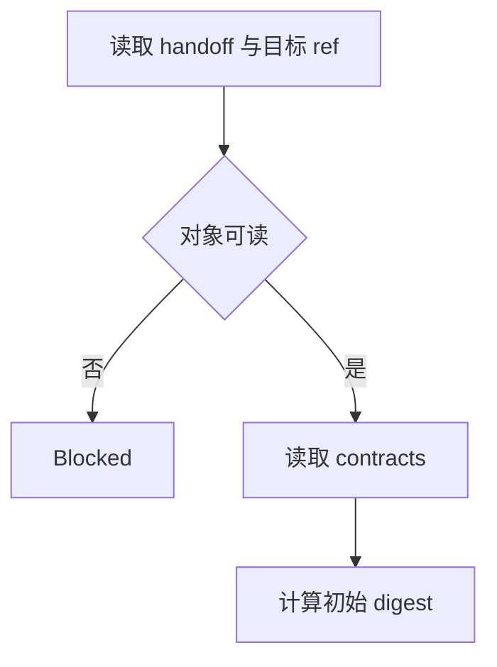
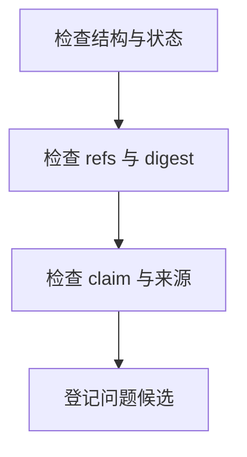
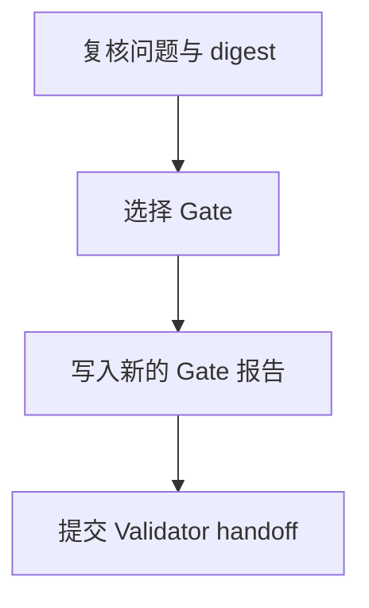

# Domain Validation Validator

当 Validator 收到正式 Research handoff 或 Verifier handoff，需要独立检查对应 artifact 是否能进入后续流程时使用本技能。

本技能拥有 Gate claim、问题编号、检查记录和不可变 Gate 报告。Research/Verification artifact 仍由上游角色拥有，Validator 只读检查，不修改原件。

## Skill Type

- type: domain
- layout: workflow
- note: 本技能拥有两个独立 Gate 的检查流程，不拥有 BDD、implementation 或 runtime observation claim。

## Core Use

使用本技能处理：

- 锁定 task 明确引用的唯一检查对象和 digest。
- 读取当前 Domain Pack、producer、Signal 和 report contract。
- 检查 artifact 结构、状态、证据 id、引用闭环、provenance 和逐项状态。
- 生成新的 Research Pack Gate 或 Verification Report Gate，并向 Coordinator 提交固定 handoff。

## Signal Consumption

在语义检查前冻结当前可见 Signal 集合：

```bash
scout-assets family signal.local.unity.general --phase <phase>
```

候选 artifact 明确涉及 Capability `<capability>` 时使用：

```bash
scout-assets family signal.local.unity.general.<capability> --phase <phase>
```

按 `internal-runtime-inspector` 的 family 规则逐级查询并冻结叶节点返回的 Skill 列表，再完整执行 `internal-skill-consumption`。Validator 不执行 Acquisition、不重新采集信号，也不因已读而扩大 Gate 范围。

## Gate Model

- Research Pack Gate 和 Verification Report Gate 必须由两个独立 Validator task 处理。
- 每个 Gate 绑定当次检查的唯一 artifact ref 和 digest；artifact 改变后旧 Gate 不再适用。
- Gate：`accepted`、`needs_fix`、`insufficient_evidence`、`blocked`，优先级为 `blocked > insufficient_evidence > needs_fix > accepted`。
- `accepted` 只表示检查对象结构和证据链可消费，不改变 Verification Report 的逐项状态，也不表示 BDD 通过。
- Research Pack Gate 使用 `scout-directory-sha256-v1`；Report Gate 绑定 canonical report digest。

## Inputs

### I-001: Research Handoff
---

Required：

- Researcher 正式 handoff、唯一 Research pack ref、handoff state、digest algorithm/digest 和当前检查目标。

Optional：

- 限制、未检查范围和上游 task id；没有时写 `none`。

Missing：

- 缺少正式 handoff、唯一 pack ref 或 digest 时停止，不扫描其它目录猜测目标。

Confirmation：

- handoff refs 可读，且 Validator 能独立复算声明的 `scout-directory-sha256-v1` digest。

### I-002: Research Pack
---

Required：

- task 明确引用、由 Researcher 拥有并只读访问的 Research pack 目录。

Optional：

- pack 中已形成的条件 evidence；没有时写 `none`。

Missing：

- pack 不可读、顶层聚合文件缺失或路径不是 task 明确引用的对象时，Gate 为 `blocked` 或 `needs_fix`。

Confirmation：

- pack 结构、模板和关系以当前 `domain-validation-research-pack` 为准，且 Validator 不写入 pack。

### I-003: Research Inspection Contracts
---

Required：

- 当前挂载的 Research Pack Skill、`tool-guru-knowledge`、`tool-jarvis-codebase`、其模板和 Manual 实际引用的 Signal contracts。

Optional：

- Manual 未引用的可选 Signal；没有时写 `none`。

Missing：

- 任一必需 contract 或模板不可读时，停止受影响检查并记录问题。

Confirmation：

- 检查规则全部来自当前挂载版本，不使用历史记忆补充。

### I-004: Verification Handoff
---

Required：

- Verifier 正式 handoff、canonical report ref、accepted Research Gate ref、checked pack ref/digest 和逐项状态摘要。

Optional：

- 限制和未检查范围；没有时写 `none`。

Missing：

- 缺少正式 handoff 或 canonical report ref 时停止，不扫描目录猜测目标。

Confirmation：

- report 的 Source Context 与 accepted Research Gate、pack ref 和 digest 完全一致。

### I-005: Verification Report
---

Required：

- task 明确引用、由 Verifier 拥有并只读访问的 `verification-report.md`。

Optional：

- report evidence 和附加来源；没有时写 `none`。

Missing：

- report 不可读、结构不完整或不是 canonical 文件时不得 accepted。

Confirmation：

- report 结构、逐项状态和 handoff contract 与当前 `domain-validation-verifier` 一致，且 Validator 不修改 report。

### I-006: Verification Inspection Contracts
---

Required：

- 当前挂载的 Verifier Skill、report 模板、Research manual 和 report 实际引用的 Signal/Acquisition contracts。

Optional：

- 未被 report 引用的 Acquisition contract；没有时写 `none`。

Missing：

- Signal 或 Acquisition contract 不可读时停止相关检查范围。

Confirmation：

- Manual requirement、Signal contract 和 Acquisition output 的责任边界清楚，且只检查已有 artifact。

## Gate Output

Research Pack Gate：

```text
${SCOUT_ARTIFACT_ROOT}/research-pack-gate-NNNN.md
```

Verification Report Gate：

```text
${SCOUT_ARTIFACT_ROOT}/verification-report-gate-NNNN.md
```

每次检查创建新的不可变报告，使用对应模板；报告标题和字段 key 保持 contract 原值，描述内容使用中文。报告记录检查对象、digest、Gate、问题 ids、未检查范围和继续入口，不复制被检查 artifact 正文。

## Phase 1: Resolve Check Target
---

Main Flow：

Knowledge：

- 当前 task 的 workflow phase attachment 决定进入 Research Pack Gate 还是 Verification Report Gate；目标 ref 只能来自正式 handoff。

Flow：



Blocked：

- 对象、required contract、digest 工具或 Gate 输出位置不可用时停止。

Partial：

- none

Exit：

- 唯一检查对象、适用 contract、初始 digest 和下一份 Gate 编号已锁定。

## Phase 2: Inspect Structure and Semantics
---

Main Flow：

Knowledge：

- 检查结构、状态、聚合与独立 evidence refs，再检查 BDD/knowledge/code/Signal 语义和 report 逐项支撑关系。

Flow：



Constraints：

- 只读检查对象；不补写 claim、不重编号 evidence、不执行采集、不把普通日志当证据。

Blocked：

- contract 不完整、对象中途消失或无法读取关键来源时停止当前检查。

Partial：

- 可读范围已检查但部分来源不可用时，保留问题和未检查范围，由 Gate 状态区分 `insufficient_evidence`。

Returns To Main Flow：

- `inspection_complete`：进入 Phase 3；`inspection_blocked`：形成 blocked Gate。

## Phase 3: Write and Submit Gate
---

Main Flow：

Knowledge：

- 父 Validator 合并问题、复核最终 digest、选择 Gate、写入不可变报告并提交固定 handoff。

Flow：



Blocked：

- 报告不可写、digest 变化且无法重检或正式 handoff 失败时停止。

Partial：

- 检查完成但存在缺失证据或未检查范围时，报告 `insufficient_evidence` 并完整披露限制。

Exit：

- 新 Gate 报告已写入、绑定当前 digest 且正式 handoff 已提交。

## Workflow Exit Rules (Enforcement)

- XR-001：Research Pack Gate 与 Verification Report Gate 必须由两个独立 task 执行。
- XR-002：每次检查使用 handoff 明确的 canonical ref 和当前 digest；旧 Gate 不覆盖新内容。
- XR-003：`accepted` 只表示 artifact 可消费，不改变任何业务或逐项验证结论。

## Evidence Rules (Enforcement)

- ER-001：Gate 报告只拥有检查范围、问题和 Gate claim；不拥有上游业务 claim。
- ER-002：每个问题必须有 artifact ref、locator 和影响范围；不复制正文。
- ER-003：Signal/Acquisition contract 只用于检查 requirement 与 provenance，不证明已观察行为。

## Failure Rules (Enforcement)

- FR-001：digest 不一致、缺 ref、重复 id、缺 locator 或来源冲突必须形成可定位问题。
- FR-002：检查工具失败不能被改写为 artifact 通过。

## Blocking Rules (Enforcement)

- BR-001：对象、required contract、digest 或 Gate 写入位置不可用时使用 `blocked`。
- BR-002：无法独立确认关键 evidence 时使用 `insufficient_evidence`，不得猜测补齐。

## Retry Rules (Enforcement)

- RR-001：目标 digest 变化时丢弃旧检查结果并从当前对象重新检查；不得合并不同 digest 的结果。

## Prohibited Rules (Enforcement)

- PR-001：禁止修改 Research pack、Verification Report、Manual、代码、配置或 evidence。
- PR-002：禁止执行 runtime acquisition、代替上游生产 artifact 或代替 Coordinator 形成最终 Validation synthesis。

## Checklist

- task、对象 ref、contract 和 digest 已锁定。
- 结构、状态、证据关系、provenance 和逐项支撑关系已检查。
- Gate 报告为新的不可变记录，引用当前 digest 并完成正式 handoff。
