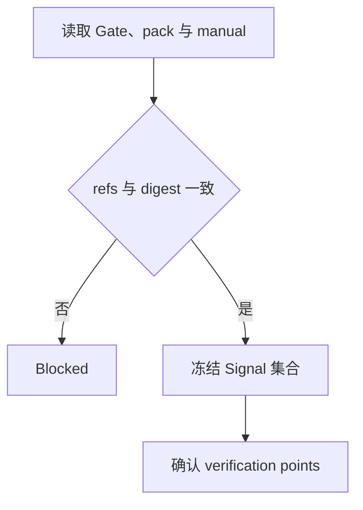
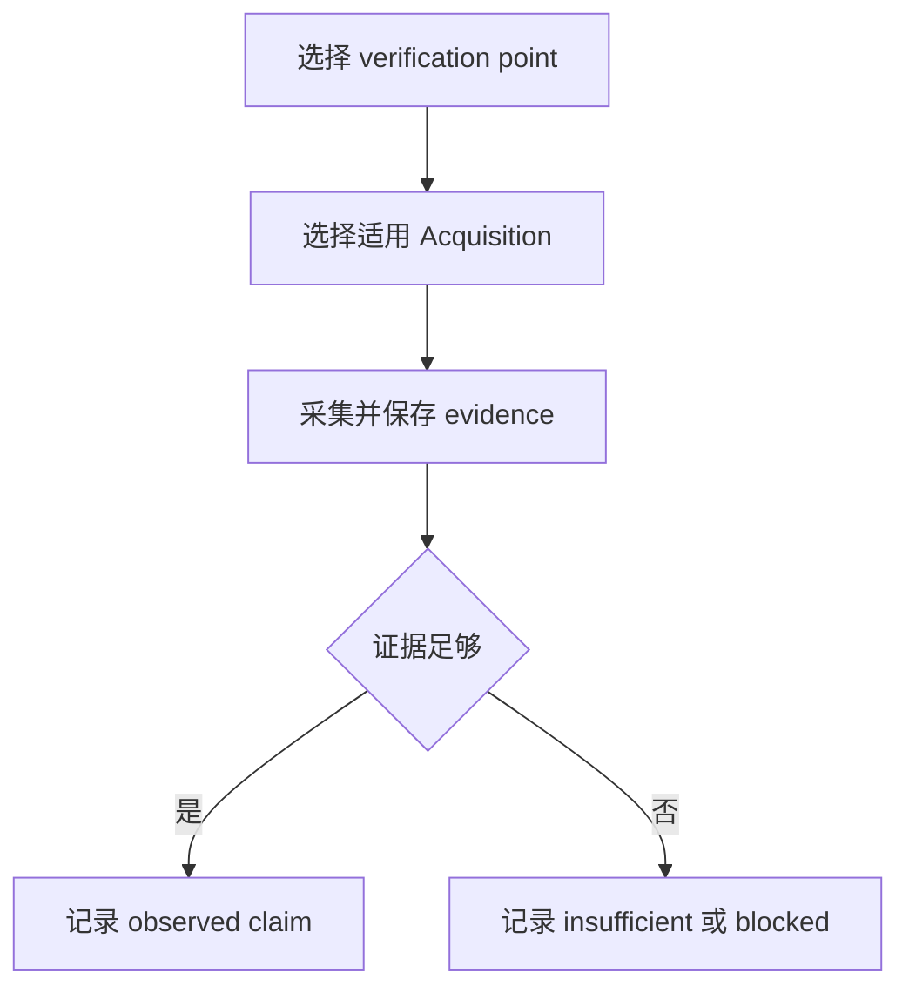
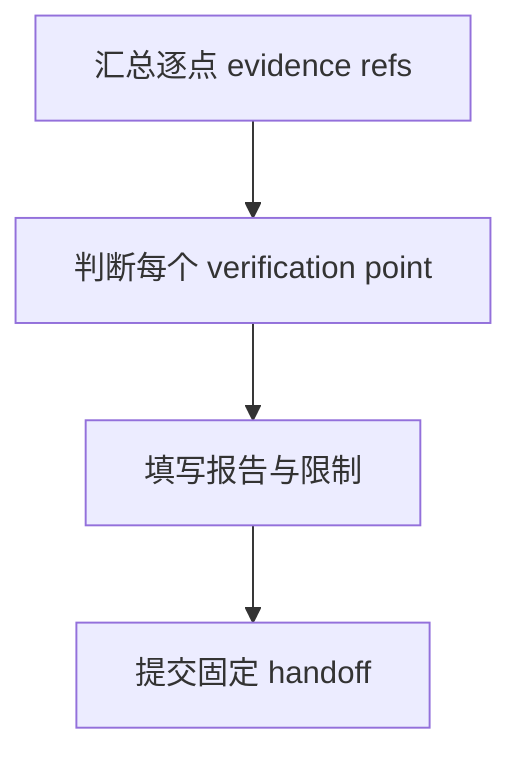

# Domain Validation Verifier

当 Verifier 收到 accepted Research Pack Gate，需要围绕 verification points 采集可定位信号并形成 Verification Report 时使用本技能。

本技能拥有 observed claim、逐项状态和报告 handoff；代码检索由 `tool-jarvis-codebase` 所有，信号语义由 Signal Skill 所有，具体采集由适用 Acquisition Skill 所有。

## Skill Type

- type: domain
- layout: workflow
- note: 本技能拥有 Validation Verification 流程和报告，不重新定义 Research claim。

## Core Use

使用本技能处理：

- 核对 accepted Research Gate、pack、manual 和执行边界。
- 按 verification point 选择适用 Signal/Acquisition 并保存可定位 evidence。
- 区分 verified、not_verified、insufficient_evidence 和 blocked。
- 原地写入 `verification-report.md` 并提交固定 handoff。

## Signal Consumption

在解释 verification point 或采集信号前，冻结并完整读取当前可见集合：

```bash
scout-assets family signal.local.unity.general --phase <phase>
```

已确认 Capability `<capability>` 时使用：

```bash
scout-assets family signal.local.unity.general.<capability> --phase <phase>
```

按 `internal-runtime-inspector` 的 family 规则逐级查询，只有叶节点返回的 Skill 才进入当前列表；按列表顺序完整执行 `internal-skill-consumption`。任一成员未通过 readiness gate 时，不开始依赖该集合的采集，也不生成 coverage 记录。

## Verification Model

- Manual 定义 verification point 和 Signal requirement，不等于已观察。
- runtime/device/log/test observation 支撑 observed claim；代码 evidence 只支撑实现事实。
- `verified` 需要可定位 observation 直接满足 requirement；`not_verified` 需要直接反证。
- 失败、权限拒绝、解析失败、超时、空结果或未执行只能是 `insufficient_evidence` 或 `blocked`。
- 每个 verification point 独立给出状态，总体状态不能覆盖逐项结果。

## Inputs

### I-001: Accepted Research Gate Context
---

Required：

- accepted Research Pack Gate ref、唯一 pack ref、匹配 digest、evidence registry ref 和 verification manual ref。

Optional：

- 上游 task id、限制和继续入口；没有时写 `none`。

Missing：

- 缺少 accepted Gate、唯一 pack 或匹配 digest 时交回 Coordinator，不自行重做 Research。

Confirmation：

- Gate、pack ref、digest、registry 和 manual refs 完全一致，且 Gate 状态为 `accepted`。

### I-002: Verification Manual
---

Required：

- manual ref、verification point、用户画像 ref、Given/When/Then、supporting evidence ids 和 signals to collect。

Optional：

- verification point 的 limitation；没有时写 `none`。

Missing：

- manual、signal requirement 或 supporting refs 缺失时，停止受影响 verification point 并报告缺口。

Confirmation：

- 每个执行点的输入、预期、Signal ref 和匹配 requirement 都能从 manual 与 registry 定位。

### I-003: Execution Boundary
---

Required：

- 当前版本、代码来源、平台、设备、配置、可用工具和允许采集的信号范围。

Optional：

- MCP/plugin 能力和已存在的 observation refs；没有时写 `none`。

Missing：

- 某类环境能力缺失时，只阻塞依赖它的 verification point，不伪造 observation。

Confirmation：

- 目标环境、工具和 Signal Acquisition 能力与 verification point 要求一致。

## Verification Report Output

报告固定写入：

```text
${SCOUT_ARTIFACT_ROOT}/verification-report.md
```

首次验证和 follow-up 都原地更新同一文件，不创建隐式版本。报告使用 `draft + partial`、`ready + complete` 或 `blocked + blocked`，并为每个 verification point 保存状态、evidence refs、provenance、失败命令、限制和人工确认项。

正式 handoff 固定为：

```markdown
# Verifier Handoff: Verification Report

- verifier_task_id: <当前 Verifier task id>
- report_ref: <canonical report ref>
- research_gate_ref: <accepted Research Pack Gate ref>
- checked_pack_ref: <Research pack ref>
- checked_pack_digest: sha256:<hex>
- verification_point_states: <VP-* 与状态列表>
- unverified_scope_or_limitations: <限制；没有时写 none>
- continuation_entry: <下一步消费入口>
```

## Phase 1: Confirm Verification Inputs
---

Main Flow：

Knowledge：

- 当前 workflow phase attachment、accepted Gate、pack、manual 和执行边界共同决定可执行范围。

Flow：



Blocked：

- 缺少 accepted Gate、pack、manual、关键输入或 required Signal contract 时停止。

Partial：

- 只有部分 verification point 可执行时锁定范围，继续可执行点并记录未覆盖点。

Exit：

- 可执行点、预期、环境、Signal requirements 和候选 Acquisition 已明确。

## Phase 2: Collect Verification Evidence
---

Main Flow：

Knowledge：

- 每个点按 Signal contract 和 Acquisition contract 采集，保留原始来源、locator、版本、环境和限制。

Flow：



Constraints：

- 不修改 Manual 的 match、ordering、observation window 或成功标准；工具失败不能变成反证。

Blocked：

- required capability、权限或目标环境不可用且没有合法替代来源时停止受影响点。

Partial：

- 已采集部分 evidence 但不足以定论时保留 refs，并标记 `insufficient_evidence`。

Returns To Main Flow：

- `evidence_ready`：进入逐项判断；`evidence_insufficient`：记录限制后继续其它点；`acquisition_blocked`：记录 blocked 并继续可执行范围。

## Phase 3: Produce Verification Report
---

Main Flow：

Knowledge：

- Report 只拥有 observed claim 和逐项结论；Research claim、Signal contract 和 Acquisition 事实由各自 artifact 所有。

Flow：



Blocked：

- 报告不可写、evidence refs 不可定位或正式 handoff 失败时停止。

Partial：

- 报告可以包含不同逐点状态，但必须完整披露未覆盖范围。

Exit：

- canonical report 已写入并通过正式 task 入口提交，且 handoff 字段完整。

## Workflow Exit Rules (Enforcement)

- XR-001：未核对 accepted Research Gate 和 verification points 前不得采集。
- XR-002：每个 verification point 必须独立状态和 evidence refs；不能用总体结论覆盖。
- XR-003：Gate follow-up 原地修正同一 report，并使用当前 pack digest。

## Evidence Rules (Enforcement)

- ER-001：工具调用和过程消息不是 evidence，必须保存可定位原始来源。
- ER-002：代码、Signal contract 和 runtime observation 的 claim owner 不得混淆。
- ER-003：矛盾 observation 必须同时保留并解释。

## Failure Rules (Enforcement)

- FR-001：工具失败、空输出、权限或解析失败必须记录命令、错误、影响范围和 limitation。
- FR-002：失败或缺失 observation 不得写成 `verified` 或 `not_verified`。

## Blocking Rules (Enforcement)

- BR-001：缺少 accepted Gate、匹配 pack/digest、manual 或 required capability 时停止受影响工作。
- BR-002：artifact target 或正式 handoff 不可用时不得报告完成。

## Retry Rules (Enforcement)

- RR-001：采集重试遵守对应 Tool Skill；有副作用的环境操作不得自动重复。

## Prohibited Rules (Enforcement)

- PR-001：禁止修改代码、配置、Research artifact、Manual 或成功标准来制造结果。
- PR-002：禁止代替 Validator 给出 Gate，禁止用失败过程冒充反证。

## Checklist

- accepted Gate、pack、manual、digest 和 execution boundary 已对齐。
- 每个 verification point 都有真实 evidence refs、provenance 和独立状态。
- canonical report 与固定 handoff 已提交，未覆盖范围已披露。
