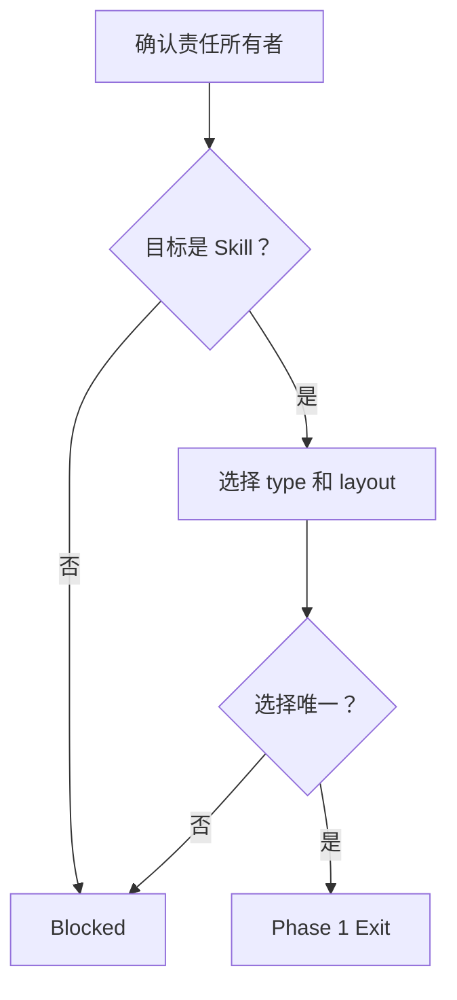
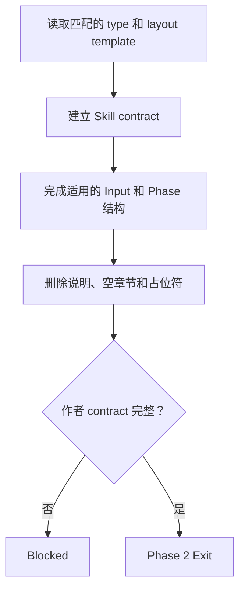
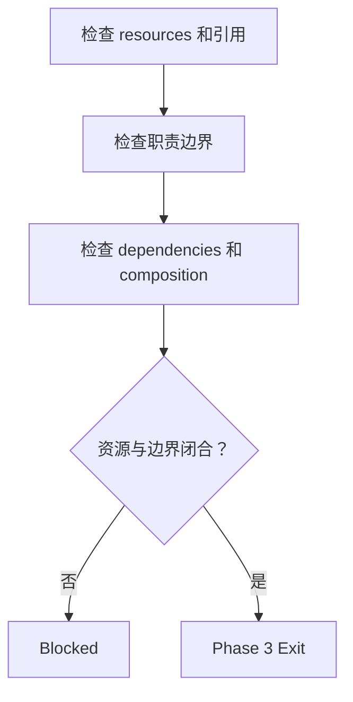
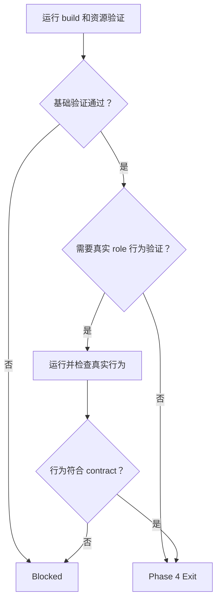

# Internal Skill Creator

当任务要求创建、修改、评审或规范化 `assets/codex/skills/**/SKILL.md` 时使用本技能。

本技能拥有 Scout Skill 资产格式和职责治理。它不定义 Scout Runtime 事件、领域业务事实、具体工具实现或当前 `run` 状态。

- `Skill type` 表示一个 Skill 拥有的责任种类。
- `Skill layout` 表示 `SKILL.md` 正文组织规则的方式。

## Document Notation

以下记法适用于目标 `SKILL.md` 及其 supplementary resources：

- 反引号中的内容表示 Scout 正式术语、字面值或单一路径。
- `<name>` 表示创建 Skill 时必须使用当前上下文中的实际值替换的占位符。
- 定义一个名称时使用不带 `<>` 的名称；定义完成后，只有表示待替换值时才使用 `<name>`。
- 可执行命令、多行路径、目录结构、schema 和命名形式使用带语言标记的 fenced code block。

## Skill Type

- type: internal
- layout: workflow
- note: 规范 Skill 源资产、分类、布局和作者声明，不实现 Skill 消费协议。

## Core Use

使用本技能处理：

- 创建、修改、评审或规范化 Scout Skill 及其 supplementary resources。
- 判断内容应属于 AGENTS、Domain Skill、Tool Skill、Signal Skill、Internal Skill、template 还是 reference。
- 为一个 Skill 独立选择 type 与 layout，并按当前资产和 Scout Runtime 事实验证结果。

## Skill Authoring Model

- `type template` 规定一种 Skill type 必须表达的内容、责任归属和禁止越界的内容。
- `layout template` 规定一种 Skill layout 的正文结构、章节顺序和格式。

每个 Skill 必须选择一个 type：

| type | 拥有的责任 |
| --- | --- |
| `internal` | Scout 自有资产、运行边界和治理规则。 |
| `domain` | 当前 domain 中当前 role 的业务输入、判断、工作、输出和交接。 |
| `tool` | 一种操作能力的调用方式、输入、结果、副作用和失败边界。 |
| `signal` | 一个稳定、可组合的领域 contract。 |

每个 Skill 必须选择一个 layout：

| layout | 使用条件 |
| --- | --- |
| `workflow` | contract 包含必须按顺序执行的阶段、状态转换或完成门禁。 |
| `compact` | contract 可以通过模型、规则和边界直接表达，不需要编号执行阶段。 |

type 与 layout 相互独立。同一种 type 可以根据自己的 contract 选择任一 layout；不能根据 type、family 或名称自动推断 layout。

## Source and Mount Model

Skill 源目录固定为：

```text
assets/codex/skills/<skill-name>/SKILL.md
```

Scout Runtime 将 Skill 源目录投影到 role 的 mount，并将 Skill 入口物化为：

```text
.scout/skill/<family-segment-1>/<family-segment-2>/<skill-name>/SKILL.md
```

规则：

- `phase` 是作者声明 Skill 进入哪些资源投影的元数据；当前 type 是否使用该字段由对应 type template 定义。
- 不声明 `phase` 的 Skill 只能按照对应 type template 规定的依赖关系进入资源投影。
- `family` 是必填的稳定分类路径，直接决定 `mount` 中的文件夹，不是交互式发现入口、执行顺序或授权状态。
- 当前 `role` 使用普通文件系统定位和读取 Skill；Skill 的完整读取、依赖展开、composition 和开始执行条件由 `internal-skill-consumption` 定义。
- Skill 不放入 `.agents/skills`，避免与 Codex 原生全局 Skill 混合；Scout Skill 只从 `.scout/skill` 使用。
- 物化路径可以是软链接；逻辑路径与 canonical target 必须同时符合当前权限。

源码资产维护发生在 Scout checkout；`role` 运行时只使用当前 `mount` 的 `.scout/skill`。

## Responsibility Placement

- 全部 `role`、全部 domain 都适用的稳定规则放在全局 `AGENTS.md`。
- 各 Skill type 的内容责任和禁止越界范围由对应 type template 定义。
- template 与 reference 只拥有自己服务的结构或资料，不复制所属 Skill 的完整方法论。

## Directory Structure

新建 Skill 时，目录名、`name` 和 `id` 必须完全一致：

```text
assets/codex/skills/<skill-name>/
  SKILL.md
  templates/                 # 可选
  references/                # 可选
```

`type` 表示当前 Skill 选定的实际 type；`stable-name` 表示该 type template 定义的实际稳定名称。

```text
<type>-<stable-name>
```

- Skill name 必须使用与 `type` 对应的固定前缀；完整名称结构由对应 type template 定义。
- `skill-name` 使用小写字母、数字和连字符，并表达当前 type 拥有的稳定责任。

不要使用空格、下划线、版本号、issue id、run id、一次性任务名或 `helper`、`tools` 一类宽泛名称。

## Frontmatter Contract

所有 Skill 使用下列通用 frontmatter 骨架。type-specific 字段由对应 type template 定义。

- `skill-description` 表示 Skill 的实际触发场景和主要职责。
- `family-segment` 表示 `family` 中一个实际目录名。
- `family-path` 表示由实际 `family-segment` 使用 `.` 连接形成的 family 查询值；末尾可以追加 `.*` 或 `.**`。
- `skill-path` 表示 Scout Runtime 返回的当前 `mount` 内 Skill 入口文件系统路径；该路径相对于当前 `mount`，可直接使用。
- `tag` 表示一个实际稳定特征。
- `skill-summary` 表示实际短职责摘要。

```markdown
---
assetKind: scout.skill
name: <skill-name>
description: <skill-description>
type: <type>
id: <skill-name>
version: 0.1.0
family: [<family-segment>]
tags: [<tag>]
devices: [any]
summary: <skill-summary>
---
```

字段规则：

- `assetKind` 固定为 `scout.skill`。
- `name`、`id` 和目录名表达同一 canonical identity；重命名时同步修改全部显式引用，不保留 alias。
- `description` 说明触发场景和主要职责，不能塞入完整 workflow。
- `version` 使用语义版本；首次创建使用 `0.1.0`。
- `type` 只能是 `internal`、`domain`、`tool` 或 `signal`。
- `phase` 是否存在及其固定值由选定的 type template 定义；作者不能根据当前任务自行扩大或缩小可见范围。
- `family` 是必填非空 inline list；每个 token 使用小写 kebab-case。
- `tags` 是必填非空 inline list，只表达稳定特征，不参与物化路径或筛选。
- `devices` 没有明确限制时使用 `[any]`。
- `summary` 是短职责摘要，不复制 description。

正文必须声明当前 type、layout 和责任边界。type 只能是 `internal`、`domain`、`tool` 或 `signal`；layout 只能是 `workflow` 或 `compact`。具体章节、位置和格式由选定的 layout template 定义。

正文只写当前 Skill 实际处理的工作、拥有的 contract 和执行约束。不要写“`不使用本技能处理`”或其它反向用途清单，也不要枚举相邻角色、Skill 或工具负责的工作；外部责任只在说明当前 Skill 的直接依赖或交接边界确实需要时引用。当前 Skill 无条件禁止的自身行为写入适用的 `Prohibited Rules (Enforcement)`，不能改写成“不使用”说明。

### Input Contracts

正文存在 `Inputs` 时，每个 `I-*` 必须使用以下四项：

- `Required`：列出进入当前 contract 前必须具备的每个字段、字段语义和权威来源。缺少任一字段时输入不能确认通过。
- `Optional`：只列真实可选字段，并说明缺失时按 `none` 处理还是进入哪个后续选择步骤；没有可选字段时写 `none`。
- `Missing`：逐字段说明缺失、空值、不可读或不唯一时的处理动作。Optional 缺失不得阻塞基础 contract，也不得通过猜测生成默认值。
- `Confirmation`：列出必须互相对齐的字段、来源或当前事实，以及输入确认通过的完整条件。冲突和不可验证必须保留实际差异，不能改写为缺失或成功。

`Inputs` 只声明当前 Skill 开始工作前实际消费的外部事实。执行过程中产生的值写入对应步骤或结果；不被当前 contract 消费的 Runtime identity 不写入 Input。

## Family Classification

family 表达文件系统分类和归属，不表达依赖、执行顺序或 layout：

- 完整 family 结构由对应 type template 定义。
- 同一 family 可以包含多个 Skill；它们物化为该目录下以 Skill identity 命名的兄弟目录。
- family 中的目录名恰好与某个 layout 同名时，也不建立自动推导关系。

## Dependencies

只有真实依赖存在时才写 `dependencies`：

- `skills` 使用真实 Skill identity 或带 wildcard 的 family-path。
- `shellTools` 使用 `assets/codex/tools/shell-tools.json` 中的 tool id。
- `mcpServers` 使用 `assets/codex/mcp/servers.json` 中的 server id。
- `plugins` 使用 plugin manifest 中的 name。
- `required` 表示缺失时 contract 无法完整执行；`optional` 只表示条件能力或增强能力。
- required Skill 缺失时当前 contract 不完整；optional Skill 是可供当前工作选择的候选能力，当前环境没有该候选时不阻塞基础 contract。存在的依赖必须无环。
- 依赖只表达“使用当前 Skill 必须同时具备什么”，不能用来偷渡其它层的方法论。
- composition 的作者声明遵守下列 Composition Authoring Rules；候选构造、完整读取和验证由 `internal-skill-consumption` 定义。

### Family Paths

`family-path` 在 Skill dependency 中显式选择一个 family 范围时，只允许使用以下形式：

```text
family:<family-path>.*
family:<family-path>.**
```

- `family:<family-path>.*` 选择比 `<family-path>` 多一层的全部 family 中的 Skills。
- `family:<family-path>.**` 选择 `<family-path>` 本身及其全部后代 family 中的 Skills。
- `<family-path>` 必须非空，每个 segment 使用小写 kebab-case；不支持脱离 family path 的全局 `*`。
- family-path 与具体 Skill identity 一样，只能写在 `dependencies.skills.required` 或 `dependencies.skills.optional` 的 inline list 中。
- required family-path 的全部匹配 Skills 都是 required dependencies；没有匹配项时，使用当前 Skill 所需的资源投影无法建立。
- optional family-path 的全部匹配 Skills 都是 optional candidates；没有匹配项时，不阻塞基础 contract。
- family-path 只批量声明依赖范围，不建立 execution order、derived 或 implementation composition。composition 所需的 contract owner 仍必须使用具体 Skill identity direct required。
- Scout Runtime 在构建 mount 时展开 family-path；作者不得把当前匹配结果复制成另一份手工维护的列表。

示例：

```yaml
dependencies:
  skills:
    required: [internal-skill-consumption, family:signal.local.unity.general.**]
    optional: [family:tool.scout.dynamic.**]
```

### Composition Authoring Rules

以下名称表示 composition authoring 中的实际值：

- `derived-name` 表示 derived contract owner identity 中位于 `-by-<source>` 之前的实际名称。
- `source` 表示 derived contract 所依据来源的实际名称。
- `implemented-owner-id` 表示拥有待实现 contract 的实际 Skill identity。
- `mechanism` 表示 implementation contract 使用的实际方法或能力名称。

- interface contract 定义基础结果，不绑定具体 implementation mechanism。
- derived contract 基于 interface contract 的基础结果定义更具体的结果；implementation contract 规定通过具体 mechanism 产生另一个 contract 定义的结果。

owner identity 使用以下命名形式：

```text
<derived-name>-by-<source>
<implemented-owner-id>-via-<mechanism>
```

- derived contract owner 必须 direct required 对应的 interface contract owner。
- implementation contract owner 必须 direct required `<implemented-owner-id>`。
- implementation 过程依赖其它 Skill 时，implementation contract owner 必须 direct required 这些实际依赖。
- `<implemented-owner-id>` 不得反向 required 某个具体 implementation contract owner。
- `by-<source>` 和 `via-<mechanism>` 不能替代 contract 角色及 required dependency 声明。

## Supplementary Resources

`templates/**/*.md` 与 `references/**/*.md` 必须在自己的 frontmatter 声明：

```yaml
scout:
  resource:
    requirement: <requirement>
    description: <resource-purpose>
```

- `<requirement>` 只允许使用 `required` 或 `optional`。
- required resource 是 Skill contract 的无条件组成部分。
- optional resource 只服务正文明确指出的条件分支；description 必须让读者无需打开正文即可判断用途。
- resource-level required / optional 与 Skill dependency 是不同层次，不得合并或移除。
- `scout.resource` 是资源控制 metadata，使用模板生成业务 artifact 时不得复制。
- `templates/` 超过一个文件时创建 `templates/template-index.md`；`references/` 存在文件时创建 `references/reference-index.md`。
- index 只做文件用途和读取顺序导航，不承载业务事实、运行状态或当前 `<task>` 判断。

index 自身必须是 required supplementary resource，并使用以下最小结构：

- `index-title` 表示实际索引标题，使用 `Template Index` 或 `Reference Index`。
- `index-purpose` 表示索引服务的实际 Skill 和资源范围。
- `resource-path` 表示一个实际 supplementary resource 路径。
- `resource-purpose` 表示该资源的实际用途。
- `read-condition` 表示 `required`，或一个能够判断 optional resource 是否适用的实际条件。
- `required-order-or-condition` 表示 required resources 的实际读取顺序，或 optional resource 的实际进入条件。
- `index-maintenance-rule` 表示资源新增、重命名或职责变化时必须同步执行的一项维护规则。

```markdown
# <index-title>

## Purpose

<index-purpose>

## Resource List

| resource | purpose | reading condition |
| --- | --- | --- |
| <resource-path> | <resource-purpose> | <read-condition> |

## Reading Order

<required-order-or-condition>

## Maintenance Rules

- <index-maintenance-rule>
```

没有跨资源顺序时删除 `Reading Order`；`Resource List` 必须登记 index 自身以及同目录全部 Markdown resources。

## Template Application

- `templates/template-index.md` 是 required supplementary resource，定义当前可用的 type templates、layout templates 和读取顺序。
- 创建或重写一个 Skill 时，必须读取一个匹配实际责任的 type template 和一个匹配正文组织方式的 layout template。
- type template 与 layout template 同时生效；不能只选一个，也不能用其中一个推断另一个。
- type template 提供必须写入的内容和责任边界；layout template 提供包括 `Skill Type` 在内的完整正文结构。
- 将 type template 要求的内容放入选定 layout 的对应位置；不能把两个模板当作两套章节骨架拼接。
- Skill 完成后必须删除 layout 中的填写说明、空章节和不适用的可选段落。

## Workflow Overview

- Phase 1：确认目标对象的责任归属，选择 Skill type 和 layout。
- Phase 2：读取对应模板并建立 Skill identity、frontmatter、依赖和正文结构。
- Phase 3：检查 supplementary resources、引用和职责边界。
- Phase 4：验证源码资产、Scout Runtime 物化和必要的 role 行为。

## Phase 1: Classify Responsibility And Layout
---

Main Flow：

Knowledge：

- 责任归属决定目标应是 AGENTS、Skill、template 还是 reference。
- Skill type 只由当前对象实际拥有的责任决定。
- layout 只由 contract 是否需要确定性阶段、状态转换或完成门禁决定。
- type 与 layout 相互独立，不能根据名称、family 或彼此推断。

Flow：



Blocked：

- 内容责任所有者无法唯一确定。
- 当前对象同时需要两个 Skill type。
- 当前 contract 同时需要两个 layout。

Partial：

- `none`

Exit：

- 目标对象的责任所有者已唯一确定。
- Skill type 已唯一确定。
- layout 已唯一确定。

## Phase 2: Author Skill Contract
---

Main Flow：

Knowledge：

- 必须完整读取 `templates/template-index.md`、匹配的 type template 和 layout template。
- type template 定义内容责任，layout template 定义正文结构；两者同时生效。
- 每个 Input 都包含 `Required`、`Optional`、`Missing` 和 `Confirmation`。
- workflow layout 的 Main Flow 按 `Knowledge`、`Flow`、`Blocked`、`Partial`、`Exit` 组织。
- workflow layout 的每个 Subflow 按 `Knowledge`、`Flow`、`Constraints`、`Blocked`、`Partial`、`Returns To Main Flow` 组织。
- Phase 存在内部流程时使用一张 Main Flow 和必要的 Subflow；Main Flow 只保留主干，Subflow 就近闭合自己的上下文。
- Subflow 的局部 Blocked 通过 `Returns To Main Flow` 映射为主干结果，Phase 状态只由 Main Flow 决定。
- 每条 Blocked 只表达一个原子条件。

Flow：



Blocked：

- identity 无法根据当前源码事实确认。
- phase 无法根据当前源码事实确认。
- family 无法根据当前源码事实确认。
- 依赖无法根据当前源码事实确认。
- contract 无法根据当前源码事实确认。

Partial：

- `none`

Exit：

- Skill 主文件符合选定 type 和 layout。
- 所有 Input contract 完整。
- workflow layout 的每个 Phase 符合 Main Flow、Subflow 和原子 Blocked 规则。
- 所有作者占位符已替换。

## Phase 3: Validate Resources And Boundaries
---

Main Flow：

Knowledge：

- supplementary resource metadata、index 和正文引用共同定义资源可读边界。
- AGENTS、各 Skill type、template 和 reference 不能复制彼此拥有的方法论。
- required dependencies、composition 声明和资源读取条件必须来自当前 contract。

Flow：



Blocked：

- required resource 无法确认。
- required Skill 无法确认。
- 显式引用无法确认。
- 责任所有者无法确认。

Partial：

- 不依赖缺失内容的独立范围；保留在当前 Skill 草稿中。

Exit：

- 所有 required resource 可按声明读取。
- 所有正文引用有效。
- 职责边界没有冲突。
- required dependencies 完整。
- composition 声明完整。

## Phase 4: Verify Materialization And Behavior
---

Main Flow：

Knowledge：

- build 和相关 asset-store 或 materialization 测试验证源码资产、目录投影和权限。
- 对 role 行为敏感的改动需要真实 `run` 验证实际读取顺序和执行行为。
- 只有当前工作目录是 Scout Runtime 为当前 `role` 生成的 `mount`，并且存在 `mount-manifest.json` 时，才使用 `scout-assets summary` 检查当前物化结果。
- 当前源码和运行结果优先于文档结论。

Testing Boundary：

- Skill 正文、标题、措辞、阅读顺序、示例、template/reference 文案和 `version` 不是单元测试 contract；不得为它们编写文本匹配或快照测试。
- 只验证 Scout Runtime 实际消费的机制：metadata 解析与校验、依赖展开、resource 发现与 hash、materialization、权限、Dynamic Tool 注册以及 role 可观测行为。
- 解析、校验、依赖和 hash 机制测试使用最小合成 fixture；不读取、替换或复制生产 Skill 文案作为测试输入。
- 使用真实 Workflow Profile 验证资源投影时，只断言实际 mount、权限、工具可见性或 role 行为，不断言 Skill 文本。

源码资产检查命令：

```sh
find assets/codex/skills -maxdepth 2 -name SKILL.md -print
sed -n '1,40p' assets/codex/skills/<skill-name>/SKILL.md
```

物化结果检查命令：

```sh
scout-assets summary
```

Flow：



Blocked：

- build 失败。
- 资源物化与 contract 不一致。
- 权限与 contract 不一致。
- 真实 role 行为与 contract 不一致。

Partial：

- 已完成且不依赖失败项的验证结果；保留在当前工作结果中。
- 无法执行的验证缺口和剩余风险；保留在当前工作结果中。

Exit：

- build 已通过。
- 必需的资源物化验证已通过。
- 必需的权限验证已通过。
- 改动对 role 行为敏感时，真实 run 行为验证已通过。

## Workflow Exit Rules (Enforcement)

- XR-001：Phase 1 未完成时不得创建或修改 Skill 内容。
- XR-002：Phase 2 和 Phase 3 未完成时不得声明作者 contract 完整。
- XR-003：Phase 4 发现源码、物化或行为不一致时，不得用文档结论覆盖运行事实。

## Failure Rules (Enforcement)

- FR-001：build、资源校验、物化测试或真实行为验证失败时，必须保留实际失败入口和受影响范围，不得声明对应 authoring contract 已验证。

## Blocking Rules (Enforcement)

- BR-001：内容所有者、Skill type 或 layout 无法唯一确定时，阻塞目标 Skill 写入。
- BR-002：identity、phase、family、required dependency 或 resource requirement 无法从当前事实确认时，阻塞受影响 contract。

## Retry Rules (Enforcement)

- RR-001：只有源码、资源、输入或环境发生能够影响失败结果的实际变化后，才重新执行对应验证；不得重复运行同一失败路径制造成功。

## Prohibited Rules (Enforcement)

- PR-001：禁止用名称、未声明的 family 关系、phase、旧文档或模型记忆猜测责任、依赖或 composition。
- PR-002：禁止在本技能或 type/layout template 中复制 `internal-skill-consumption` 的读取和 composition 算法。
- PR-003：禁止把 type template 和 layout template 拼成两套并列正文结构。
- PR-004：禁止 `<implemented-owner-id>` 反向 required 某个具体 implementation contract owner。
- PR-005：禁止通过生产 Skill 正文、supplementary resource 文案或版本号的文本断言固定作者内容。

## Checklist

- `name`、`id`、目录名唯一且一致，所有引用均指向当前 identity。
- `type` 是四种合法值之一，`layout` 是两种合法值之一，且二者来自独立判断。
- `phase` 是否存在及其值符合选定 type template，并覆盖真实资源投影。
- `family` 必填、分类正确，生成的 Skill 入口符合 `.scout/skill/<family-segment>/<skill-name>/SKILL.md`。
- required/optional Skill identity 和 family-path 符合声明规则，展开后的依赖无环；required family-path 至少匹配一个 Skill。
- required / optional resource metadata 完整，正文适用条件与 metadata 一致。
- 每个 `I-*` 都完整声明 `Required`、`Optional`、`Missing` 和 `Confirmation`，且 `Confirmation` 是可以直接判断的整体通过条件。
- AGENTS、Domain Skill、Tool Skill、Signal Skill、Internal Skill、template 和 reference 的责任没有交叉复制。
- Skill 的读取与 composition 规则引用 `internal-skill-consumption`，不复制其通用算法。
- 当前 phase 的真实 mount 只包含应见 Skill，并且逻辑路径和 canonical target 权限都正确。
- 测试只覆盖 Runtime contract 和可观测行为，没有断言 Skill 文案；机制测试使用最小合成 fixture。
