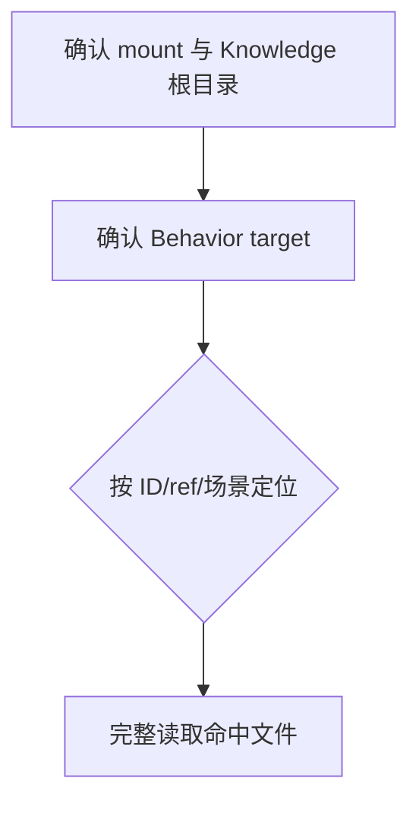
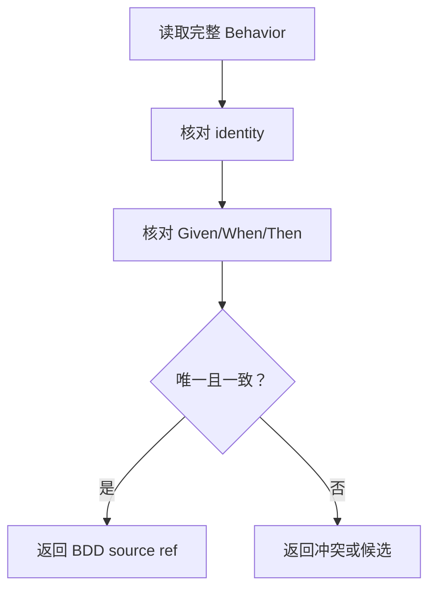

# Tool Guru Knowledge

当 Agent 需要从 Guru Knowledge 定位一个 Behavior，并把它作为当前任务的 BDD 输入时使用本技能。

本技能只负责：

- 定位指定 Behavior；
- 完整读取 Behavior 来源；
- 核对 `id`、`Given`、`When`、`Then`；
- 形成可重放的 BDD source ref。

## Skill Type

- type: tool
- layout: compact
- note: 本技能是 Guru Knowledge 的只读 Behavior 查询工具，不是 Domain workflow，也不是 artifact/Pack 工具。

## Knowledge Boundary

GuruSdk 的默认 Knowledge 根目录为：

```text
~/.guru/knowledge/Products/GuruSdk
```

只读取当前调用方提供或当前 mount 可读的 Knowledge 根目录。Knowledge 文档是待核验来源，不自动等于 runtime 事实或验证通过。

本技能只使用以下区域：

- `index.md`：确认产品边界和 Behavior 目录入口；
- `Behaviors/`：Behavior 的 canonical 来源。

## Inputs

### I-001: Mount And Knowledge Root

Required：

- 当前 mount 可见本技能、`scout-assets` 和只读文件工具；
- 可读的 Guru Knowledge 根目录，或默认的 GuruSdk 根目录。

Missing：

- mount 或 Knowledge 根目录不可读时，停止并返回原始失败命令、路径和错误。

### I-002: Behavior Target

至少提供以下一项：

- canonical Behavior `id`；
- 已知的 Behavior source ref；
- 足以定位 Behavior 的场景描述。

优先级：`id` > source ref > 场景描述。

Missing：

- 三者都缺失时，不扫描整个 Knowledge 根目录，返回缺少 Behavior target。

## Fast Behavior Lookup

### 已知 Behavior ID

1. 先确认 `index.md` 和 `Behaviors/` 位于同一产品根目录。
2. 对 GuruSdk 的 canonical id `gurusdk.behavior.<name>`，先检查：

   ```text
   <knowledge-root>/Behaviors/<name>.md
   ```

3. 如果约定路径不存在，只在 `Behaviors/` 内按 frontmatter 的完整 id 精确查询：

   ```bash
   rg -n '^id: gurusdk\.behavior\.<name>$' '<knowledge-root>/Behaviors'
   ```

4. 命中后只读取命中的完整文件，不继续扫描其它目录。

### 已知 source ref

直接读取调用方提供的 source ref，并确认它位于当前 Knowledge 根目录的 `Behaviors/` 内。

### 只有场景描述

只在 `Behaviors/` 内使用有边界的关键词查询：

```bash
rg -n '<场景关键词>' '<knowledge-root>/Behaviors'
```

然后逐个读取候选完整文件，保留所有候选、冲突和排除依据；本技能不替调用方从多个候选中臆选唯一 Behavior。

禁止：

- `find <knowledge-root> -type f` 全量扫描；
- 根据相似文件名猜测 canonical Behavior；
- 用搜索摘要代替完整来源读取；
- 在 Behavior 不唯一时自行选择。

## Complete Behavior Read

命中候选后必须完整读取 Behavior 文件，至少核对：

- frontmatter 中的 `id`、`status`、`product` 和其它身份字段；
- `Feature` 或等价标题；
- `Given`；
- `When`；
- `Then`；
- `Expect`、`Cases` 和场景边界（如果存在）；
- 文件中的 source locator。

如果调用方提供了 Behavior ID：

- 文件 frontmatter 的 `id` 必须与调用方提供的 ID 完全一致；
- 不一致时返回 source mismatch，不得把相似文档当作结果。

如果调用方只提供场景描述：

- 返回所有仍可读的候选及各自 source ref；
- 由 Domain 调用方核对意图并决定是否已经唯一闭合。

## BDD Source Ref

返回的 BDD source ref 必须包含：

- Knowledge repository：例如 `GuruSdk`；
- 产品相对路径：例如 `Behaviors/<behavior-name>.md`；
- 可重放 locator：至少包含 frontmatter `id` 和 `Given`、`When`、`Then` 标题。

本机绝对路径只能作为当前读取位置的诊断信息，不能代替产品相对 source ref。

## Workflow

### Phase 1: Confirm Read Boundary

Knowledge：

- 当前 mount 能读取本技能、`scout-assets` 和只读文件工具；
- Knowledge 根目录和产品边界明确。

Flow：



Blocked：

- mount 不可用；
- Knowledge 根目录不可读；
- Behavior target 缺失。

### Phase 2: Verify One Behavior

Knowledge：

- canonical `id`、`Given`、`When`、`Then` 必须来自完整 Behavior 来源；
- source ref 必须能被调用方重新定位。

Flow：



Blocked：

- frontmatter 无法解析；
- 指定 ID 与来源不一致；
- 必要的 `Given`、`When` 或 `Then` 缺失；
- 多个候选无法区分。

Exit：

- 已完整读取来源；
- identity 与目标一致；
- `Given`、`When`、`Then` 可定位；
- 已返回 BDD source ref，或已明确返回候选冲突。

## Output Contract

唯一 Behavior 已确认时返回：

```markdown
# Guru Behavior Result

## Behavior Identity
- id: <canonical behavior id>
- status: <source status>

## BDD Source Ref
- repository: <knowledge repository>
- source: <product-relative behavior path>
- locator: <replayable locator>

## Scenario
- Given: <中文摘要或原文定位>
- When: <中文摘要或原文定位>
- Then: <中文摘要或原文定位>

## Commands
## Failed Commands
## Limitations
```

存在多个候选或来源冲突时，不输出唯一 Behavior 结论；在 `Behavior Identity` 中列出候选 ID 和各自 source ref，并说明冲突。

## Failure And Prohibited Rules

- 只读 Knowledge，不修改、迁移或修复 Knowledge。
- 不创建 Research Pack、Execution Pack、Evidence Registry 或验证报告。
- 不判断当前版本是否实现 Behavior，也不判断 runtime 是否通过。
- 不把 Knowledge 文档存在解释为代码事实或运行事实。
- 命令失败时保留原始命令、退出码、错误摘要和受影响路径；不得用其它产品或未声明路径补齐。
- 已知 ID 的精确定位失败后，只允许按本技能规定在 `Behaviors/` 内做一次 frontmatter 精确查询；仍失败则返回阻塞事实。
