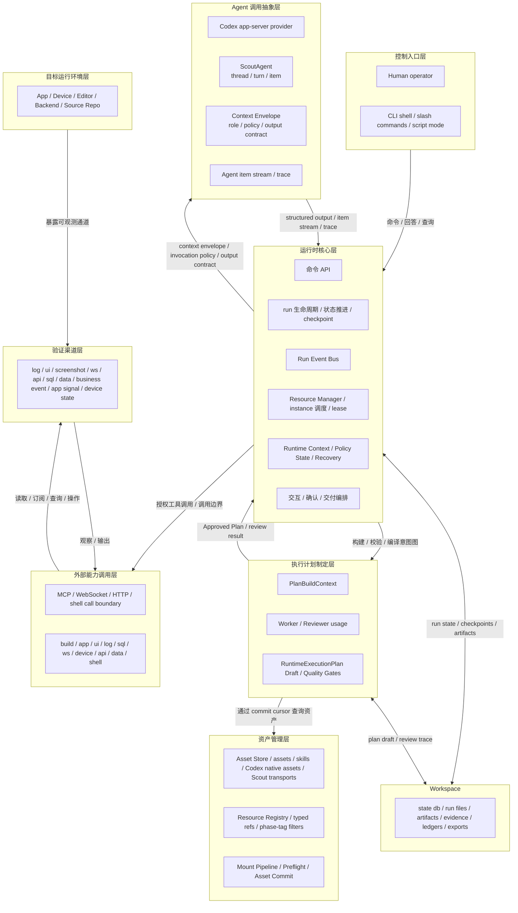
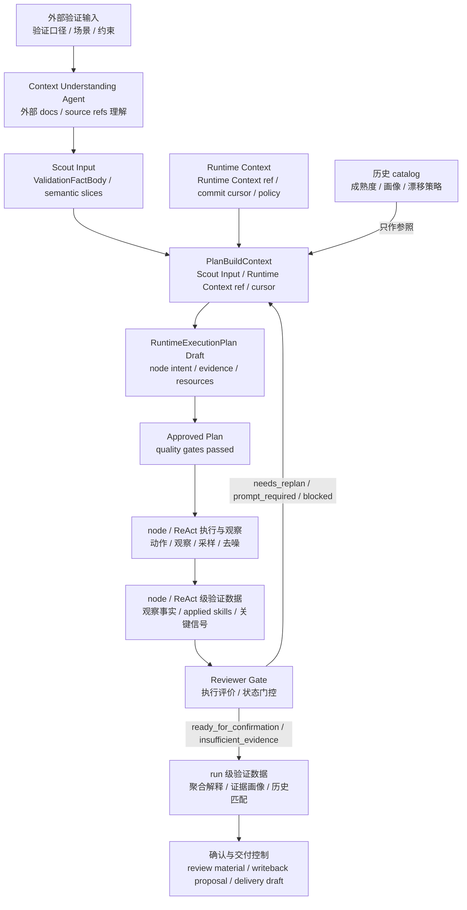
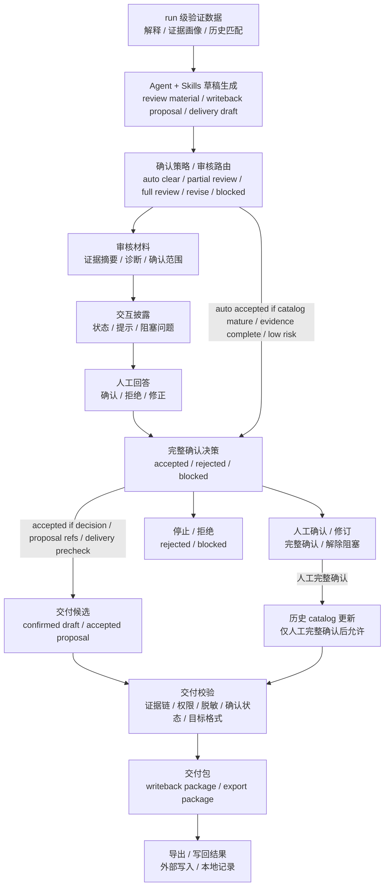
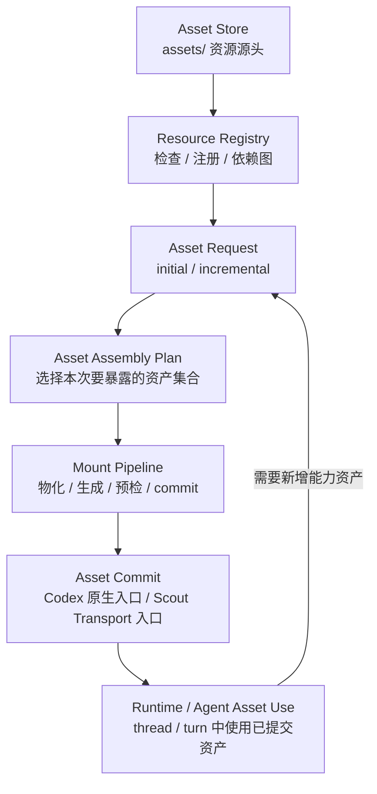
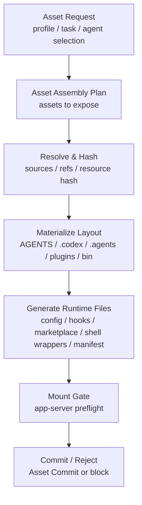
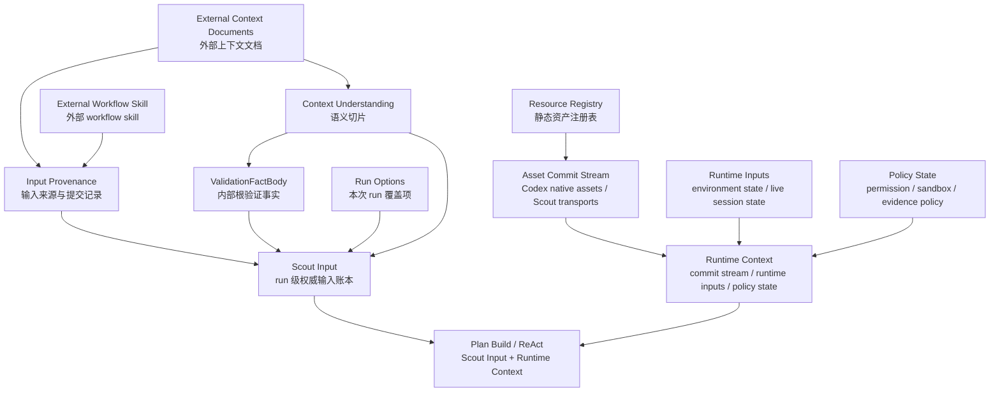

# Scout 设计

Scout 把结构化验证事实、源码上下文、Scout Internal Skills、Agent 推理、外部能力、人工交互和 workspace 持久化串成一次可恢复的 validation run。它不以固定脚本或通用 Agent 会话为中心，而以 Scout Runtime 管理的证据闭环为中心：先理解验证目标，再推理执行路径和证据渠道，在真实 App、设备或 Editor 环境中执行，最后产出可审计、可确认、可写回的运行材料。

## 1. 定位与边界

### 1.1 产品定位

Scout 是面向验证任务的 skill-driven agentic validation runtime。它以 Scout Runtime 为执行控制中心，以 Codex app-server 提供 Agent 执行底座，以 Scout Internal Skills 和历史 catalog 承载验证方法论、领域知识、流程模板和 eval，以 Workspace Ledger 固化执行、证据、恢复和审计材料。

Scout 的目标是形成一个可生长的验证体系：每次验证不仅产出结论，也沉淀证据链、方法论、失败模式、确认经验和可复用技能；这些资产反过来改进下一次验证，让 Scout 从一次性 Agent 执行工具，逐步演进为持续积累、可复盘、可评估、可迭代的验证系统。

### 1.2 解决的问题

- 语义化验证目标难以直接转成固定自动化脚本，需要 Agent 基于验证事实、源码语义、运行环境和工具可用性推理验证流程。
- 通用 Agent / LLM 会话可以推理和执行，但缺少验证任务所需的运行边界、资源调度、证据账本、恢复语义、策略治理和可复用技能体系。
- 验证不能停留在 Agent 自评，需要在真实 App、设备或 Editor 环境中采集可信证据，并把 observation 沉淀为可审计证据链。
- 长周期验证任务不能依赖单次 Agent / LLM 会话存活，需要任务状态、执行上下文、checkpoint、interaction 和 artifact 能够独立恢复。
- 验证运行过程中的状态、提示、证据、确认和交付材料需要统一组织，避免证据链、状态链和交付链路割裂。
- Runtime 状态、证据、checkpoint、确认记录和交付材料必须有清晰落盘边界，保证 run 可复盘、可审计、可写回。

### 1.3 不解决的问题

- Scout 不是外部知识库中心，不负责长期知识资产的索引、路由、聚合、发布和版本治理。
- Scout 不对外部输入质量本身负责；Validation Fact、源码引用、BDD、架构事实和 code binding 的正确性由输入生产方保证。
- Scout 不决定交付材料被外部系统如何采纳、归档、替换、废弃或发布。
- Scout 不替代人工业务判断；它提供证据链、Agent 解释、确认入口和写回材料。

### 1.4 架构核心原则

**以 Agent 为验证核心**

Scout 的核心不是执行固定脚本，而是让 Agent 基于验证目标、源码语义、运行环境和可用能力，自主推理验证路径、执行动作、观察结果并修正判断。

**上下文是 Agent 能力的来源**

Scout 通过输入事实、源码语义、预定义资产、运行环境、工具能力、历史参照和策略边界，为 Agent 构造清晰、准确、可追溯的上下文。Agent 做得是否准确，首先取决于上下文是否组织得足够好。每次 run 中，Runtime 都必须把验证事实、源码上下文、skill 候选、资产引用和工具环境组织成可执行上下文，再交给 Agent 推理验证意图、执行路径和证据采集方案。

**验证方法论沉淀为 Skills**

Scout 不把验证能力、领域知识、流程模板、工具使用经验和 eval case 固化在 Runtime 分支逻辑或重 schema 中，而是沉淀为 Scout Internal Skills。Skills 指导 Agent 如何验证；Runtime 负责候选降噪、工具环境准备、结构化记录和恢复。

**外部能力扩展 Agent 的行动范围，Runtime 保证执行不偏离目标**

MCP、WebSocket、HTTP 和 shell 能力不是独立决策者，而是 Agent 触达外部系统、操作目标环境、采集观察信号的行动接口。Runtime 负责按任务上下文、权限、资源和证据要求准备能力上下文、授权边界和运行环境，并在执行过程中持续校验边界、记录事实、处理偏差，让 Agent 能做事、做对事，并稳定完成任务。

**执行底座与验证边界分离**

Codex app-server 提供 Agent 推理、本地执行和 Codex 原生能力加载；Scout Runtime 负责验证任务的输入、资产、权限、证据、恢复和交付边界。Agent runtime 可以替换，但 Scout 的验证边界、资产边界和 workspace 边界不能被执行底座接管。

**结构化约束服务事实边界和运行账本**

Scout 不用强 schema 锁死 Agent 的推理路径。结构化约束主要用于固定输入事实、语义引用、意图执行图、资源边界、ReAct 记录、证据材料、节点结果、资源账本和恢复点，让 Agent 的自主验证过程可追溯、可恢复、可审计。

**证据优先于自我判断**

Agent 的解释不能替代证据。验证结论必须来自真实环境中的可观察信号、可追溯的信号提取依据、可解释的判断标准，以及每一步执行后留下的结构化结果。证据渠道可以来自日志、UI、App WebSocket、API、SQL、设备状态、截图或业务事件；Agent 选择候选证据渠道，Runtime 负责校验上下文、权限和资源边界。

**验证产物是可复盘记录，不是简单结论**

Scout 的产物不是单个 pass / fail，而是一组可恢复、可审计、可确认、可写回的验证记录。结论必须和输入事实、执行路径、证据材料、Agent 解释、人工确认和交付材料保持可追溯关系。

**适应性执行优先于固定流程**

Scout 支持 Agent 根据观察结果调整路径，处理分支、并发、等待、重试、降级和阻塞。执行计划不是一次性静态步骤清单，而是可以被运行时检查和恢复的意图执行图。Graph 控制意图、依赖、并发和运行边界；Skills 与 Agent 控制 node 内的推理、行动选择、证据发现和解释。

**可中断和恢复是执行长任务的基石**

长周期验证不能依赖单次 Agent 执行会话或 LLM 调用链存活。输入、计划、事件、观察结果、人工交互、资源使用记录和恢复点都必须能够落盘、复盘和恢复。

**区分定义、运行和结论**

预定义资产、运行时资源、实际观察结果、证据材料和确认事实必须分离，避免 Agent 把“模板”“当前观察”“历史经验”和“本次结论”混在一起。

**人在不确定边界介入**

Scout 不替代人工判断。遇到输入不清、证据不足、环境冲突、策略风险或确认门禁时，系统应把问题显式化，让人工在正确上下文中介入。

## 2. 总体架构与主链路

Scout 的总体架构是以 Runtime Core 为执行控制中枢、以执行计划制定层和 Asset Store 为独立机构协作的运行体系。Runtime Core 拥有 run 执行控制权、状态推进、checkpoint、Agent 调用编排、工具路由边界、资源调度边界和运行账本写入边界；执行计划制定层负责 `RuntimeExecutionPlan` draft 的创建、审核和质量门控；Asset Store 负责静态资产定义管理，并通过 Mount Pipeline 形成 Asset Commit；Runtime Context 维护 asset commit stream、Runtime Inputs 和 Policy State；Resource Manager 基于 Runtime Context 管理运行时资源和调度；Workspace 承载 run 内生成和固化的运行材料。

### 2.1 分层架构



核心职责：

- 控制入口层：负责人与系统的交互。
  - Human operator：提供人工确认、修正、阻塞问题回答和运行决策。
  - CLI shell / slash commands / script mode：提供交互式和脚本化控制入口，只调用 Runtime Command API。
- Runtime Core：负责 run 执行控制、状态推进、命令边界、Agent 调用编排、工具路由边界、资源调度边界、Agent trace ledger、checkpoint 和 recovery。
  - Command API：承接 CLI 命令和查询请求。
  - run 生命周期 / 状态推进 / checkpoint：维护主线状态、恢复边界和一致性水位。
  - Run Event Bus：承载 run 内事件，统一事件排序、消费和恢复。
  - Agent 调用编排：创建和调用 `ScoutAgent`，准备 context envelope、invocation policy、output contract 和 Codex runtime environment，接收结构化输出、item stream 和 trace，并把工具调用、状态推进和账本写入保持在 Runtime 受控边界内。
  - Resource Manager / instance 调度 / lease：基于 Runtime Context 解析本次 run 的实际绑定和占用关系，并管理 worker 调度、timer、monitoring、工具环境准备和 resource ledger。
  - Runtime Context / Policy State / Recovery：维护 asset commit stream、Runtime Inputs、Policy State 和恢复边界。
  - 交互 / 确认 / 交付编排：负责把验证数据推进到审核、确认、写回和导出链路。
- 执行计划制定层：负责把 Scout Input、Runtime Context 引用、asset commit cursor 和计划约束转成可审核的 `RuntimeExecutionPlan` draft。
  - PlanBuildContext：封装计划制定使用的输入事实、运行态上下文引用、commit cursor 和计划约束。
  - Worker / Reviewer usage：计划制定层使用 Runtime / Agent Orchestrator 持有的 Worker / Reviewer；Worker 负责创建和修复计划，Reviewer 负责独立审核计划。
  - RuntimeExecutionPlan Draft / Quality Gates：承载行为 node、证据要求、资源要求、输出契约和质量门控结论。
- Asset Store：负责资产定义管理、注册、装配、预检和提交。
  - Asset Store / assets / skills / Codex native assets / Scout transports：保存可被 Scout 管理的内部技能、Codex 原生资产、MCP server config、WebSocket / HTTP transport、ShellTool 和运行配置。
  - Resource Registry / typed refs / phase-tag filters：管理资产身份、格式 schema、内容校验、分域 typed refs 和 skill 过滤结构。
  - Mount Pipeline / Preflight / Asset Commit：物化 Codex 原生布局、生成运行时文件、执行 preflight，并形成 Asset Commit。
- Agent 调用抽象层：负责把 Codex app-server thread / turn / item 封装成 Scout 内部统一的 `ScoutAgent` invocation。
  - Codex app-server provider：提供底层 thread / turn、模型调用、本地文件读取、Codex plugin 原生能力、MCP runtime、shell command 和事件流。
  - ScoutAgent：封装一个底层 thread，承载 turn 输入输出、thread history、item stream 和 trace 引用。
  - Context Envelope / Invocation Policy / Output Contract：定义本次 Agent invocation 的上下文视图、权限边界和结构化输出契约。
  - Agent item stream / trace：记录 message、event、tool call、tool result、usage、applied assets 和 output contract 校验结果。
- 外部能力调用层：负责外部能力的运行期调用、stream / subscribe 转发和结构化输出返回。外部能力包括 Codex 原生能力（MCP server、plugin、shell command）和 Scout 自持 Transport 能力（WebSocket、HTTP）。
  - MCP / WebSocket / HTTP / shell call boundary：执行已由 Asset Commit 暴露或 Runtime 授权范围内的能力，处理 stream、subscribe、权限校验和路由错误。
  - build / app / ui / log / sql / ws / device / api / data / shell：按 Runtime 授权访问验证渠道或操作目标环境，并返回结构化输出，不拥有 Scout run state 或业务结论。
- 验证渠道层：定义目标运行环境暴露出来的可观测、可采证通道。
  - log / ui / screenshot / ws / api / sql / data / business event / app signal / device state：作为 EvidenceResource.channel 的受控来源，由目标环境暴露，由 MCP 工具读取、订阅、查询或操作。
- 目标运行环境层：承载真实 App、设备、Editor、后端和源码环境。
  - App / Device / Editor / Backend / Source Repo：被构建、安装、启动、观察、查询和验证的真实对象。
- Workspace：保存本次 run 产生和固化的运行材料。
  - state db / run files / artifacts / evidence / ledgers / exports：保存 Scout Input、plan draft / Approved Plan、events、NodeResult、证据、日志、截图、resource ledger、确认和导出材料。

### 2.2 从输入到验证数据

这条链路只表达数据如何从输入走向验证结果，不表达具体 schema。外部验证输入、项目源码引用和外部文档先由短期 Context Understanding Agent 整理成 Scout Input；Runtime Context 提供当前 asset commit cursor、运行输入状态和策略边界；计划制定层把 Scout Input、Runtime Context 引用、asset commit cursor 和计划约束组成 `PlanBuildContext`，再生成 `RuntimeExecutionPlan` draft，并通过质量门控形成 Approved Plan；Runtime 执行 Approved Plan，驱动 node / ReAct 执行和观察，沉淀 node / ReAct 级验证数据；Reviewer Agent 对执行结果、证据质量、风险和置信度进行统一门控评价；run 结束后再聚合为 run 级验证数据，进入确认与交付链路。

node / ReAct 级验证数据必须保留当前 node 的意图、实际观察、语义切片、applied skill refs、关键信号、缺失信号、噪声信号、推理和置信度。run 级验证数据必须基于所有有效 node / ReAct 数据生成聚合解释、证据画像和历史匹配结果。历史 catalog 只参与成熟度和漂移判断，不能替代本次 run 的证据采集、证据发现和判断依据。



核心职责：

- 外部验证输入：提供验证口径、业务场景和约束边界，是 run 的语义来源。
- Context Understanding Agent：短期 Agent，只负责把外部 docs、source refs 和代码图引用转成 Scout 内部知识，形成语义切片、`ValidationFactBody` 和 Scout Input；源码语义优先通过 CodeGraph MCP 进入语义切片。它不是 run 创建和执行期间长期在线的 Worker / Reviewer 之一。
- Scout Input：提供验证目标、业务场景、验收口径、语义切片和输入溯源，是计划制定读取验证语义的权威来源。
- 运行上下文：提供 Runtime Context 引用、当前 asset commit cursor、运行输入状态和策略边界；资产 refs 通过 cursor 指向的 Asset Commit 查询获得。
- 历史 catalog：提供成熟度、历史画像和漂移策略，只用于参照和匹配，不能替代本次采证。
- PlanBuildContext：把 Scout Input、Runtime Context 引用、asset commit cursor 和计划约束组织成 Worker / Reviewer 使用的上下文。
- RuntimeExecutionPlan Draft / Approved Plan：把验证目标转成 node intent、依赖关系、skill refs、资源边界和证据方向，并通过质量门控后进入执行。
- node / ReAct 执行与观察：负责触发行为、采集观察、处理噪声和形成 node / ReAct 级验证数据。
- node / ReAct 级验证数据：保留当前 node 的意图、实际观察、语义切片、applied skill refs、关键信号、缺失信号、噪声信号、推理和置信度。
- Reviewer Gate：复用执行评价和状态推进门控。Reviewer 的评价不直接写 run state，但它的结构化 verdict 由 State Controller / Plan Manager 消费为同一个 gate 结果。Reviewer Gate verdict 只使用 `ready_for_confirmation`、`needs_replan`、`prompt_required`、`blocked` 和 `insufficient_evidence` 这组枚举；文档中的 prompt 语义均指 `prompt_required`。
- run 级验证数据：基于所有通过 Reviewer Gate 的有效 node / ReAct 数据生成聚合解释、证据画像和历史匹配结果；其中 `ready_for_confirmation` 表示可进入确认链路，`insufficient_evidence` 表示形成不可判定的 run 级验证数据并进入确认 / 交付披露，不回到旧 Approved Plan 下继续执行。语义解释和交付草稿由 Agent 在 Skills 指导下生成，Runtime 负责记录来源、证据引用和校验结果。
- 确认与交付控制：Agent + Skills 可以生成 review material、writeback proposal 和 delivery draft；Runtime / Delivery schema / confirmation chain 负责校验证据链、权限、脱敏、确认状态和目标格式，并控制最终 writeback / export。

### 2.3 确认与交付控制

交付链路消费 run 级验证数据，不直接消费单条原始 artifact。Agent 在 Skills 指导下可以生成 review material、writeback proposal 和 delivery draft；Runtime / Delivery schema / confirmation chain 负责校验证据链、权限、脱敏、确认状态、目标格式和最终 writeback / export 边界。Agent 的解释不能直接替代确认门禁；确认通过之后才能生成对外可消费的交付材料。历史 catalog 更新只来自人工完整确认整个 run 的记录，自动接受不能直接强化历史 catalog。



核心职责：

- run 级验证数据：提供解释、证据画像和历史匹配结果，是确认与交付链路的输入。
- Agent + Skills 草稿生成：根据 run 级验证数据同时生成 review material、writeback proposal 和 delivery draft。review material 用于证据摘要、诊断、确认范围和阻塞说明；writeback proposal / delivery draft 用于描述候选写回内容、目标格式和交付包草稿。所有草稿都不是最终外部写入事实，必须经过确认策略 / 审核路由、完整确认决策和交付校验后才能形成 writeback / export。

人工审核流程：

- 审核材料：把证据摘要、诊断结论和待确认范围组织成人工可判断的材料。
- 交互披露：负责展示当前状态、提示和阻塞问题，并等待外部回答。
- 人工回答：表达局部确认、完整确认、拒绝、修正或解除阻塞，是人工确认链路的业务事实。
- 人工确认 / 修订：消费人工回答；局部确认只用于清理局部证据、warning、drift、missing signal 或 draft item，不等于完整 accepted；修订必须回到 Agent + Skills 草稿生成；人工完整确认才允许进入历史 catalog 更新。
- 停止 / 拒绝：承载 rejected / blocked 的去向，必须停止交付、记录拒绝原因或等待外部输入。

审核路由与自动门禁流程：

- 确认策略 / 审核路由：基于交付草稿及其引用的 run data、evidence refs、catalog refs、当前 scenario、project、target 和 writeback type 判断审核模式。第一阶段是部分审核 / 局部确认，用于决定局部材料可以自动通过、需要人工审核、需要修订或 blocked；第二阶段是完整确认，用于决定整个 proposal 是否可以自动完整确认或必须人工完整确认。
- 完整确认决策：统一承载完整人工确认和自动完整确认的结果；只有 accepted 可以进入交付候选，rejected / blocked 不进入候选。
- 完整确认自动门禁：自动完整确认必须同时满足以下条件：
  - policy 允许自动接受。
  - 验证目标低风险。
  - 证据链完整。
  - 历史 catalog 成熟且无明显漂移。
  - 没有 unresolved uncertainty、policy warning、resource degradation、tool error、证据冲突或 Agent 低置信度。
- 低风险范围：通常包括只读导出、生成本地报告、更新本地报告草稿或本地候选材料；涉及源码修改、需求文档写回、Issue 状态变更、PR 评论、生产配置或外部系统状态变更时，一般不应自动进入候选。
- 交付候选：由交付草稿和完整确认 accepted 共同形成，表示已被允许进入交付校验的 confirmed draft 或 accepted proposal。

审核组合：

- 自动部分审核 + 自动完整确认：适用于最成熟、低风险、证据完整、无漂移的场景。可以直接从草稿进入交付候选，但仍必须经过交付校验。
- 自动部分审核 + 人工完整确认：适用于局部证据和草稿已经稳定，但最终交付仍需要人工拍板的场景，例如 PR 评论、Issue 更新或需求文档写回。
- 人工部分审核 + 自动完整确认：适用于只有局部不确定性需要人工解除，解除后其余规则足够成熟、可以自动完整确认的场景，例如人工确认某条日志口径或某个 drift 是否可接受，然后 policy 自动 accepted。
- 人工部分审核 + 人工完整确认：适用于高风险、不成熟、证据冲突或重大写回场景。第一阶段人工处理局部证据、风险、drift、warning 或 draft item；第二阶段人工对整个 proposal 做完整确认。只有完整人工确认后，才允许进入交付候选并生成历史 catalog 更新。

交付控制流程：

- 历史 catalog 更新：只在人工完整确认整个 run 后允许生成，用于更新历史画像缓存。
- 交付校验：由 Runtime / Delivery schema / confirmation chain 校验证据链、权限、脱敏、确认状态和目标格式，并控制最终 writeback / export。
- 交付包：聚合对外可消费的 writeback package 和 export package。
- 导出 / 写回结果：记录外部写入、本地导出和执行结果。

## 3. 资产管理

资产管理层由 Asset Store 承担。Asset Store 的文件系统根目录是 `assets/`，负责保存 Scout 管理的 Codex 原生资产源、Scout shell tool contract、资产 manifest 和轻量注册表。Asset Store 不直接把 `assets/` 暴露给 Agent；它先把本次 run 需要的资产物化为 Codex 原生目录布局，写入 `run/codex-mount/<mount-id>/`，完成 preflight 后形成 Asset Commit 交给 Runtime 消费。

Codex app-server 只理解 Codex 原生布局，不理解 Scout 自定义资源目录。因此 Asset Store 的核心职责不是把资源路径简单交给 Runtime，而是把 Scout Resource Bundle 转换为 Codex Native Mount：生成标准 `AGENTS.md`、`.codex/config.toml`、`.codex/hooks.json`、`.agents/skills/`、`.agents/plugins/marketplace.json`、`plugins/` 和 `bin/` wrapper，并用 app-server 控制面验证 Codex 能看到这些资产。

**设计原则**

- 设计目的：集中管理 Scout 资源源头，并为每次 run 生成可复现、可审计、可被 Codex 原生加载的 mount。
- 边界：Asset Store 负责资产扫描、注册、选择、mount pipeline、preflight 和 Asset Commit；Runtime 负责 thread / turn、run state、事件、artifact、证据和恢复。
- 加载约束：required 静态配置错误、materialize 错误或 preflight 失败必须阻塞 Asset Commit；optional 静态引用缺失只输出 warning。
- 渐进式披露：skills 是任务语义资产，先过滤、再由 Agent 选择、再通过 mount pipeline 增量暴露；其它 Codex 原生运行环境资产按 profile 默认全量加载。
- 可复现：每个 Asset Commit 必须记录 commit id、parent commit、mount id、资产 hash、生成文件 hash、preflight 结果和 Codex effective view。

### 3.1 定位与边界

Asset Store 是资产源管理和 Codex mount 管道。它回答“有哪些资产可以被 Scout 管理”“本次 run 应该暴露哪些资产”“这些资产能否被 Codex 原生发现和加载”。它不回答“Agent 在某个 turn 做什么”“工具输出是否构成证据”“run 状态如何推进”。

Asset Store 负责：

- 扫描 `assets/`，读取 manifest、skill metadata、plugin package、MCP server config、hook config、Codex config 模板和 shell tool contract。
- 构建 Resource Registry 和 skill phase / tag 派生索引。
- 按 profile / task / selected refs 选择本次 Asset Commit 要暴露的资产。
- 将选中资产物化到 `run/codex-mount/<mount-id>/`。
- 生成 `.codex/config.toml`、`.codex/hooks.json`、`.agents/plugins/marketplace.json`、shell wrapper、`mount-manifest.json` 和 preflight 记录。
- 通过 app-server 控制面执行 mount preflight，例如 `config/read`、`skills/list`、`plugin/list`、`hooks/list` 和 shell tool smoke call。
- 形成 Asset Commit，向 Runtime 返回 commit ref、mountRoot 和 preflight 结果引用。

约束：

- 不保存 run 过程中产生的计划、状态、事件、证据、确认、审计或交付材料。
- 不创建、持有或恢复运行态资源；运行态资源由 Runtime Core 在执行期管理。
- 不启动 Scout run，不推进 run state，不消费 Agent 结论。
- 不把 `assets/` 直接作为 Codex cwd；Codex 只消费 Asset Commit 指向的 mountRoot。
- 不把 shell tool 注册到 app-server；shell tool 只通过 Scout contract 物化为 PATH wrapper、env 和使用说明。
- 不在 Registry 中保存 MCP 在线状态、工具调用结果、设备状态、账号状态或外部系统可用性结论。

### 3.2 Asset Store 文件组织

Asset Store root 固定为 `assets/`。`assets/` 保存资产源和声明；`run/` 保存由 Asset Store 生成的 registry cache、Codex mount 和 preflight 结果，也保存由 Runtime 生成的 run state、events 和 artifacts。`assets/` 是权威输入；`run/` 中的 mount 和 registry 都可以按 hash 重建，Runtime 产物按 run 生命周期管理。

建议文件组织：

```text
assets/
  codex/
    manifest.json
    skill-taxonomy.json
    shell-tools.json
    transports.json

    AGENTS.md

    config/
      base.config.toml
      profiles/
        default.config.toml
        ios.config.toml

    hooks/
      hooks.json

    skills/
      scout-runtime/
        SKILL.md
        agents/
          openai.yaml

    plugins/
      packages/
        apppilot/
          .codex-plugin/
            plugin.json
          skills/
            apppilot-mcp/
              SKILL.md
              agents/
                openai.yaml
          hooks/
            hooks.json
          mcp/
            servers.toml

    mcp/
      servers.toml
```

目录职责：

- **manifest.json**：Asset Store 的资源清单入口，声明 profile、默认加载集合、资源 id、类型、source path、hash、required / optional refs 和生成策略。
- **skill-taxonomy.json**：Scout skill 受控词表，包含 phase、tags、devices。它只服务 Scout 候选过滤，不是 Codex 原生资产。
- **shell-tools.json**：Scout shell tool contract，声明可暴露到 mount `bin/` 的命令、真实路径、smoke call、写入边界和是否 required。它不是 app-server shell tool 注册表。
- **transports.json**：Scout 自持 WebSocket / HTTP transport contract，声明 transport ref、endpointRef、authRef、能力枚举、lifecycle 和 preflight 策略。它不是 Codex 原生 MCP 或 plugin 配置。
- **AGENTS.md**：Codex project guidance 模板，materialize 后位于 mount 根目录。
- **config/**：Codex `.codex/config.toml` 的生成输入，包括基础配置和 profile overlay。
- **hooks/**：Codex hook 配置模板，materialize 后位于 `.codex/hooks.json` 或合并进 `.codex/config.toml`。
- **skills/**：Scout 管理的 Codex native skills。每个 skill 保持标准 `SKILL.md` 结构，并可附带 `agents/openai.yaml`。
- **plugins/packages/**：Scout 管理的 Codex plugin package。每个 package 保留 `.codex-plugin/plugin.json` 和插件自带 skills、hooks、MCP 声明。
- **mcp/servers.toml**：Scout 顶层 MCP server config 源，materialize 后写入 `.codex/config.toml` 的 `[mcp_servers.*]`。

### 3.3 什么是资产

资产是可版本化、可审计、可引用的静态资源源或 contract。资产不是 run 输出、不是当前连接状态、不是设备占用、不是工具调用记录，也不是 Agent 对本次 run 的结论。

Codex 原生资产类型只包括：

- **config**：生成 mount `.codex/config.toml` 的配置源。
- **AGENTS.md**：生成 mount 根目录 `AGENTS.md` 的 project guidance。
- **skill**：生成 mount `.agents/skills/<name>/SKILL.md` 的 Codex skill。
- **plugin**：生成 mount `plugins/<name>` 和 `.agents/plugins/marketplace.json` 的 Codex plugin package。
- **MCP server config**：生成 `.codex/config.toml` 中 `[mcp_servers.*]` 的 server 配置。
- **hook config**：生成 `.codex/hooks.json` 或 `.codex/config.toml` 中 `[hooks]` 的 hook 配置。

Scout 支撑资产：

- **manifest**：Asset Store 的资源登记源和 profile 选择入口。
- **skill taxonomy**：Scout skill 的 phase / tags / devices 受控词表。
- **shell tool contract**：Scout 自己维护的 shell tool 声明，materialize 为 mount `bin/` wrapper、PATH、env 和说明；Codex app-server 只把它们当普通 shell 命令使用。

加载策略：

- **skills**：走内部过滤 + Agent 选择 + 渐进式 mount pipeline。Asset Store 先按 `phase`、`tags`、`devices` 降噪，Runtime 把候选 metadata 和 refs 交给 Agent；Agent 选择后，Asset Store 再把对应 skill 增量物化，并形成新的 Asset Commit。新暴露的 skill 从下一 turn 开始可用。Context Understanding Agent 也遵守同一规则；`context_understanding` phase 的 skill 不是预装特例，而是由 Runtime 过滤候选后交给 Understanding Agent 选择加载。
- **config / AGENTS.md / plugins / MCP server config / hooks / shell tools**：按 profile 默认全量加载。这些是运行环境资产，数量不大，不在每个 turn 做复杂筛选。

### 3.4 Skill Metadata 与候选过滤

Scout 管理的 skill 以 Codex 原生 `SKILL.md` 保存。Asset Store 在 rebuild 阶段只读取 frontmatter 和可选 `agents/openai.yaml` metadata，不读取或解释完整 skill body。Skill body 是 Codex app-server 可读取的本地资产正文；Runtime 只把候选 skill 的 name、description、path、phase、tags、devices 和 dependencies 摘要交给 Agent。Agent 选择某个 skill 后，Asset Store 通过 mount pipeline 把该 skill 暴露到 `.agents/skills/`，Codex 再按原生 skill 机制读取正文。

示例：

```markdown
---
assetKind: scout.skill
id: skills.mobile.login_validation
version: 1.0.0
phase: [plan_build, react]
tags: [mobile_app, login, auth]
keywords: [token refresh, session restore, auth callback]
devices: [ios, android]
tools:
  required:
    - shellTools.adb
    - mcpServers.apppilot
plugins:
  optional:
    - plugins.apppilot
summary: Validate mobile login behavior through UI state and auth logs.
---

# Mobile Login Validation

Skill body 由 Codex app-server 在需要时按 path 自行读取。
```

字段说明：

- **assetKind**：固定为 `scout.skill`。
- **id / version**：skill 的稳定身份和版本。
- **phase**：受控类型，表达 skill 适用阶段，例如 `context_understanding`、`plan_build`、`react`、`evidence_interpretation`、`confirmation_review`。
- **tags**：受控类型，表达领域、场景和验证类别，用于 Runtime 后续做主要候选过滤。
- **keywords**：自由描述词、业务别名或个性化提示，不建立全局索引，只保存在 skill metadata 中，供 Runtime / Agent 在小候选集内二次筛选。
- **devices**：受控设备类型，例如 `ios`、`android`、`editor`、`backend`、`any`。
- **tools**：skill 依赖的 Scout resource refs，可以引用 `shellTools.*`、`mcpServers.*` 或其它 manifest 中定义的能力。Asset Store 只检查 ref 是否存在，实际 MCP tool / shell command 是否能执行由 preflight 和运行期处理。
- **plugins**：skill 相关的 Codex plugin 引用。plugin 作为 profile 运行环境资产默认全量 materialize；skill 只用它表达推荐关系和缺失诊断。
- **summary**：短描述，用于候选展示和 Agent 选择。

`phase` 受控枚举：

- **context_understanding**：用于把外部上下文文档整理成语义切片和根验证事实。
- **plan_build**：用于把 Scout Input、源码语义、运行上下文和证据方向编译成 RuntimeExecutionPlan。
- **react**：用于 node / instance worker 内的 ReAct 执行、观察、局部诊断和工具使用指导。
- **evidence_interpretation**：用于证据抽取、EvidenceMatchResult 解释、missing signal 诊断和 step / run 级验证数据聚合。
- **review_drafting**：用于生成 review material、writeback proposal 和 delivery draft。
- **confirmation_review**：用于确认策略、审核材料、阻塞问题和人工 / 自动确认建议。

`tags` 是受控分类 token，用于 Runtime 在某个 phase 内做主要候选过滤。tags 不表达长句、业务别名或一次性描述；这类内容放入 `keywords`。

建议 `assets/codex/skill-taxonomy.json` 结构：

```json
{
  "phase": [
    "context_understanding",
    "plan_build",
    "react",
    "evidence_interpretation",
    "review_drafting",
    "confirmation_review"
  ],
  "tags": {
    "domain": ["mobile_app", "backend", "source_repo", "data", "editor"],
    "feature": ["auth", "login", "ads", "iap", "analytics", "remote_config", "notification"],
    "evidence": ["ui", "log", "screenshot", "ws", "api", "sql", "business_event", "app_signal", "device_state", "source"],
    "validation": ["smoke", "regression", "integration", "bugfix_verification", "release_check", "drift_check"],
    "skill_kind": ["plan_guidance", "react_guidance", "evidence_guidance", "tool_safety", "review_guidance"]
  },
  "devices": ["ios", "android", "editor", "backend", "any"]
}
```

规则：

- `phase` 是候选粗过滤。Runtime 在当前阶段默认只查询匹配 phase 的 skills，用于降低上下文噪音。
- `tags` 是受控主过滤。每个 tag token 必须在 taxonomy 中出现，且全局唯一，用于把明显无关的 skills 先排除。
- `tags` 可以按类别维护，但 skill frontmatter 中仍使用扁平数组，例如 `[mobile_app, login, auth]`。
- `keywords` 不进入 tag taxonomy，不建立全局索引，只用于候选集内的二次筛选和 Agent 判断。
- 项目可以扩展 taxonomy，但扩展必须走 config / profile / pack 管理，不能在单个 skill 中临时发明 tag。

约束：

- `phase`、`tags` 和 `devices` 必须来自 `assets/codex/skill-taxonomy.json` 的受控词表。
- `keywords` 不参与 Asset Store 全局索引，也不能替代 tags。
- required `tools` 或 `plugins` ref 缺失时，skill 不注册并阻塞资产加载结果。
- optional `tools` 或 `plugins` ref 缺失时，skill 可以注册，但 AssetLoadReport 必须输出 warning。
- skill metadata 不声明真实设备 id、运行态连接、工具授权结果或本次 run 使用状态；本次实际读取和使用的 skills、plugins、MCP servers、shell tools 和 asset paths 由 Agent 在 plan / ReAct / evidence interpretation 输出中结构化回报，Runtime 负责记录。

### 3.5 Codex 原生资产声明

Codex 原生资产保持 Codex 可识别格式。Asset Store 可以在 `manifest.json` 中登记它们，但不改写它们的内部语义。

`assets/codex/mcp/servers.toml` 示例：

```toml
[mcp_servers.apppilot]
command = "/Users/chengdai/.apppilot/apppilot-mcp"
args = []

[mcp_servers.codegraph]
command = "codegraph"
args = ["mcp"]
```

`assets/codex/plugins/packages/apppilot/.codex-plugin/plugin.json` 示例：

```json
{
  "name": "apppilot",
  "version": "0.1.0",
  "description": "AppPilot build and device validation helpers",
  "skills": "./skills/"
}
```

`assets/codex/config/base.config.toml` 示例：

```toml
approval_policy = "never"
sandbox_mode = "workspace-write"

[shell_environment_policy]
inherit = "none"
include_only = ["PATH", "HOME", "TMPDIR", "SCOUT_RUN_ID", "SCOUT_ARTIFACT_ROOT"]
```

检查规则：

- config 必须能解析为 TOML，且 project-local 禁止项不能写入 mount `.codex/config.toml`。
- plugin package 必须包含 `.codex-plugin/plugin.json`，plugin name 在当前 Asset Store 内唯一。
- MCP server config 必须能合并进 Codex `.codex/config.toml` 的 `[mcp_servers.*]`。
- hook config 必须能被 Codex hooks schema 解析；hook 命令路径必须来自 mount 或 manifest 明确声明。
- AGENTS.md 必须存在且非空；多 profile 合并时必须保留来源和 hash。
- Asset Store 不展开 plugin 内部 apps / bundled MCP / bundled hooks 的行为语义；plugin 是否能被 Codex 原生发现由 app-server `plugin/list` 和 `plugin/read` 验证。MCP server 的 thread 级状态由 Runtime 在 `thread/start` 后验证。

### 3.6 Shell Tools Contract

Shell tools 是 Scout 自己的资产契约，不是 Codex app-server 的 native tool registration。Asset Store 读取 `assets/codex/shell-tools.json`，把它注册为 `shellTools.*` 资产；Mount Pipeline 再把已选中的 shell tools 物化为 mount `bin/` 下的 wrapper 或 symlink，并写入 PATH、env 和使用说明。运行时 Agent 通过普通 shell 调用这些命令。

示例：

```json
{
  "tools": [
    {
      "id": "shellTools.adb",
      "name": "adb",
      "command": "/opt/homebrew/bin/adb",
      "exposeAs": "adb",
      "required": true,
      "smoke": "adb version",
      "writes": ["$SCOUT_ARTIFACT_ROOT"],
      "network": false
    },
    {
      "id": "shellTools.pymobiledevice3",
      "name": "pymobiledevice3",
      "command": "/Users/chengdai/.apppilot/.tools/python/venv/bin/pymobiledevice3",
      "exposeAs": "pymobiledevice3",
      "required": true,
      "smoke": "pymobiledevice3 --version",
      "writes": ["$SCOUT_ARTIFACT_ROOT"],
      "network": false
    }
  ]
}
```

规则：

- 全局默认命令随 profile 默认 materialize。
- skill / plugin 依赖命令随对应 skill / plugin 进入 mount pipeline 后物化。
- required shell tool 缺失、wrapper 生成失败或 smoke call 失败时，preflight 必须失败并阻塞 Asset Commit。
- shell wrapper 必须把默认写入限制到 `$SCOUT_ARTIFACT_ROOT` 或 mount 内允许目录；需要额外写入路径时必须由 Runtime 明确授权。
- shell tool 不声明完整 args / output contract；大多数参数和输出由 skill / AGENTS.md 指导 Agent 自行对齐。
- app-server 不注册 shell tool，`config/value/write` 也不声明 shell tool；app-server 只接收 sandbox、PATH、env 和普通 shell command。

### 3.7 Resource Registry

Resource Registry 是 `assets rebuild` 的产物。它只保存 Scout 管理的资产摘要、可追溯引用、静态依赖关系和派生查询索引，不保存 Codex app-server 的有效视图，也不保存 run 选择结果。Registry 可以落盘缓存；权威来源仍然是 `assets/`。

`assets rebuild` 必须为下一次 run 负责。run start 只消费已经生成且未过期的 registry；如果 registry 缺失、过期或存在 required 错误，run start 必须 block，不能自动兜底重建。

`assets rebuild` 有两个核心职责：

- **检查**：验证 manifest、schema、路径、hash、受控 phase / tags / devices、required / optional refs、profile 状态和文件可解析性。
- **注册与构图**：注册通过检查的资产，生成 Resource Registry、skill phase / tag 派生索引、transport ref 索引，并构建 asset refs graph。这个 graph 是 registry 的一部分，不是单独的运行索引。

加载流程：

```text
scan assets/codex/manifest.json
-> parse Codex native asset sources, shell-tools.json and transports.json
-> parse SKILL.md frontmatter and agents/openai.yaml metadata
-> validate schema, paths and controlled phase / tags / devices
-> build temporary id maps
-> resolve required / optional refs
-> emit AssetLoadReport
-> register valid resources
-> build asset refs graph
-> build skill phase index and skill tag index
-> build transport ref index
```

注册结果：

- **Resource Registry**：保存已通过静态检查的资产摘要、来源引用、版本、hash、typed refs 和 profile 状态。
- **Asset Refs Graph**：保存资产之间的 required / optional 引用关系，用于查询某个 skill 依赖哪些资产，以及 mount pipeline 解析资产集合。
- **Skill Indexes**：保存 `phase` 和 `tags` 到 skill id 的派生索引。`keywords` 不建立全局索引。
- **Transport Index**：保存 `transports.*` refs 到 WebSocket / HTTP transport 声明的映射。Registry 只验证声明结构、ref 唯一性、profile 状态、auth ref 形态和 required 静态依赖，不证明 endpoint 当前可连接。
- **AssetLoadReport**：本次加载的错误和 warning，由 CLI、CI 或 Web UI 展示；Asset Store 不维护独立错误索引。

错误处理：

- required 静态引用缺失、id 重复、schema 错误、受控枚举非法、文件缺失或 hash 不匹配时，对应资产不注册，并阻塞本次 assets rebuild / run start。
- optional 静态引用缺失时，对应资产可以注册，但必须输出 warning。
- profile 禁用的资产不参与当前 registry。
- 同名覆盖、profile 选择和 manifest import 必须可审计，不能静默改变已落盘 run 的输入或结论。

边界：

- Registry 只证明资产源完整、可引用、可审计。
- Registry 不证明 MCP server 在线、shell tool 可执行、transport endpoint 可连接、设备在线、账号可用、后端可达或工具调用会成功。
- 运行时连接失败、工具不可用、权限失败、超时、响应不合法和证据不足，由 Runtime 使用到对应能力时处理。

Transport 声明的最小字段：

- **transportId / ref**：稳定 typed ref，例如 `transports.app.ws_events`。
- **kind**：`websocket` 或 `http`。
- **endpointRef**：endpoint 来源引用，可以是 profile config、env ref 或 runtime input ref，不能直接要求 Agent 拼接未登记 URL。
- **authRef**：认证来源引用；明文 secret 不进入 registry、Asset Commit 或 Agent context。
- **capabilities**：支持 `request`、`stream`、`subscribe`、`upload` 或 `download` 等能力枚举。
- **lifecycle**：连接建立、心跳、重连、超时和关闭策略摘要。
- **preflight**：required transport 可以声明轻量 preflight；preflight 只验证入口可达性或配置完整性，不证明业务消息会成功。

建议存放结构：

```text
run/
  asset-registry/
    registry.json
    codex-assets.json
    skills.json
    asset-refs-graph.json
    skill-phase-index.json
    skill-tag-index.json
    shell-tools.json
    transports.json
```

顶层 registry manifest：

```json
{
  "registryVersion": 1,
  "generatedAt": "2026-06-18T00:00:00Z",
  "profile": "default",
  "scoutRelease": "scout@0.1.0",
  "contentHash": "sha256:...",
  "domains": {
    "codexAssets": { "ref": "codex-assets.json", "count": 8, "contentHash": "sha256:..." },
    "skills": { "ref": "skills.json", "count": 1200, "contentHash": "sha256:..." },
    "assetRefsGraph": { "ref": "asset-refs-graph.json", "count": 3200, "contentHash": "sha256:..." },
    "skillPhaseIndex": { "ref": "skill-phase-index.json", "count": 5, "contentHash": "sha256:..." },
    "skillTagIndex": { "ref": "skill-tag-index.json", "count": 80, "contentHash": "sha256:..." },
    "shellTools": { "ref": "shell-tools.json", "count": 4, "contentHash": "sha256:..." },
    "transports": { "ref": "transports.json", "count": 2, "contentHash": "sha256:..." }
  }
}
```

`codex-assets.json` 只登记 Codex 原生资产源：

```json
{
  "domain": "codexAssets",
  "assets": {
    "codex.config.base": {
      "id": "codex.config.base",
      "type": "config",
      "sourcePath": "assets/codex/config/base.config.toml",
      "hash": "sha256:...",
      "profileState": "enabled"
    },
    "codex.agents.default": {
      "id": "codex.agents.default",
      "type": "agents_md",
      "sourcePath": "assets/codex/AGENTS.md",
      "hash": "sha256:...",
      "profileState": "enabled"
    },
    "plugins.apppilot": {
      "id": "plugins.apppilot",
      "type": "plugin",
      "sourcePath": "assets/codex/plugins/packages/apppilot/.codex-plugin/plugin.json",
      "packagePath": "assets/codex/plugins/packages/apppilot",
      "hash": "sha256:...",
      "profileState": "enabled"
    },
    "mcpServers.apppilot": {
      "id": "mcpServers.apppilot",
      "type": "mcp_server_config",
      "sourcePath": "assets/codex/mcp/servers.toml",
      "hash": "sha256:...",
      "profileState": "enabled"
    },
    "hooks.default": {
      "id": "hooks.default",
      "type": "hook_config",
      "sourcePath": "assets/codex/hooks/hooks.json",
      "hash": "sha256:...",
      "profileState": "enabled"
    }
  }
}
```

`skills.json` 示例：

```json
{
  "domain": "skills",
  "assets": {
    "skills.mobile.login_validation": {
      "id": "skills.mobile.login_validation",
      "type": "skill",
      "sourcePath": "assets/codex/skills/mobile-login/SKILL.md",
      "hash": "sha256:...",
      "profileState": "enabled",
      "summary": "Validate mobile login behavior through UI state and auth logs.",
      "metadata": {
        "phase": ["plan_build", "react"],
        "tags": ["mobile_app", "login", "auth"],
        "keywords": ["token refresh", "session restore", "auth callback"],
        "devices": ["ios", "android"]
      },
      "refs": {
        "required": ["mcpServers.apppilot"],
        "optional": ["plugins.apppilot", "shellTools.adb"]
      }
    }
  }
}
```

`shell-tools.json` 示例：

```json
{
  "domain": "shellTools",
  "assets": {
    "shellTools.adb": {
      "id": "shellTools.adb",
      "type": "shell_tool",
      "sourcePath": "assets/codex/shell-tools.json",
      "command": "/opt/homebrew/bin/adb",
      "exposeAs": "adb",
      "required": true,
      "smoke": "adb version",
      "hash": "sha256:..."
    }
  }
}
```

`asset-refs-graph.json` 示例：

```json
{
  "domain": "assetRefsGraph",
  "edges": [
    {
      "from": "skills.mobile.login_validation",
      "to": "mcpServers.apppilot",
      "refKind": "required"
    },
    {
      "from": "skills.mobile.login_validation",
      "to": "shellTools.adb",
      "refKind": "optional"
    }
  ]
}
```

查询能力：

- `getResource(id)`：按 id 查询已注册资产摘要。
- `listResources(type)`：按资产类型列出已注册资产。
- `findSkillsByPhase(phase)`：按受控 phase 查询 skill 候选。
- `findSkillsByTags(tags)`：按受控 tags 查询 skill 候选。
- `getSkillMetadata(skillId)`：读取 skill metadata，不读取 skill body。
- `getSkillPath(skillId)`：返回 skill source path 和 hash，供 mount pipeline 物化。
- `getSkillDependencies(skillId)`：列出某个 skill 依赖或推荐的所有资产，包括 required / optional `tools`、`plugins`、MCP server config、shell tools、以及这些资产的 source path、hash、profileState 和缺失 / degraded 状态。
- `getShellTool(toolId)`：查询 shell tool contract。
- `resolveCodexAssets(profile)`：返回当前 profile 默认全量加载的 config、AGENTS.md、plugins、MCP server config、hooks 和 shell tools。

约束：

- Registry 只包含 registered assets，不包含 discovered 但未通过检查的资产。
- Registry 不保存 mount 结果、preflight 结果、Codex effective view、MCP 在线状态、shell tool 执行状态、设备状态、运行时授权或 applied skill 记录。
- asset refs graph 和 skill phase / tag indexes 是由 registry 重建的派生查询结构，不是独立资产源。
- `keywords` 只保存在 skill metadata 中，不建立全局索引。
- 资产正文按需读取，不内联到 registry manifest，也不默认放入 Agent 上下文。

### 3.8 资产装配总流程

资产装配把 `assets/` 中的 Scout Resource Bundle 转成 Codex app-server 可消费的 Asset Commit。它以 Resource Registry 为输入，经过 Mount Pipeline 生成 Codex 原生布局，完成 preflight 后形成 commit。Runtime 不直接拼装 Codex 原生目录，只提交资产需求并消费 Asset Store 返回的 Asset Commit。



总流程：

```text
assets/
-> Resource Registry
-> Asset Request
-> Asset Assembly Plan
-> Mount Pipeline
-> Asset Commit
-> Runtime / Agent Asset Use
```

职责切分：

- Asset Store 负责到 Asset Commit 为止，包括 registry、asset plan、mount pipeline、preflight 和 commit。
- Runtime 从 Asset Commit 开始，负责 thread / turn、run state、事件、artifact、工具调用结果和错误处理。
- Codex app-server 负责读取 Asset Commit 指向的 Codex 原生布局，并在运行期执行 shell / MCP / plugin / skill 等能力。
- 外部能力的入口配置是资产；外部能力的实际调用结果是 Runtime 事件和证据输入。

两种资产请求进入同一条装配管道：

- **初始请求**：run start 时由 profile、task 和默认运行环境生成，通常全量包含 config、AGENTS.md、plugins、MCP server config、hooks 和 shell tools。初始 skill 候选只以 metadata 和 refs 形式交给 Runtime / Agent；`context_understanding`、`plan_build`、`react` 等阶段的 skill 都只有在 required 或被对应 Agent 选择后才进入 Mount Pipeline。
- **增量请求**：run 中由 Runtime 或 Agent 发现新能力需求后生成，例如新增 skill、MCP server config、plugin、hook 或 shell tool。增量请求通过同一条 mount pipeline 预检并 commit，下一 turn 才能使用。

初始资产装配：

- Runtime 在 run start 时提交 profile、task、run id、artifact root、sandbox / approval 边界和初始 skill metadata refs。
- Asset Store 从 Resource Registry 解析默认运行环境资产、required skill 和已选择 skill，生成 Asset Assembly Plan；候选 skill metadata 只作为 Agent 选择输入。
- Mount Pipeline 物化 Codex 原生布局、生成 run-scoped config、执行 preflight，并返回初始 Asset Commit。
- Runtime 只在拿到初始 Asset Commit 后启动 thread / turn。

运行中按需装配：

- 普通上下文资源不属于 Codex 原生资产注册表。它可以追加到当前 mount 或 artifact 区域，并把路径、用途和 hash 作为 turn input 给 Agent。
- skill / MCP / plugin / hook / shell tool 属于能力型资产，必须重新进入同一条 Mount Pipeline。
- Asset Store 对新增能力资产执行 resolve、materialize、generate runtime files、preflight 和 commit。
- Runtime 负责把新增入口作为下一 turn 输入通知 Agent，并记录 run event。

下一 turn 生效规则：

```text
Runtime requests asset X
-> Asset Store resolves X
-> Mount Pipeline materializes and preflights X
-> Asset Store creates Asset Commit
-> Runtime sends new paths / capability summary in next turn
```

原则：普通资源 turn 级追加；能力型资源走 Mount Pipeline 增量提交，并在下一 turn 生效。

### 3.9 Mount Pipeline：内部流程

Asset Store 在初始资产请求或增量资产请求时，把已选择资产物化为 Codex 原生 mount。静态资源默认 symlink，运行时配置默认生成真实文件。增量请求不走另一套机制；它复用同一条 mount pipeline，只是输入资产集合和 parent commit 不同。

Mount Pipeline 内部流程：

```text
resolveAssetRequest(task/profile/selectedRefs)
-> build Asset Assembly Plan
-> resolve sources and refs from Resource Registry
-> compute resource hash and mount id
-> materialize Codex native layout
-> generate runtime files
-> run Mount Gate preflight
-> create Asset Commit or reject
```



Mount Pipeline 不区分“静态管道”和“动态管道”。初始请求和增量请求只是输入不同；每次成功提交都会产生新的 Asset Commit。增量关系由 `commitId` 和 `parentCommitId` 记录，不引入额外版本节点。

### 3.10 Materialization：物化 Codex 原生布局

Materialization 负责把已选资产放入 `run/codex-mount/<mount-id>/`，形成 Codex app-server 能识别的目录结构。它只处理目录布局和文件来源策略；config、hooks、marketplace、shell wrappers 和 manifest 的生成规则在下一节说明。

运行态目录：

```text
run/
  codex-mount/
    <mount-id>/
      AGENTS.md
      .codex/
        config.toml
        hooks.json
      .agents/
        skills/
          scout-runtime -> assets/codex/skills/scout-runtime
        plugins/
          marketplace.json
      plugins/
        apppilot -> assets/codex/plugins/packages/apppilot
      bin/
        adb
        pymobiledevice3
      mount-manifest.json
  <run-id>/
    current-mount -> ../codex-mount/<mount-id>
    bin -> current-mount/bin
    artifacts/
```

materialize 策略：

- `skills/`、`plugins/packages/`、large refs / assets 使用 symlink 或 copy-on-write copy。
- `AGENTS.md` 使用生成或 copy，必须记录来源 hash。
- `.codex/`、`.agents/`、`plugins/` 和 `bin/` 目录必须由 Mount Pipeline 创建。
- plugin package 默认 symlink 到 `plugins/<plugin>`；如果运行需要隔离修改，使用 copy-on-write copy。
- skill 默认 symlink 到 `.agents/skills/<skill>`；如果 skill 来自生成内容，使用真实文件。
- large refs / assets 只通过 path 暴露，不内联到 Agent prompt。

### 3.11 Generate Runtime Files

Mount Pipeline 在 materialization 之后生成运行时文件。这一步把 registry 中的资产声明转成 Codex app-server 原生配置，以及 Agent 可以通过 shell 使用的命令入口。

生成内容：

- **`.codex/config.toml`**：合并 config profile、MCP server config、sandbox、approval、shell env、trusted project 和必要的 Codex 配置；run 级路径和写入边界见下一节。
- **`.codex/hooks.json`**：由 hook config 生成或 copy，必须记录 hook 来源和 hash。
- **`.agents/plugins/marketplace.json`**：指向 mount 内 `plugins/<plugin>`，让 Codex app-server 按原生 plugin 机制发现插件。
- **`bin/` shell wrappers**：由 `shell-tools.json` 生成 wrapper 或 symlink，并把 mount `bin/` 放入 PATH。
- **`AGENTS.md` / skill usage note**：写入 shell tool 使用约定，例如使用 PATH 中的 `adb`，不要直接调用其它 adb binary。
- **`mount-manifest.json`**：记录本次 mount 的真实内容、生成文件、hash 和 commit 关系。

shell wrapper 生成规则：

- wrapper 名称使用 `exposeAs`，例如 `bin/adb`。
- wrapper 真实命令来自 `shellTools.*.command`，不得在生成阶段改写为其它 binary。
- wrapper 默认写入边界是 `$SCOUT_ARTIFACT_ROOT` 和 mount 内允许目录。
- required shell tool 的 wrapper 生成失败时，Mount Gate 必须失败。

`mount-manifest.json` 最小结构：

```json
{
  "mountId": "m_...",
  "assetCommitId": "mc_...",
  "parentAssetCommitId": "mc_...",
  "profile": "default",
  "mountRoot": "/abs/run/codex-mount/m_...",
  "resourceHash": "sha256:...",
  "assets": [
    { "id": "codex.config.base", "type": "config", "sourcePath": "assets/codex/config/base.config.toml", "hash": "sha256:..." },
    { "id": "skills.mobile.login_validation", "type": "skill", "sourcePath": "assets/codex/skills/mobile-login/SKILL.md", "hash": "sha256:..." },
    { "id": "shellTools.adb", "type": "shell_tool", "exposeAs": "adb", "hash": "sha256:..." },
    { "id": "transports.app.ws_events", "type": "transport", "kind": "websocket", "endpointRef": "runtimeInputs.appWsEndpoint", "hash": "sha256:..." }
  ],
  "transportRefs": [
    {
      "ref": "transports.app.ws_events",
      "kind": "websocket",
      "endpointRef": "runtimeInputs.appWsEndpoint",
      "capabilities": ["subscribe", "stream"]
    }
  ],
  "generatedFiles": [
    { "path": ".codex/config.toml", "hash": "sha256:..." },
    { "path": ".agents/plugins/marketplace.json", "hash": "sha256:..." },
    { "path": "bin/adb", "hash": "sha256:..." }
  ]
}
```

### 3.12 Run-scoped Codex Config

run start 会触发 run 级 Codex config 生成，但执行者仍然是 Asset Store。Runtime 提供 `runId`、profile、artifact root、sandbox / approval 边界和 writable roots；Asset Store 把这些输入合并进 mount 内 `.codex/config.toml`，并把结果记录到 `mount-manifest.json`。

run-scoped config 的语义在 run start 确定。后续每个新 mount 默认复用或复制这份 config 内容；除非 MCP server config、hook config、shell env、approval / sandbox 或 writable roots 发生变化，否则后续 Asset Commit 只切换稳定 symlink 和 manifest，不改变 `.codex/config.toml` 的语义。

run 级 config 必须写稳定路径，不写具体 mount id：

```text
run/
  <run-id>/
    current-mount -> ../codex-mount/<mount-id>
    bin -> current-mount/bin
    artifacts/
  codex-mount/
    <mount-id>/
      .codex/
        config.toml
      bin/
```

`.codex/config.toml` 示例：

```toml
approval_policy = "never"
sandbox_mode = "workspace-write"

[shell_environment_policy]
inherit = "none"
set = {
  PATH = "/abs/run/<run-id>/bin:/usr/bin:/bin:/usr/sbin:/sbin:/opt/homebrew/bin",
  SCOUT_RUN_ID = "<run-id>",
  SCOUT_ARTIFACT_ROOT = "/abs/run/<run-id>/artifacts"
}
include_only = ["PATH", "HOME", "TMPDIR", "SCOUT_RUN_ID", "SCOUT_ARTIFACT_ROOT"]
```

计划制定期的 `thread/start` 或 `turn/start` 可以使用当前资产水位对应的稳定入口：

```ts
{
  cwd: "/abs/run/<run-id>/current-mount",
  sandboxPolicy: {
    type: "workspaceWrite",
    writableRoots: [
      "/abs/run/<run-id>/current-mount",
      "/abs/run/<run-id>/artifacts"
    ],
    networkAccess: false
  },
  approvalPolicy: "never"
}
```

Approved Plan 执行期不能依赖会继续变化的 `current-mount`。执行层必须从 Approved Plan 锁定的 asset commit cursor 解析出对应 immutable `mountRoot`，并以该 `mountRoot` 作为 cwd / writable root 的资产边界；artifact root 仍使用 run 级稳定路径。执行期 `PATH` 也必须由 Runtime 在 invocationPolicy / environment 中重写为 locked `mountRoot/bin` 优先，而不能继续使用 `/abs/run/<run-id>/bin` 这个会跟随 `current-mount` 变化的稳定 symlink。

规则：

- run start 生成 `.codex/config.toml`、`current-mount`、`bin` 和 artifact root。
- 后续 Asset Commit 默认只切换 `current-mount` / `bin` symlink，并更新 manifest 和 preflight 记录，不反复改 `.codex/config.toml`。
- 计划制定期可以使用 `current-mount` 和 run 级 `bin` 表达当前资产水位；Approved Plan 执行期必须使用锁定 cursor 解析出的 `mountRoot` 和 `mountRoot/bin`。
- 如果新增资产会改变 MCP server config、hook config、shell env、approval / sandbox 或 writable roots，必须重新生成 run 级 config，并重新进入 Mount Gate。
- Runtime 负责提出 run 级边界，Asset Store 负责把边界写成 Codex 原生 config。Runtime 不直接拼写 `.codex/config.toml`。

### 3.13 Mount Gate: Preflight

preflight 验证的是“本次 mount 是否能被 Codex 原生发现并加载”。它不证明验证目标会成功，也不保证外部系统在 run 中永远可用。

preflight 需要隔离 `CODEX_HOME`，避免用户全局 `~/.codex/config.toml`、global skills、global plugins 或 hooks 污染 Scout run。Asset Store 在隔离 `CODEX_HOME/config.toml` 中写入本次 run 稳定入口的 trust 配置：

```toml
[projects."/abs/run/<run-id>/current-mount"]
trust_level = "trusted"
```

Mount preflight 默认验证当前资产水位的 `current-mount`。Approved Plan 执行期使用 locked `mountRoot` 时，Runtime 必须确保该 `mountRoot` 在隔离 `CODEX_HOME` 中也处于 trusted project 范围，并以 locked `mountRoot` 作为 cwd 至少执行一次执行期 preflight。执行期 preflight 可以复用 Mount preflight 的检查项，但 cwd、writable root 和 PATH 必须来自 Approved Plan 锁定的 commit，而不是 `current-mount`。

推荐 Mount preflight：

```text
config/read(cwd = /abs/run/<run-id>/current-mount)
skills/list(cwds = [/abs/run/<run-id>/current-mount], forceReload = true)
plugin/list(cwds = [/abs/run/<run-id>/current-mount])
plugin/installed(...)
hooks/list(cwds = [/abs/run/<run-id>/current-mount])
command/exec(["sh", "-lc", "command -v adb && adb version"], cwd = /abs/run/<run-id>/current-mount)
```

Approved Plan 执行期 preflight：

```text
config/read(cwd = <locked mountRoot>)
skills/list(cwds = [<locked mountRoot>], forceReload = true)
plugin/list(cwds = [<locked mountRoot>])
hooks/list(cwds = [<locked mountRoot>])
assert environment.PATH starts with <locked mountRoot>/bin
```

推荐 Thread preflight：

```text
mcpServerStatus/list(detail = Full, thread = <threadRef>)
```

preflight 分为两类：

- **Mount preflight**：由 Asset Store 在形成 Asset Commit 前执行，验证 mount layout、config、skills、plugins、hooks 和 shell wrappers 是否能被 Codex 原生发现和加载。Mount preflight 通过后才能形成 Asset Commit。
- **Thread preflight**：由 Runtime 在 `thread/start` 后执行，用于验证依赖 thread context 才能确认的状态，例如最终 MCP server status。Thread preflight 不参与 Asset Commit 形成，但失败时必须进入 `blocked`，并阻塞后续 run 推进。

Asset Store 定义 preflight 项和通过标准；Runtime 在 thread 创建后提交 thread preflight 结果，或根据失败结果把 run 标记为 `blocked`。

Mount preflight 输出：

```json
{
  "mountId": "m_...",
  "assetCommitId": "mc_...",
  "status": "passed",
  "configRead": { "status": "passed" },
  "skillsList": { "status": "passed", "skills": ["scout-runtime"] },
  "pluginList": { "status": "passed", "plugins": ["apppilot"] },
  "mcpConfig": { "status": "passed", "servers": ["apppilot", "codegraph"] },
  "hooksList": { "status": "passed" },
  "shellTools": { "adb": "passed", "pymobiledevice3": "passed" }
}
```

Thread preflight 输出由 Runtime 记录到 run event / trace 中，例如：

```json
{
  "threadRef": "thread_...",
  "status": "passed",
  "mcpServerStatus": { "status": "passed", "servers": ["apppilot", "codegraph"] }
}
```

失败处理：

- required config、AGENTS.md、plugin、MCP server config、hook config 或 shell tool preflight 失败时，preflight 不通过。
- optional asset preflight 失败时，preflight 可以通过，但必须记录 warning 和 degraded asset。
- thread preflight 失败时，不回滚已形成的 Asset Commit，但必须阻塞后续 Agent plan / execute 推进，并把失败记录写入 run event。
- preflight 错误直接输出到 CLI / UI，不需要单独维护错误索引。
- 运行中仍可能出现 MCP tool call、shell command、设备、账号、网络或后端错误；这些是 Runtime error model 的输入，不代表 Asset Store preflight 设计失败。

### 3.14 Asset Commit

Asset Commit 是 Asset Store 对一次资产暴露结果形成的不可变提交记录。它描述本次提交后的完整有效资产暴露结果，包括哪些资产可见、这些资产对应的原生入口、parent commit、resource hash、asset diff、内容完整性和 preflight 结果。

Asset Commit 不表达用途，只提供稳定属性和查询接口。由 commit 推导出的资产视图、引用解析和能力入口应通过 commit 自身查询获得，不应作为另一份状态重复保存。

形成规则：

- Asset Store 完成 materialization、runtime file generation 和 preflight 后，才能形成 Asset Commit。
- required preflight 不通过时，不形成 Asset Commit。
- optional preflight 降级时，可以形成 Asset Commit，但 warning 和 degraded refs 必须写入 commit。
- 每个 Asset Commit 都必须记录 parent commit、resource hash 和相对父 commit 的资产差异；差异只用于审计和增量说明，不改变 commit 表达完整有效暴露结果的语义。
- Asset Commit 形成后不可变；后续变化必须形成新的 commit。

结构示例：

```json
{
  "commitId": "mc_002",
  "parentCommitId": "mc_001",
  "mountId": "m_...",
  "mountRoot": "run/codex-mount/m_...",
  "addedRefs": ["skills.mobile.login_validation"],
  "removedRefs": [],
  "transportRefs": ["transports.app.ws_events"],
  "resourceHash": "sha256:...",
  "manifestRef": {
    "path": "run/codex-mount/m_.../mount-manifest.json",
    "hash": "sha256:..."
  },
  "preflightResultRef": {
    "path": "run/codex-mount/m_.../preflight-mc_002.json",
    "status": "passed"
  }
}
```

核心属性：

- **commitId**：本次资产提交身份，例如 `mc_002`。
- **parentCommitId**：父提交身份；初始 commit 可以为空。
- **mountId**：对应的 Codex mount 身份。
- **mountRoot**：本次 commit 生效的 Codex 原生 mount 根目录。
- **createdAt / createdBy**：提交时间和提交来源。
- **sourceReason**：提交原因摘要，只用于审计，不定义上层用途。
- **resourceHash**：本次提交输入资产、生成文件和 manifest 的整体内容 hash。
- **assetRefs**：本次 commit 完整暴露的资产 refs 集合。
- **addedRefs / removedRefs / unchangedRefs**：相对父 commit 的资产差异，只用于审计和增量说明。
- **codexNativeRefs**：AGENTS、config、hooks、skills、plugins、MCP server config、shell wrappers 等 Codex 原生布局引用。
- **transportRefs**：Scout 自持 WebSocket / HTTP transport 入口引用。
- **shellCommandRefs**：由 shell tool contract 物化出的 command refs、wrapper paths 和 env requirements。
- **preflightResult**：config、skills、plugins、MCP server config、hooks、shell wrappers 等 mount preflight 结果。
- **degradedRefs / warningRefs**：optional 资产降级或 warning 记录。
- **manifestRef**：本次 commit 的 `mount-manifest.json` 路径和 hash。

查询接口：

```ts
interface AssetCommit {
  id(): AssetCommitId;
  parent(): AssetCommitId | null;
  mountRoot(): AbsolutePath;
  manifest(): ManifestRef;
  preflight(): PreflightResult;

  listAssets(query?: AssetQuery): AssetRef[];
  getAsset(ref: AssetRef): AssetRecord | null;
  resolve(ref: AssetRef): ResolvedAsset | null;
  find(query: AssetQuery): AssetRecord[];

  listSkills(query?: AssetQuery): SkillAssetRef[];
  getSkill(ref: SkillAssetRef): SkillAssetRecord | null;

  listPlugins(query?: AssetQuery): PluginRef[];
  getPlugin(ref: PluginRef): PluginAssetRecord | null;

  listMcpServers(query?: AssetQuery): McpServerRef[];
  getMcpServer(ref: McpServerRef): McpServerAssetRecord | null;

  listShellCommands(query?: AssetQuery): ShellCommandRef[];
  getShellCommand(ref: ShellCommandRef): ShellCommandRecord | null;

  listTransports(query?: AssetQuery): TransportRef[];
  getTransport(ref: TransportRef): TransportAssetRecord | null;

  diff(parent?: AssetCommitId): AssetCommitDiff;
}
```

查询规则：

- `list*` 只返回当前 commit 暴露的资产，不跨 commit 做隐式合并。
- `resolve(ref)` 返回资产在当前 commit 中的可用入口，例如 source path、mount path、wrapper path、config ref、manifest ref 或 transport endpoint ref。
- `find(query)` 只基于 commit 自身的 manifest、metadata、tags、types、refs 和 generated refs 查询，不读取外部运行状态。
- `preflight()` 只表示本 commit 的 mount / config / asset 暴露结果，不表示运行期工具调用一定成功。
- `diff(parent)` 只描述资产提交差异，不描述上层业务语义，也不替代当前 commit 的完整有效资产集合。

## 4. CLI 控制层

CLI 是 Scout 的默认控制入口。CLI 只表达控制意图、查询请求和人工回答，不直接调用 Codex app-server、Agent execution surface、MCP 工具、state db 或 Workspace 内部材料；所有动作都通过 Runtime Command API 进入 Runtime。

**设计原则**

- 设计目的：CLI 把人的控制意图、查询请求和人工回答稳定地带入 Runtime，让用户可以启动、观察、恢复、取消和确认 run。
- 边界：CLI 只调用 Runtime Command API，不直接执行验证、不调用 Agent 或 MCP、不读写 state db 和 workspace 内部材料。
- 输出约束：CLI 默认只展示状态、摘要、引用、hash 和错误摘要；不直接展开 registry 文件正文、skill body、大体积 artifact、原始证据或未脱敏内容。
- 交互约束：人工回答必须挂在明确的 run 和 prompt 下；无交互模式只能表达控制意图，不能伪造人工确认。

### 4.1 Scope Model

CLI 是 scope 导航模型。当前 scope 决定可用命令、默认输出上下文和子资源入口；子 scope 继承父 scope 的上下文，例如某个 run 下的 mounts 和 prompts 都隐含该 run。CLI 默认展示用户可读 ref，不把内部 id 作为默认界面内容。

scope 展开规则：

- 父 scope 只说明本层有哪些命令、命令作用和通向哪个子 scope。
- 有子 scope 的命令在后续小节递归展开。
- 有状态输出的命令在所属 scope 小节给出示例。
- 内部 id、完整 refs、正文和原始文件只在 JSON / debug / audit 模式下展示。

顶层不提供 prompts 或 answer 命令。prompt 是 run 的子资源，answer 是 prompt 的子动作；回答会推进对应 run 的 checkpoint，必须在 run scope 下处理。

### 4.2 Workspace Scope

Workspace scope 是 CLI 的顶层。它管理当前 workspace 的 run 集合、资产入口和整体状态。

```text
workspace
├── /start
├── /assets
├── /runs
├── /status
└── /help
```

命令：

- `/start`：创建新的 run，解析外部输入并初始化 run。start 必须使用当前有效 Resource Registry，并触发 Asset Store 生成初始 Asset Commit 和执行 Mount Gate；若 registry 缺失、过期、存在 required 静态错误或 mount preflight 失败，Runtime Command API 必须返回 blocked，不能自动重建注册表。
- `/assets`：进入 Assets Scope，用于查看静态资产加载状态、查询注册表和重建 Resource Registry。
- `/runs`：进入 Runs Scope，用于列出 run 集合并进入单个 run。
- `/status`：展示 workspace 状态，例如 run 数量、active run、blocked run、空间占用、agent runtime 状态摘要和预算使用摘要。
- `/help`：展示当前 scope 可用命令。

`/status` 输出示例：

```text
workspace: scout
status: ready
runs: 18 total, 1 active, 2 blocked
assets: ready, registry sha256:...
storage: 3.4 GB
```

顶层 `/status` 只展示 workspace 聚合状态，不展示单个 run 的完整审计材料。

### 4.3 Assets Scope

Assets Scope 管理当前 workspace / profile 下的静态资产注册结果。外部能力包括 Codex 原生能力和 Scout 自持 Transport 能力：前者包括 MCP server、plugin 和 shell command，后者包括 WebSocket 和 HTTP。CLI 不直接扫描 Asset Store、不解析 `SKILL.md`、不读取 registry 文件正文，也不连接 MCP server、WebSocket / HTTP transport 或执行 shell command；所有资产和外部能力相关命令都通过 Runtime Command API 触发 Asset Store loader 或读取 Runtime 暴露的摘要。

```text
/assets
├── status
├── rebuild
└── registry
```

命令：

- `status`：查看当前 Resource Registry 总览，包括 ready / blocked / stale 状态、profile、registry version、registry hash、generatedAt、registered asset counts、warning / error 摘要，以及 skill phase / tag 过滤结构是否可用。
- `rebuild`：显式重建下一次 run 使用的 Resource Registry 和 phase / tag 过滤结构。它从 `assets/` 重新扫描当前 profile / pack 下应注册的静态资产，校验 schema、受控枚举、source path、hash 和 required / optional refs，生成 AssetLoadReport，并注册有效资产。required 静态错误会 block；optional 缺失输出 warning。`rebuild` 只为下一次 run 负责，不自动修复或替换当前 run 已提交的 mount。
- `registry`：进入 Registry Scope，用于查询注册表 domain。

`status` 输出示例：

```text
status: ready
profile: default
registry: sha256:...
generatedAt: 2026-06-19T09:30:00Z
assets: codex-assets 8, skills 1200, shell-tools 4
skill filters: phase/tag ready
warnings: 2
errors: 0
```

assets scope 只处理静态注册结果，不表示本次 run 实际暴露给 Codex 的运行视图。某个 run 实际提交过哪些 mount、当前 `current-mount` 指向哪个 mount、preflight 是否通过，由 run scope 下的 mounts 查询。

### 4.4 Registry Scope

Registry Scope 是 Resource Registry 的查询入口。它按 domain 展示已注册资产摘要，不展开资产正文。

```text
/assets/registry
├── skills
├── codex-assets
└── shell-tools
```

命令：

- `skills`：进入 Skills Scope，查询所有 registered skills 和单个 skill 详情。
- `codex-assets`：查看 Codex 原生资产摘要，例如 config、AGENTS.md、plugins、MCP server config 和 hook config。
- `shell-tools`：查看 shell tool contract 摘要，例如 exposed command、required 状态和 smoke 配置。

默认输出示例：

```text
registry: sha256:...
domains:
  codex-assets   8
  skills         1200
  shell-tools    4
warnings: 2
```

### 4.5 Skills Scope

Skills Scope 是 registry 下的重点子 scope。它用于列出 registered skills，并进入单个 skill 查看 metadata 和依赖关系。Skill 正文默认不展开。

```text
/assets/registry/skills
├── list
└── <skillRef>
```

命令：

- `list`：列出所有 registered skill 的用户可读 skill ref、名称、phase、tags 和注册状态。
- `<skillRef>`：进入某个 skill，展示 metadata、类型、phase / tags / devices / keywords、summary、dependencies 和 source ref / hash。

`list` 输出示例：

```text
#12  mobile-login-validation   registered   phase: plan_build, react   tags: mobile_app, login, auth
#13  ads-reward-validation     registered   phase: react               tags: mobile_app, ads
```

单个 skill 输出示例：

```text
skill: #12 mobile-login-validation
status: registered
type: skill
phase: plan_build, react
tags: mobile_app, login, auth
devices: ios, android
keywords: token refresh, session restore
summary: Validate mobile login behavior through UI state and auth logs.

dependencies:
  required:
    mcpServers.apppilot   registered
    shellTools.adb        registered
  optional:
    plugins.apppilot      registered

source: assets/codex/skills/mobile-login/SKILL.md sha256:...
```

默认不展示内部 asset id，不展开完整 `SKILL.md` 正文。

### 4.6 Runs Scope

Runs Scope 管理 workspace 下的 run 集合，并提供进入单个 run 的入口。

```text
/runs
├── list
└── <runRef>
```

命令：

- `list`：列出当前 workspace 下的 runs。
- `<runRef>`：进入 Run Scope。`runRef` 是 CLI 展示用引用；内部 `runId` 默认不显示。

`list` 输出示例：

```text
#8  login-regression      active    current step: react
#7  ads-smoke             blocked   waiting for prompt
#6  checkout-fix          completed accepted
```

run identity 分为稳定身份和展示名称：

- `runId`：稳定、不可变、全局唯一，用于目录、checkpoint、artifact refs、state db 外键和脚本化命令，默认不在交互式 CLI 中展示。
- `runName`：可改名，用于 CLI 展示、搜索和人工识别。
- `scenarioSlug`：从输入场景生成的简短名，用于生成默认 runId 和默认 runName。

runId 应使用可读但不可变的格式，例如 `<scenarioSlug>-<timestamp>-<shortId>`。同一场景重复执行必须创建新的 runId；改名只修改 runName，不修改 runId。

### 4.7 Run Scope

Run Scope 管理单个 run 的状态查询、恢复、取消、改名、审计、artifact、export、mounts 和 prompts。

```text
/runs/<runRef>
├── status
├── resume
├── cancel
├── rename
├── artifacts
├── audit
├── export
├── mounts
└── prompts
```

交互式 shell 可以在进入某个 run 后提供短命令，但短命令只是 selected run context 下的 alias，底层仍映射到明确 run 的 Runtime Command API。

命令：

- `status`：查看单个 run 的当前状态、阶段、阻塞原因、等待项、最近事件和关键材料引用。
- `resume`：从该 run 的 checkpoint 恢复执行；只使用已落盘的 Scout input、状态、材料和已提交 mount，不重新解析外部输入，也不自动 rebuild assets。
- `cancel`：取消该 run 的继续推进；不删除已落盘状态、证据、artifact、交互记录和导出材料。
- `rename`：修改该 run 的展示名称；不修改 runId、目录、checkpoint、artifact refs 或 state db 外键。
- `artifacts`：查看该 run 的 artifact 索引和材料引用；默认只展示摘要和引用，不展开大体积正文。
- `audit`：查看该 run 的有效审计链路，包括输入、执行、证据、解释、确认、写回和导出引用。
- `export`：导出该 run 的可消费材料，例如摘要、证据、写回材料和本地运行记录。
- `mounts`：进入该 run 的 mount scope，查看本 run 已提交的 Codex mount 视图、当前 mount 和 mount status 摘要。
- `prompts`：查看该 run 下等待或已回答的 prompt，并进入 prompt scope。

`status` 输出示例：

```text
run: #8 login-regression
state: active
phase: react
currentMount: current
lastEvent: agent requested evidence interpretation
waiting: none
artifacts: 14 refs
```

### 4.8 Mount Scope

Mount Scope 查询本次 run 实际提交并暴露给 Codex app-server 的资产视图。它连接 Asset Store 的静态 registry 和 Runtime 的实际使用记录。

```text
/runs/<runRef>/mounts
├── list
├── current
└── <mountRef>
```

命令：

- `list`：列出本 run 已提交过的 mount 记录，使用用户友好的 mount ref，例如 `#1`、`#2`、`current`，默认不展示内部 `mountId`、`assetCommitId` 或 `parentAssetCommitId`。
- `current`：进入当前 `current-mount` 指向的 mount 详情。
- `<mountRef>`：进入某个 mount 详情。

进入某个 mount 后，默认展示聚合 status，而不是拆分 asset / config / preflight 子命令：

```text
status:
  state: passed | failed | degraded
  assets: 12 loaded, 1 added, 0 removed, 0 missing required
  config: generated, stable paths ok, writable roots ok
  preflight: passed, 0 warnings, 0 failures
current-mount: yes
parentMount: #3
reason: agent selected mobile login skill
manifest: run/.../mount-manifest.json sha256:...
```

`parentMount` 显示为可跳转引用，不显示内部 parent id。内部 id 只在 JSON / debug / audit 模式中暴露。CLI 默认不展开完整 manifest、config、skill body 或 plugin 内容。

### 4.9 Prompt Scope

Prompt Scope 管理单个 run 下等待或已回答的 prompt。prompt 只能挂在 run 下，不提供顶层 prompt 入口。

```text
/runs/<runRef>/prompts
├── list
├── <promptRef>
└── <promptRef>/answer
```

命令：

- `list`：查看该 run 下等待或已回答的 prompt 列表。
- `<promptRef>`：查看单个 prompt 的上下文、问题、候选回答、关联材料和当前状态。
- `answer`：对单个 prompt 提交人工回答；回答落盘后由 Runtime 消费，并推进对应 run 的 checkpoint。

`answer` 只属于 prompt，不作为 run 的平级命令。

### 4.10 输出与无交互模式

交互模式面向人工操作。CLI 可以维护 selected run context，并允许在进入某个 run 后使用短命令；短命令只是显式 run ref 的交互别名，底层仍通过 Runtime Command API 操作对应 run。凡是需要人工判断的 prompt 都必须由人工进入 prompt scope 后回答。`answer` 只支持人工在交互模式下调用；回答落盘后由 Runtime 消费，并推进对应 run 的 checkpoint。

无交互模式面向脚本化命令、CI/CD、IDE 和外部调度器。无交互调用必须使用显式 run ref 或内部 run id，不依赖交互式 selected run 状态。JSON 输出只返回状态、摘要和引用，不返回未脱敏的大体积 artifact 正文。无交互模式不支持直接调用 `answer` 伪造人工回答；运行遇到 prompt 时，只能按已配置的非交互策略处理：允许静默默认回答时，由 Runtime 按策略生成回答并落盘；不允许静默回答时，run 停在等待状态，无交互命令以需要人工处理的结果退出。

## 5. Agent 调用抽象层

Agent 调用抽象层定义 Scout 如何创建、调用、约束和记录 Agent。`ScoutAgent` 是 Scout 对 Codex app-server thread / turn / item 的上层封装，它把底层 Agent runtime 的会话、输入、输出、事件流和权限设置收敛为 Scout 内部可审计、可约束、可组合的调用实体。

调用方通过 `role`、`contextEnvelope`、`invocationPolicy` 和 `outputContract` 创建 Agent invocation，并通过 `turn` 驱动一次输入输出。Agent invocation 的输出必须经过结构化 contract 校验，才能被调用方解释为上层语义结果。

**职责摘要**

- 封装 Codex app-server 的 thread / turn / item 模型。
- 建立 role、context envelope、permission control 和 output contract 的统一调用入口。
- 记录 Agent invocation 的 item stream、trace、usage、applied assets 和 applied tools。
- 明确 `ScoutAgent` 是上下文隔离，不是进程、文件系统、网络或权限的物理隔离。
- 将 Agent 输出约束为结构化结果和解释材料，避免自由文本直接成为 Scout 权威状态。

### 5.1 定位与边界

Agent 调用抽象层的边界是“Agent invocation 边界”。它定义一次 Agent 调用如何被构造、如何获得上下文、如何受到权限约束、如何产生结构化输出，以及如何被记录为可审计 trace。

`ScoutAgent` 不直接拥有 Scout 的 run state、checkpoint、resource lease、Workspace 写入权或最终结论。它只拥有自己的 thread history、turn 输入输出、runtime item stream 和调用方授予的上下文视图。调用方负责解释 Agent 输出，并决定这些输出如何进入后续状态、计划、证据或交付链路。

### 5.2 ScoutAgent

`ScoutAgent` 是一次 Codex app-server thread 的 Scout 封装。创建一个新的 `ScoutAgent` 就创建一个新的底层 Agent thread。这个 thread 的 history 只属于当前 `ScoutAgent` 实例，不隐式继承其它 Agent、其它 thread 或其它 run 的对话历史。

概念接口：

```ts
const agent = new ScoutAgent({
  role,
  contextEnvelope,
  invocationPolicy,
  outputContract,
});

const result = await agent.turn(input);
```

`ScoutAgent` 至少包含：

- **agentId**：Scout 侧 Agent invocation 身份。
- **threadRef**：底层 Codex app-server thread 引用。
- **role**：调用方声明的行为约束标签。
- **contextEnvelope**：调用方为本次 invocation 组装的结构化输入，引用 Runtime Context、当前 subject 和必要 refs。
- **invocationPolicy**：本次 thread / turn 的权限、能力、sandbox、env、budget 和 timeout 约束。
- **outputContract**：调用方要求的结构化输出契约。
- **traceRef**：Agent invocation 产生的 trace / item stream 引用。

约束：

- 一个 `ScoutAgent` 对应一个底层 thread。
- 新建 `ScoutAgent` 不继承其它 `ScoutAgent` 的 thread history。
- `ScoutAgent` 的上下文隔离不等于物理隔离；物理访问边界由 sandbox、cwd、mount、PATH、env、network 和 writable roots 决定。
- thread history 是 Agent runtime context，不是 Scout 权威状态源。

### 5.3 Agent Role

`role` 是调用方传入的行为约束标签，用于选择 prompt profile、context envelope schema、output contract、invocation policy defaults 和 trace schema。role 描述 Agent 在本次 invocation 中应该如何工作，但不自动授予任何真实能力。

Role 规则：

- role 必须显式传入，不能由 Agent 自行切换。
- role 只能约束行为、输入形态和输出形态，不能绕过 `invocationPolicy` 获得额外权限。
- role 不能作为安全授权本身；安全授权来自 policy、sandbox、mount、tool execution guardrails 和调用方校验。
- role 的 prompt profile、输出 schema 和默认 policy 必须可版本化、可审计。

### 5.4 Permission / Control

`invocationPolicy` 是创建 `ScoutAgent` 时生效的 role-scoped guardrail override。它只描述本次 Agent invocation 的运行护栏：使用什么 provider、在哪个工作目录运行、使用什么 sandbox、是否允许网络、如何处理 approval、允许写到哪里、预算和时间边界是多少。

`.codex/config.toml` 和 run-scoped Codex config 是 Agent runtime 的 baseline；`invocationPolicy` 是本次 Agent invocation 的最终护栏。`invocationPolicy` 可以覆盖全局默认配置或 run-scoped baseline，但覆盖范围只限当前 Agent invocation。它由调用方基于 role defaults 和当前 Policy State 生成，只能等于或收窄当前 Policy State / baseline，不能放宽 sandbox、network、writable roots、approval、tool exposure 或 budget 边界。它不是资产状态，不是输入事实，不是计划结果，也不是权限审计账本。

`invocationPolicy` 至少表达：

- **Runtime Provider**：底层 Codex app-server provider、model、budget 和 timeout。
- **cwd / mountRoot**：本次 Agent thread / turn 的工作目录和可见 mount。
- **sandboxPolicy**：文件读取、写入、网络、tmp、workspace writable roots 和 artifact roots。
- **approvalPolicy**：是否需要人工批准高风险动作或越界动作。
- **toolExecutionGuardrails**：本次 invocation 对 MCP server、plugin、shell command、WebSocket / HTTP transport 的调用限制、禁止项和审计要求。
- **environment**：PATH、env allowlist、artifact root、run id 和必要的运行变量。
- **limits**：turn 数、token、wall time、tool call、stream buffer 和 retry 限制。

权限约束：

- 读写边界必须来自 sandbox 和 mount，不来自自然语言提示。
- Agent 不能自行修改 `invocationPolicy`。
- Agent 不能自行修改 cwd、sandbox、approvalPolicy、network policy、env allowlist 或 writable roots。
- 写入必须落在 invocation policy 允许的 writable roots 或 artifact roots 中。
- 所有越界请求必须以结构化形式返回给调用方处理。

### 5.5 Thread / Turn / Item Model

Scout 使用 thread / turn / item 模型描述 Agent runtime 的基本单位：

- **Thread**：一个 `ScoutAgent` 生命周期内的上下文历史，对应底层 Codex app-server thread。
- **Turn**：一次调用方输入与 Agent 响应事务，对应一次 `agent.turn(input)`。
- **Item**：底层 runtime 产生的 message、event、tool call、tool result、stream update、usage 或 trace item。

Thread / turn / item 规则：

- thread history 只在当前 `ScoutAgent` 内有效，不是 Scout 的权威恢复源。
- 每个 turn 必须绑定 invocation id、thread ref、input ref、output contract 和 policy ref。
- item stream 必须保留顺序、来源、类型、状态和关联 turn。
- tool call item 和 tool result item 必须可追溯到 Runtime Context 的 asset commit stream 和 invocation policy 的执行护栏。
- turn 失败、输出不满足 contract、tool 越界或 runtime 中断时，必须产出结构化 failure result。

### 5.6 Context Envelope

`contextEnvelope` 是调用方为本次 invocation 组装的结构化输入。它可以引用 Runtime Context、当前 subject、资产 refs、策略 refs 和必要文件 refs，但不是新的上下文状态，也不是文件读取权限本身。

Context envelope 至少满足：

- **显式 scope**：说明本次 invocation 可以关注的 run、step、asset、subject 或 evidence 范围。
- **typed refs**：使用 typed refs 指向输入、资产、工具摘要、策略引用、历史材料或 subject。
- **content hash / revision**：关键上下文必须带 hash、revision 或 ref。
- **progressive disclosure**：大正文、大资产和长历史通过 refs 暴露，由 Agent 在允许范围内按需读取。
- **auditability**：调用方必须能从 envelope 追溯 Agent 看到了什么、可以引用什么、不能假设什么。

Context envelope 不能隐式扩展 Runtime Context 或权限。Agent 即使知道某个路径、工具或 endpoint，也必须经过 Runtime Context 当前 cursor、invocation policy 和 runtime boundary 才能使用。

### 5.7 Output Contract

`outputContract` 定义 Agent 本次 invocation 必须返回的结构化结果。Agent 可以输出解释性自然语言，但自然语言只能作为说明材料，不能替代结构化字段、状态、引用和诊断。

Output contract 至少定义：

- **contractId / version**：输出契约身份和版本。
- **result schema**：必填字段、可选字段、枚举、typed refs 和嵌套结构。
- **status model**：completed、repair_required、prompt_required、blocked、failed 等状态空间。
- **diagnostics**：assumptions、uncertainties、missing inputs、policy violations 和 failure reasons。
- **applied refs**：Agent 实际使用的 skills、assets、plugins、MCP servers、shell commands、WebSocket / HTTP transports 和 file paths。
- **trace link**：输出结果与 turn、item stream、tool call、asset read、context envelope 的关联。

输出约束：

- 不满足 output contract 的结果不能直接进入调用方语义链路。
- Agent 自评不能替代结构化状态和证据引用。
- Agent 必须回报实际使用的 assets / tools / refs；调用方负责校验它们是否来自允许范围。
- contract validation failure 必须作为 invocation failure 或 repair signal 记录。

### 5.8 Event / Trace

Agent invocation 产生的 event、item 和 trace 是审计材料、调试材料和重放线索。它们帮助解释 Agent 看到了什么、调用了什么、输出为何形成，但不直接等同于 run state、checkpoint、NodeResult 或验证结论。

Trace 至少记录：

- invocation start / end、agent id、thread ref、turn id、role 和 policy ref。
- context envelope refs、output contract refs 和 runtime provider metadata。
- item stream 顺序、item 类型、状态、错误和 usage。
- tool call / tool result 的 refs、边界、摘要和失败原因。
- applied assets、applied tools、asset read refs 和文件路径。
- output contract validation result。

Trace 约束：

- trace 可以用于审计、诊断、replay 辅助和成本分析。
- trace 不能替代 Workspace 中的权威状态、证据、checkpoint 或确认结果。
- trace 写入必须遵守 redaction、retention 和权限策略。

## 6. 输入上下文

输入与上下文层负责把外部验证材料转成 Scout 可运行的输入事实。外部材料通常是一组 Markdown 文档，例如 BDD、requirement、specification、feature / module、code graph、implementation evidence、validator history 等。External Workflow Skill 若作为输入来源出现，必须在进入 Scout run 前由外部 agent 执行完毕；Scout 不执行 skill，也不把 skill 本身当作上下文文档，只把它作为 Input Provenance 的来源记录。Context Understanding 对进入本次 run 的外部上下文文档形成语义切片，再填入 `ValidationFactBody` 和 Scout 自有规格化运行输入。

Context Understanding 本身由短期 `ScoutAgent` 执行，但它不消费 Scout Input；它负责生成 Scout Input。这个 Agent 的生命周期只覆盖外部知识到内部知识的转换，完成 Scout Input 后即可结束，不参与后续计划创建、执行或执行结果评价。Understanding 相关 thread 不复用：用于选择 `context_understanding` skills 的短期 thread 在输出 selected skill refs 后结束；Mount Pipeline 形成新 Asset Commit 后，Runtime 新建另一个短期 Context Understanding thread 读取已加载 skill body、外部文档和 source refs，生成语义切片、`ValidationFactBody` 和 Scout Input。Runtime 只保留这些短期 thread 的 trace、selected skill refs、input provenance 和最终 asset commit cursor 作为审计材料，不把它们继续交给 Worker / Reviewer。

启动顺序：

```text
assets rebuild
-> initial Asset Commit with CodeGraph MCP / default reading abilities / skill metadata refs
-> Runtime filters context_understanding skill candidates by phase / tags / devices
-> short-lived Understanding skill selection thread selects required understanding skills from metadata
-> Mount Pipeline loads selected understanding skills and creates a new Asset Commit
-> Runtime creates a new short-lived Context Understanding thread
-> Context Understanding thread reads loaded skill bodies, external docs and source refs through allowed abilities
-> ValidationFactBody + semantic slices + Input Provenance
-> Scout Input
-> Scout Input completeness gate
-> PlanBuildContext
```

**设计原则**

- 设计目的：把外部材料整理成 Agent 可以可靠使用的验证上下文，让 Agent 理解目标、约束、源码语义和历史参照。
- 边界：输入与上下文层只生成 run 的权威输入事实，不执行验证、不生成执行计划、不采集证据，也不替代后续验证结论。
- 恢复约束：run 创建后以已落盘的 Scout Input 为准；resume 不重新解释外部文档，不因外部材料变化静默改变本次 run 的目标。



### 6.1 External Context Documents

外部上下文文档是验证事实的原始材料，不是可执行脚本。它们可以表达业务需求、规格、BDD、能力、历史验证事实、实现证据、代码图、源码引用和验证经验。

外部 validation fact 文档只是外部上下文文档的一种来源，不等同于 Scout 内部的 `ValidationFactBody`。

外部上下文文档可以来自本地仓库、知识库导出、代码图产物或其它可读取来源。Scout 不把这些文档直接当成 Runtime 执行方案；Agent 必须先理解文档语义，再提取与当前 run 相关的验证目标、约束、实现触点和证据线索。

### 6.2 Context Understanding

Agent 负责把外部上下文文档转成可执行前的语义理解。这个过程包括识别场景、需求、规格、能力、实现触点、约束、不可观测风险和证据线索，并把本次 run 的 `Validation Goal`、`Scenario` 和 `Acceptance Criteria` 填入 `ValidationFactBody`。

语义理解的结果必须保留到 Scout Input 中，作为本 run 的输入事实。plan build、step 执行、证据解释和写回材料都应引用 Scout Input 中已经形成的验证目标、场景、验收口径和语义切片，而不是反复读取和重新解释外部文档。

核心说明：

- 作用：把外部上下文文档转成语义切片。

重点字段：

- **External Context Documents**：提供需求、规格、BDD、源码引用、实现证据和历史验证材料。
- **Semantic Slices**：保存 Agent 从外部材料中提取出的场景、目标、约束、实现触点和证据线索。
  - **Scenario Slice**：描述本次验证所在的业务场景、用户路径和运行语境。
  - **Goal Slice**：描述本次验证要证明或排除的目标。
  - **Constraint Slice**：描述输入材料中明确限制 Agent 执行和判断的条件。
  - **Implementation Touchpoint Slice**：描述与验证目标相关的源码、配置、接口、事件或数据触点。
  - **Evidence Hint Slice**：描述外部材料中出现的可观察信号、失败信号和可能的证据线索。
  - **Uncertainty Slice**：描述输入中缺失、矛盾、不可观测或需要人工澄清的部分。

约束：

- 必须在进入计划制定前形成清晰的 `Validation Goal`、`Scenario` 和 `Acceptance Criteria`；无法形成时，必须进入 `blocked` 或 `prompt_required`。
- 不能重新定义 `ValidationFactBody` 的验证目标。
- 不能编造外部上下文中不存在的事实。
- 源码上下文必须通过 CodeGraph MCP、外部文档引用或明确 source refs 进入 semantic slices / context references；不能让计划制定层重新自由扫描源码来补输入事实。
- 无法形成清晰语义切片或可观测验证触点时，必须进入 `blocked` 或 `prompt_required`。

### 6.3 ValidationFactBody

`ValidationFactBody` 是 Scout 内部自有的根验证事实结构。它由 Context Understanding 填入，负责承载所有外部输入信号，包括本次验证的目标、场景、通过口径、失败信号和上下文文档引用。

`ValidationFactBody` 通过上下文引用和语义切片承载这些输入信号。上下文引用来自 Context Understanding 对外部文档和来源的整理，用于 plan build、审计和追溯。

如果引用文档缺失、互相矛盾、目标不清或无法形成可观测验证触点，Agent 必须把问题交给 Runtime 进入 `blocked` 或 `prompt_required` 流程，不能自行编造验证口径。

核心说明：

- 作用：承载外部输入信号，是领域层根验证事实。

重点字段：

- **Validation Goal**：表达本次验证要证明或排除的目标。
  - **Target Object**：要验证的对象，例如功能、流程、接口、事件、数据链路或业务能力。
  - **Expected Behavior**：目标对象在本次验证中应表现出的行为。
  - **Validation Intent**：本次验证的意图，例如证明功能可用、确认修复生效、避免回归或排除风险。
  - **Scope**：目标覆盖范围，避免 Agent 把验证扩大到无关功能。
  - **Failure Hypothesis**：本次验证重点要排除的失败可能。
- **Scenario**：表达验证发生的业务场景和运行语境。
  - **Actor / Role**：触发场景的用户、系统角色或外部回调来源。
  - **Entry State**：开始验证前系统应处于的状态。
  - **Trigger**：触发目标行为的动作、事件、消息或接口调用。
  - **Flow**：从入口状态到目标行为之间的关键路径。
  - **Environment**：场景依赖的平台、设备、构建产物、后端环境或账号条件。
  - **Data Context**：场景依赖的数据、配置、实验组、用户状态或业务状态。
- **Acceptance Criteria**：表达通过口径、失败信号和需要观察的关键行为。
  - **Pass Conditions**：满足哪些明确条件才算验证通过。
  - **Fail Conditions**：出现哪些信号应判定为失败。
  - **Observable Signals**：需要观察到的 UI 状态、日志、接口结果、WebSocket 消息、数据库记录或业务事件。
  - **Timing / Window**：可观察信号应出现或保持的时间范围。
  - **Tolerance**：允许的误差、延迟、重试次数或数量阈值。
  - **Insufficient Evidence Conditions**：哪些情况下不能判定通过，只能判定为证据不足、阻塞或需要人工介入。
- **Context References**：关联 requirement、specification、validation fact、validator、feature、implementation evidence、code graph 和 source refs 等来源。

约束：

- 它不是外部 Markdown 原文合集，也不直接等同于可执行 run。
- `Validation Goal`、`Scenario` 和 `Acceptance Criteria` 的权威来源只能是 `ValidationFactBody`。
- 它只表达验证目标、场景、口径、失败信号和上下文引用。
- 引用文档缺失、矛盾或不可观测时，必须进入 `blocked` 或 `prompt_required`，不能编造验证口径。

### 6.4 External Workflow Skill

External Workflow Skill 是进入 Scout run 前已经由外部 agent 执行完毕的外部工作流来源。它用于记录本次输入曾经过什么外部工作流处理，但不直接成为 Scout 内部的上下文文档或验证结果。

Scout 不执行 External Workflow Skill。Scout 内部 agent 不把 External Workflow Skill 当作已完成的验证结果，也不直接执行其中的步骤。External Workflow Skill 只作为 Input Provenance 记录本次输入曾经过的外部处理链路。

核心说明：

- 作用：记录进入 Scout 前已经发生的外部工作流来源，帮助审计输入如何形成。

重点字段：

- **Skill Identity**：记录外部 workflow skill 的身份、名称或来源。
- **Skill Version**：记录外部 workflow skill 的版本，用于审计和复现。
- **Execution Record**：记录外部 workflow skill 在进入 Scout 前已经执行完成的事实。

约束：

- 它不能覆盖 `ValidationFactBody` 的验证目标。
- 它不能编造外部上下文中不存在的事实。
- Scout 一律不执行 External Workflow Skill。
- External Workflow Skill 只作为 Input Provenance 的来源记录，不作为 Scout 内部验证结果。
- skill version 必须进入 Input Provenance。
- resume 不因 skill 更新重新解释旧输入。

### 6.5 Scout Input

Scout Input 是本 run 的自有规格化运行输入。它由 `ValidationFactBody`、外部上下文文档、External Workflow Skill 执行记录、run options、Input Provenance 和 Agent 的语义理解共同形成，并在 run 目录落盘。

Scout Input 是 resume 的权威输入事实，也是后续计划制定读取验证目标、场景和验收口径的唯一来源。resume 使用已落盘的 Scout Input，不重新解析外部文档。Scout Input 的权威内容保存在 Workspace run files 中，state db 只保存 inputRef、摘要索引和一致性水位。`fact_id` 用于历史归类，不等同于 run identity。hash 只用于内容完整性校验，不作为业务同一性判断。

核心说明：

- 作用：作为 run 级权威输入账本。

重点字段：

- **ValidationFactBody**：本次验证的根事实，表达验证目标、场景、验收口径和失败信号。`validationGoal`、`scenario` 和 `acceptanceCriteria` 必须从这里读取。
- **Input Provenance**：记录输入来源、source revision、commit records、Agent / skill version 和内容校验信息。
- **Run Options**：记录本次 run 的轻量覆盖项。
- **Context Understanding**：保存 Agent 对外部上下文形成的语义切片。

约束：

- run 创建时落盘，resume 只使用已落盘的 Scout Input。
- Scout Input 进入 plan build 前必须通过输入完整性 gate；`ValidationFactBody` 缺少清晰的 `validationGoal`、`scenario` 或 `acceptanceCriteria` 时，不能创建 `PlanBuildContext`，必须进入 prompt 或 blocked。
- resume 不重新解析外部文档，不重新生成输入事实。
- state db 只保存 inputRef 和索引，不保存 Scout Input 的权威正文。
- 它不是外部资产契约。
- hash 只做完整性校验，不做业务同一性判断。

### 6.6 Run Options

run options 是本次执行轻量覆盖项，不是外部资产契约。策略、安全规则、证据保留、脱敏、设备选择、构建配置、证据通道偏好不通过 run options 传入。

核心说明：

- 作用：表达本次 run 的轻量执行覆盖项。

重点字段：

- **App Artifact**：指定本次 run 使用的应用构建产物或引用。
- **Platform**：指定本次 run 的目标平台或运行形态。
- **Agent Budget**：指定本次 run 的 Agent 预算、时间或轮次限制。

约束：

- 只影响本次 run，不写回外部资产。
- 不得承载策略、安全规则、证据保留、脱敏、设备选择和证据通道偏好。
- 缺失项由 Scout config/defaults 或 Runtime 当前环境补齐。
- run 创建后以落盘的 Scout Input 为准，resume 不重新读取外部 run options。

### 6.7 Runtime Context

Runtime Context 是本次 run 的唯一运行态上下文状态。它由 Runtime 维护，用来记录本 run 当前已经提交的资产状态、运行环境状态和策略状态。它不是一次性静态包，也不是多份上下文副本；它在 run 过程中以状态流方式持续追加和更新。

Runtime Context 的核心是 append-only asset commit stream。run start 时的初始资产暴露结果形成第一条 asset commit；运行中追加或调整资产暴露时，也以新的 asset commit 进入同一条 stream。Runtime Context 只记录 commit 流、当前 commit 游标和运行态状态；commit 内部可查询的资产 refs、mount refs、shell wrappers、Codex 原生入口和 Scout Transport 入口，由 Asset Commit 自身提供，不在 Runtime Context 中复制成另一份 view。

Runtime Context 不替代 `ValidationFactBody` 或 Scout Input。外部文档里的验证目标必须先进入 Scout Input；Runtime Context 只提供本 run 当前的资产提交状态、环境状态和策略约束。

核心说明：

- 作用：维护本次 run 当前资产提交流、运行输入状态和策略状态。

重点字段：

- **Asset Commit Stream**：本 run 已提交的 asset commit refs。每个 commit 由 Asset Store 形成，记录 parent commit、asset refs、Codex native assets、shell command wrappers、Scout Transport refs、mount refs、manifest refs、preflight result、warning / degraded refs 和内容完整性信息。Runtime Context 记录 stream 顺序和当前 commit cursor，不重复保存 commit 可查询出的资产视图。
- **Runtime Inputs**：本 run 当前运行输入状态，包括目标平台、设备、Editor、后端、源码仓库、构建产物、Codex app-server 会话状态，以及 WebSocket / HTTP 等 live session state。自持 Transport 的能力定义和入口属于 Asset Commit；连接、心跳、认证态、断线和重连结果属于 Runtime Inputs。
- **Policy State**：本 run 当前策略评估结果，包括 permission、sandbox、network、writable roots、resource conflict、evidence、redaction、confirmation、retention、human intervention、timeout 和 budget 等约束。后续 Agent invocation 可以基于这些状态收窄为具体 `invocationPolicy`。

约束：

- 它不是验证事实，不改变验证目标。
- Runtime Context 是本 run 唯一可变的运行态上下文状态；调用、展示或审计可以读取它并生成临时输出，但不能把这些临时输出保存成另一份需要同步的上下文状态。
- asset commit 是追加流；初始装配和运行中追加使用同一种 commit 模型。
- Runtime Context 只记录 asset commit 的提交事实、顺序关系和当前生效游标；调用方可以在不同流程中解释和使用某个 commit，但这些解释不改变 Runtime Context 对 commit stream 的记录方式。
- 运行态连接失败、心跳失败、认证失效或策略拒绝不修改已有 commit；它们更新 Runtime Inputs 或 Policy State。资产暴露本身变化时，必须追加新的 asset commit。
- Resume 时不能默认旧 Runtime Context 仍有效；必须基于已落盘的 Scout Input、asset commit stream 和可重建的 runtime / policy 状态恢复。

### 6.8 Input Provenance

Input Provenance 是 Scout Input 的组成部分，记录输入来源、source path、source revision、commit records、Agent / skill version 和内容校验信息。它只用于审计，不作为 resume 身份判断。

核心说明：

- 作用：记录输入从哪里来、如何进入 Scout、由哪个 Agent / skill 理解，并把这些信息固化到本 run 的输入账本中。

重点字段：

- **Source Path**：记录输入材料的来源路径或位置。
- **Source Revision**：记录输入材料对应的版本、commit 或快照。
- **Commit Records**：记录与输入相关的提交记录。
- **Agent / Skill Version**：记录产生语义理解时使用的 Agent 和 skill 版本。
- **Content Hash**：记录内容完整性校验信息。

约束：

- 只用于审计和完整性校验。
- 不作为 resume 身份判断。
- 不作为业务同一性判断。

## 7. 执行计划制定层

执行计划制定层负责使用第 5 章定义的 `ScoutAgent` 调用抽象，把 Scout Input、Runtime Context 引用、asset commit cursor 和计划约束转成可检查的 `RuntimeExecutionPlan` draft，并通过独立审核把 draft 修正到可进入后续执行的质量水平。

本层使用两个长期在线的 run-level Agent role 协作完成计划制定：Worker Agent 和 Reviewer Agent。Worker Agent 负责创建、修复 `RuntimeExecutionPlan` draft，并在计划通过后继续负责执行 Approved Plan；Reviewer Agent 负责独立审核计划，并在执行后继续评价执行结果、证据质量、风险和置信度。二者的生命周期由 Runtime / Agent Orchestrator 持有，不归计划制定层持久拥有；本层只定义它们在计划制定和审核中的输入、输出和质量门控职责。二者在计划创建和执行期间同时在线，运行在不同 `ScoutAgent` thread 中；Reviewer 不继承 Worker 的 thread history，只读取 draft、trace、执行结果和同一份权威上下文，从而降低被 Worker 解释锚定的风险。输入上下文阶段的 Context Understanding Agent 是短期 Agent，不属于这里的长期 run-level Worker / Reviewer 模型。

**职责摘要**

- 通过 Worker Agent 将输入事实和验证方法论推导成 `RuntimeExecutionPlan` draft。
- 让每个行为 node 都能追溯到目标、场景、证据要求、资源边界和方法论依据。
- 通过 Reviewer Agent 对 draft 做分层审核、语义纠错和修复要求输出。
- 在 pass、repair_required、prompt_required、blocked 之间形成明确质量结论。

### 7.1 定位与边界

执行计划制定层位于 Scout Input / Runtime Context 之后、执行层之前。它消费前面章节已经准备好的输入事实、语义切片、Runtime Context 中的 commit cursor 和策略边界；当前可用的 typed refs 必须通过 cursor 指向的 Asset Commit 查询获得，再被组织进 `RuntimeExecutionPlan` draft。

计划制定层的边界是“计划语义边界”。它关心验证目标如何被理解，目标为什么被拆成这些行为 node，每个 node 需要证明哪段行为或事实，以及这些 node 需要什么证据、资源边界、输出契约和 fan-out / fan-in 结构。

计划制定层只产出计划候选和质量判断，不拥有运行事实。真实工具结果、运行资源绑定、NodeResult、run state、checkpoint 和最终验证结论，都属于后续执行、验证和恢复链路的事实输入。

### 7.2 PlanBuildContext

`PlanBuildContext` 是计划制定层传给 Worker 和 Reviewer 的同一份上下文封装。它不是新的事实来源，也不复制 Runtime Context 状态；它只持有 Scout Input、Runtime Context 引用、asset commit cursor 和计划约束。

概念结构：

```ts
type PlanBuildContext = {
  scoutInput: ScoutInput;
  runtimeContext: RuntimeContext;
  assetCommitCursor: AssetCommitCursor;
  planBuildConstraints: PlanBuildConstraints;
};
```

PlanBuildContext 至少包含：

- **Scout Input**：本次 run 的权威输入事实，包括 `ValidationFactBody`、Context Understanding 语义切片、Run Options 和 Input Provenance。`validationGoal`、`scenario` 和 `acceptanceCriteria` 必须从 `scoutInput.validationFactBody` 读取。
- **Runtime Context Ref**：本 run 的运行态上下文引用。它是对本 run 唯一 Runtime Context 的引用，不是新的上下文对象。
- **Asset Commit Cursor**：指向 Runtime Context 内 asset commit stream 的某个提交位置，用于锁定本次计划制定读取的资产水位。skill refs、Codex native refs、shell command refs、MCP server refs、plugin refs、WebSocket / HTTP transport refs、manifest refs 和 hash 都必须通过该 cursor 指向的 Asset Commit 查询获得。
- **Plan Build Constraints**：计划输出格式、node 语义要求、证据表达要求、资源声明要求、策略边界、质量门控要求和 trace 要求。

约束：

- 同一轮 plan build / review 必须使用同一份 `PlanBuildContext` 和同一个 asset commit cursor。
- PlanBuildContext 必须带 input refs、Runtime Context 引用、asset commit cursor 和必要 hash，保证 Worker 与 Reviewer 在同一轮审核中面对的是同一组上下文输入。
- Agent 可以按 asset commit cursor 查询到的 refs 和 sandbox 允许范围读取资产正文，但 plan 只保存 refs、hash 和读取记录。
- PlanBuildContext 不携带 `validationGoal`、`scenario` 或 `acceptanceCriteria` 独立字段；这些语义只能从 Scout Input 中读取。若 Scout Input 没有形成清晰目标、场景或验收口径，计划制定层必须输出 `prompt_required` 或 `blocked`。
- Runtime Context 只约束计划声明，不证明执行时调用必然成功。

计划制定期的资产水位规则：

- Approved Plan 形成前，Worker / Reviewer 如果发现资产能力不足，可以请求 Asset Store 追加能力型资产并形成新的 Asset Commit。
- 新 Asset Commit 形成后，Runtime Context 当前 cursor 前移；下一次 Worker / Reviewer turn 必须显式带入更新后的 `PlanBuildContext`、新的 cursor 和 commit summary。
- Worker / Reviewer 可以继续使用原 `ScoutAgent` thread，但 thread history 不是权威状态；最新 cursor 才是本次审核的资产水位。
- Reviewer 必须基于最新 cursor 重新审查能力覆盖；旧 cursor 下的通过结论不能直接复用。
- Approved Plan 只能在最终 cursor 下形成，并锁定该 cursor。

### 7.3 Worker Agent

Worker Agent 是基于 `ScoutAgent` 创建的工作角色。它在计划制定阶段使用 `PlanBuildContext` 创建或修复 `RuntimeExecutionPlan` draft，并输出 `Plan Build Trace`；在 Approved Plan 形成后，继续作为同一个 run-level Worker Agent 执行计划。Worker Agent 不是一次性的 builder，也不是独立的 executor 角色。

概念流程：

```ts
const planBuildContext = await runtimeContextBuilder.buildPlanBuildContext(runId);

const worker = new ScoutAgent({
  role: "worker",
  contextEnvelope: planBuildContext,
  invocationPolicy,
  outputContract: RuntimeExecutionPlanDraftContract,
});

const planResult = await worker.turn({
  intent: "create_runtime_execution_plan",
});
```

Worker 的计划制定职责：

- 从 `PlanBuildContext.scoutInput.validationFactBody` 中读取验证目标、场景、验收口径和不可判定条件。
- 选择并读取相关 Scout Internal Skills，形成验证方法论依据。
- 把验证目标拆解成行为阶段和行为 node。
- 为每个 node 设计 evidence requirements、resource requirements、NodeResult contract 和 deliverable contribution。
- 对需要并行采证、并行观察、并行执行或多实例协同的父 node 设计 fan-out / fan-in。
- 输出 `RuntimeExecutionPlan` draft、Plan Build Trace、assumptions、uncertainties 和 `prompt_required` / `blocked` candidates。

Worker 的计划制定约束：

- Worker 不审核自己的计划是否通过。
- Worker 不能把工具动作当成 node 主语义。
- Worker 不能新增无法通过 `PlanBuildContext.assetCommitCursor` 查询到、或不被 Policy State 允许的能力、资产或资源边界。
- Worker 不能把不可观测风险写成可判定结论。
- Worker 执行 Approved Plan 时仍受 Approved Plan、asset commit cursor、Policy State 和 invocationPolicy 约束；如果计划失效或能力不足，必须返回 `needs_replan`，不能绕过 Reviewer 通过新路径继续执行。

### 7.4 Plan Creation Method

计划不是从自然语言目标直接生成的，也不是把目标改写成步骤清单。Worker Agent 必须按下面的推导链创建行为 node：

```text
Validation Goal
-> Scenario / Acceptance Criteria
-> Observable Signals
-> Verification Strategy
-> Behavior Phases
-> Behavior Nodes
-> Evidence Requirements
-> Resource Requirements
-> NodeResult Contract
-> Deliverable Contribution
```

拆解过程分为三层。

第一层是目标和场景归一。Worker 必须先识别本次要证明或排除的目标，再理解目标发生的入口状态、触发动作、关键路径和环境条件。

- 从 Validation Goal 中识别本次要证明或排除的目标。
- 从 Scenario 中识别目标发生的入口状态、触发动作、关键路径和环境条件。
- 从 Acceptance Criteria 中识别 pass conditions、fail conditions、observable signals、timing window 和 insufficient evidence conditions。
- 将模糊目标拆成必须验证的行为链路、必须排除的失败链路和无法从输入中确认的不确定项。

第二层是方法论选择。Worker 必须从 Scout Internal Skills 中选择适合当前场景的验证方法论，并说明选择依据。

- 使用 Scout Internal Skills 提供的方法论，决定验证策略，例如 UI-first、log-first、backend-confirmed、source-guided、multi-signal correlation 或 regression guard。
- 把验证策略拆成行为阶段，例如准备环境、触发目标行为、观察关键反应、交叉验证证据、聚合解释。
- 为每个行为阶段说明为什么需要它，以及缺少它时最终结论会失去哪一类证据。

第三层是 node 压实。Worker 必须把行为阶段压实为可执行、可观察、可判定、可交付的 behavior nodes。

- 把行为阶段压实成 behavior nodes。每个 node 必须表达一个完整行为语义单元，而不是单个工具命令。
- 为每个 node 设计 evidence requirements，说明它需要哪些可观察信号、为什么需要、缺失时如何处理。
- 为每个 node 声明 resource requirements，说明它需要哪些 instance、外部能力、skill 指导和时间窗口。
- 为每个 node 定义 NodeResult contract，说明它如何输出状态、证据匹配、缺失信号、诊断和后续迁移条件。
- 说明每个 node 对最终交付材料的贡献，例如证据画像、诊断摘要、回归风险判断、writeback proposal 或 review material。

每个 node 都必须能回答：

- 它验证哪一段行为。
- 它来自哪个输入事实、语义切片或 skill 方法论。
- 执行前需要什么前置状态。
- 它需要观察哪些信号。
- 它需要哪些资源或外部能力。
- 它产出什么 NodeResult。
- 它如何贡献最终交付材料。
- 失败、证据不足或不确定时如何处理。

如果一个候选 node 无法回答这些问题，它不能被保留为 node。Worker Agent 要么重新拆解它，要么把缺失输入上报为 `prompt_required` 或 `blocked`。

### 7.5 Node / SubNode 设计原则

Node 是行为语义单元。Node 应表达验证流程中的业务行为或验证行为，例如启动目标 App 并进入登录入口、完成账号登录流程、触发目标业务事件、等待广告回调、聚合 UI / log / backend 信号并判断修复是否生效。

Node 不是工具调用。`tap button`、`run adb command`、`query log line`、`send HTTP request` 这类动作可以成为 node 内部执行动作或 evidence query，但不能作为核心 node 的主语义。

SubNode 不是默认存在的细分步骤，也不是把 node 写细的手段。只有当一个父 node 的行为需要并行采证、并行观察、并行执行或多实例协同时，才 fan out 生成 subNode。subNode 服务父 node 的 NodeResult contract，不能绕过父 node 直接生成最终结论。

需要 subNode 的典型情况：

- 同一行为需要同时监听日志、观察 UI、查询后端或等待 WebSocket 事件。
- 同一行为需要在多个设备、多个账号或多个实例上并行验证。
- 同一行为需要一个分支执行触发动作，另一个分支持续监控时序窗口。
- 同一行为需要多个证据源在同一 observation window 内对齐。

不需要 subNode 的情况：

- 只是把一个顺序行为拆成更小动作。
- 只是为了表达工具调用细节。
- 只是为了让计划看起来更细。
- 父 node 的证据可以顺序采集并直接形成 NodeResult。

Fan-out / fan-in 规则：

- 父 node 定义 fan-out 的目的、并行分支、等待条件和聚合方式。
- 每个 subNode 必须有明确证据责任或并行执行责任。
- subNode 输出只能作为父 node fan-in 的输入。
- 父 node 负责聚合 subNode 结果并形成最终 NodeResult。
- subNode 不替代父 node 的语义结论。
- 如果 fan-out 的并行需求消失，subNode 应被折回父 node 的 evidence requirements，而不是继续保留为空壳结构。

### 7.6 Evidence / Resource / Deliverable Design

计划中的证据设计要先回答“什么信号能证明目标”，再回答“用什么能力采集”。Evidence requirements 必须来自 Acceptance Criteria、Observable Signals、Failure Hypothesis、skill 方法论或 Runtime Context 的能力边界。

Evidence 设计需要包含：

- **Evidence Channel**：证据来源，例如 UI、log、screenshot、WebSocket、HTTP、SQL、business event、app signal、device state 或 source。
- **Evidence Query**：如何采集证据，包括 toolRef、transportRef、method、queryRef、time window 或 sampling 设置。
- **Evidence Selector**：如何从证据结果中定位实际值，例如 json path、log pattern、UI locator、field、row selector 或 region。
- **Expected Expression**：如何判断实际值是否满足预期，例如 present、absent、equals、contains、matches regex、count greater or equal 等。
- **Missing Signal Policy**：证据缺失时是 retry、degraded、`blocked`、`prompt_required` 还是 `insufficient_evidence`。
- **Evidence Conflict Policy**：多个证据源冲突时如何处理。

Deliverable 设计需要说明每个 node 的结果如何进入最终材料：

- 哪些 NodeResult 支撑 pass / fail / `insufficient_evidence`。
- 哪些证据进入 review material。
- 哪些诊断进入 writeback proposal 或 export material。
- 哪些不确定性必须交给人工确认。
- 哪些材料只能作为审计引用，不能作为结论依据。

Evidence 设计不能把“计划认为会发生什么”当成证据。计划只能定义将来要观察什么、如何判断、缺失时如何处理；实际证据必须由后续执行和验证层产生。

计划只能声明资源需求和边界，不能绑定运行时事实。Resource requirements 必须来自 Runtime Context 引用、asset commit cursor 查询到的 refs、Policy State 和 Scout Internal Skill 的方法论要求。

计划可以声明：

- **Instance Requirements**：需要哪些 `ValidationInstance` 角色、instance slot、隔离域和并发占用关系。
- **External Ability Requirements**：需要哪些 Codex 原生能力或 Scout 自持 Transport，例如 MCP server、plugin、shell command、WebSocket 或 HTTP。
- **Skill Requirements**：需要哪些 Scout Internal Skill 指导 node 的 ReAct、证据解释、工具安全或确认审查。
- **Schedule Requirements**：需要哪些 timer、timeout、observation window、retry delay 或 branch timeout。
- **Event Requirements**：哪些受控 event 可以驱动 node 迁移或 fan-in。

计划不能声明：

- 真实设备 id、账号、端口、进程 id、连接句柄或 lease id。
- 未通过 asset commit cursor 查询到，或未被 Policy State 允许的能力。
- 未由 cursor 指向的 Asset Commit 暴露的 Codex 原生能力或 Scout 自持 Transport。
- 直接写入 workspace、用户全局目录或 Scout 源资产的路径。
- 自由格式 shell / SQL / HTTP payload 作为不可审计正文。

运行期绑定由后续执行层处理。计划只保留资源需求、授权范围、证据目的和审计引用。

### 7.7 RuntimeExecutionPlan Draft Contract

计划制定的产出是 `RuntimeExecutionPlan` draft。Draft 是计划候选，不是可执行事实；它必须通过 Reviewer Agent 和 Plan Manager 的质量门控后，才能进入后续执行。

Draft 至少包含：

- **Plan Identity**：planId、runId、scenarioSlug、planSchemaVersion、createdAt 和 worker metadata。identity 不等同于业务身份。
- **Input Basis**：Scout Input、ValidationFactBody、semantic slice refs、Input Provenance、Runtime Context ref、asset commit cursor、policy state ref，以及从 cursor 查询到的相关 asset refs / hash。
- **Behavior Graph**：行为节点、必要的 fan-out / fan-in、迁移条件和 graph 摘要。
- **Node Plans**：每个 node 的 semanticIntent、compileRationale、semanticBasis、evidence requirements、resource requirements、resultContract 和 deliverable contribution。
- **SubNode Plans**：仅在需要并行采证、并行观察、并行执行或多实例协同时存在；必须挂在父 node 的 fan-out / fan-in 结构下，不能独立成为主线计划。
- **Output Contract**：node 级和 run 级输出必须满足的结构化结果约束。
- **Diagnostics**：计划制定阶段的 assumptions、uncertainties、blocked reasons、degradation reasons 和需要人工澄清的问题。
- **Plan Build Trace**：记录计划如何从输入、skill 方法论、资产引用和能力边界推导而来。

Draft 不能包含：

- 自由执行代码。
- LangGraph 内部 schema。
- 已经执行过的工具结果。
- 运行态 lease、连接句柄或实际设备绑定。
- 未经解释的自然语言步骤清单。
- 直接替代验证结论的 Agent 自评。

### 7.8 Reviewer Agent

Reviewer Agent 是基于 `ScoutAgent` 创建的独立审查角色。Reviewer 在计划制定阶段使用与 Worker 相同的 `PlanBuildContext`，并把 Worker 输出的 draft 与 Plan Build Trace 作为审核 subject；在执行阶段继续在线，读取 Worker 执行产生的 NodeResult、EvidenceBundle、ExecutionFact、trace 和 resource ledger，对执行结果、证据质量、风险、置信度和是否需要 `needs_replan` / `prompt_required` / `ready_for_confirmation` 输出评价。Reviewer 不执行计划，不替 Worker 调用工具，也不直接写 run state；它输出的执行评价与状态推进共用同一个 Reviewer Gate，由 Runtime 消费为下一步状态。

概念流程：

```ts
const reviewer = new ScoutAgent({
  role: "reviewer",
  contextEnvelope: planBuildContext,
  invocationPolicy,
  outputContract: PlanReviewResultContract,
});

const reviewResult = await reviewer.turn({
  intent: "review_runtime_execution_plan",
  subject: planResult.output,
  planBuildTrace: planResult.trace,
});
```

Reviewer 的计划审核职责：

- 按独立 Plan Review Skill 执行分层审核。
- 先独立理解 `PlanBuildContext.scoutInput` 中的验证事实、场景和验收口径，以及通过 asset commit cursor 可查询的方法论和能力边界。
- 对 draft 做结构、语义、证据、资源、交付和可执行性审查。
- 输出 pass、repair_required、prompt_required 或 blocked。
- 输出 failed standards、semantic critique、required fixes、blocking questions 和 quality trace。

Reviewer 的执行评价职责：

- 审查 Worker 执行 Approved Plan 后产生的 NodeResult、worker result refs、tool output refs、EvidenceMatchResult、ExecutionFact 和 EvidenceBundle。
- 评价每个关键结论的证据充分性、证据冲突、missing signal、resource degradation、tool error、policy warning 和 unresolved uncertainty。
- 输出执行评价结果，包括 confidence、risk assessment、evidence critique 和 gate verdict。gate verdict 只能进入同一个 Reviewer Gate 状态空间：ready_for_confirmation、needs_replan、prompt_required、blocked 或 insufficient_evidence。
- 评价 Worker 是否严格执行 Approved Plan，是否发生未授权路径、越过 asset cursor、越过 invocationPolicy 或把 Agent 自评当证据的情况。
- 为确认与交付链路提供 review material、confidence rationale 和人工确认建议。

Reviewer 约束：

- Reviewer 必须运行在独立 `ScoutAgent` thread 中，不继承 Worker 的 thread history。
- Reviewer 不能只检查 draft 或执行结果是否自洽，必须把它们放回同一份权威输入、asset cursor、Policy State 和 Approved Plan 中审查。
- Reviewer 不能直接改写 draft；它只输出审核结论和修复要求。
- Reviewer 不能通过降低证据要求、删除风险或扩大能力边界来让计划通过。
- Reviewer 不能直接修正 Worker 的执行结果，不能替 Worker 补采证据，也不能把执行评价直接升级为 external acceptance。

Reviewer Gate 约束：

- 审计评价和状态推进不能拆成两套 gate；Reviewer 对执行结果的审计结论必须映射到同一个 gate verdict。
- `ready_for_confirmation` 表示证据和风险可进入确认链路，不表示外部验收已经完成。
- `insufficient_evidence` 表示本次 Approved Plan 已执行到可审查边界，但证据不足以支持 pass / fail；它进入 run 级验证数据和确认 / 披露链路，不在旧 Approved Plan 下继续执行。
- `needs_replan` 必须回到新的 draft / review / Approved Plan 流程，不能在旧 Approved Plan 下静默追加能力继续执行。
- `prompt_required`、`blocked` 和 `insufficient_evidence` 必须带可追溯原因、subject refs 和证据缺口。

Reviewer Gate Record 是 Runtime 落盘和推进状态时消费的持久化对象。它不是 Reviewer 自由文本，也不是另一套 review state；它把 Reviewer 的执行评价收敛为可审计、可恢复、可转移的 gate 记录。

Reviewer Gate Record 至少包含：

- **gateId / runId / approvedPlanId**：gate 身份和对应 Approved Plan。
- **subjectRefs**：被评价的 NodeResult、EvidenceBundle、ExecutionFact、worker result refs、tool output refs、trace refs 和 resource ledger refs。
- **basisRefs**：Scout Input ref、Runtime Context ref、locked asset commit cursor、Policy ref 和 Approved Plan hash。
- **verdict**：`ready_for_confirmation`、`needs_replan`、`prompt_required`、`blocked` 或 `insufficient_evidence`。
- **confidence / risk**：置信度、风险等级和主要风险原因。
- **evidenceCritique**：证据充分性、冲突、missing signal、degradation、tool error 和 policy warning 摘要。
- **stateTransitionHint**：Runtime 可消费的下一步建议，例如 `enter_confirmation`、`create_replan_draft`、`open_prompt`、`block_run` 或 `publish_insufficient_evidence_run_data`。
- **traceRef**：Reviewer invocation trace、item stream 和 output contract validation result。

落盘规则：

- State Controller / Plan Manager 只能消费已通过结构校验的 Reviewer Gate Record。
- Reviewer Gate Record 必须写入 Workspace / run ledger，并引用原始 subject，不复制大体积 artifact 正文。
- 同一个 subject 和 Approved Plan hash 只能有一个当前有效 gate record；重新评价必须生成新的 gateId，并保留前后关系。

### 7.9 Layered Plan Review

计划质量审查按层递进。Reviewer 先看 draft 自身是否成立，再看 draft 与输入证据是否匹配，最后看 draft 声明的执行和采证方式是否被当前能力覆盖。前一层不通过时，应直接输出 repair_required、prompt_required 或 blocked，不继续假设后续层可以补救。

#### Layer 1: Draft Intrinsic Quality

第一层只审查 draft 本身，不引入外部输入匹配判断。目标是确认计划作为结构化计划是否自洽。

审查标准：

- Behavior graph 是否有清晰 node、edge、迁移条件和必要的 fan-out / fan-in。
- 每个 node 是否是行为语义单元，而不是工具命令或自然语言步骤。
- subNode 是否只服务父 node 的并行采证、并行观察、并行执行或多实例协同。
- 每个关键 node 是否有 evidence requirements、resource requirements、NodeResult contract 和 deliverable contribution。
- Evidence Query / Selector / ExpectedExpression / Missing Signal Policy 是否构成可判定证据契约。
- NodeResult contract 是否能被后续验证层聚合。
- assumptions、uncertainties、degradation 和 `prompt_required` / `blocked` candidates 是否被显式表达。

语义查询：

- 如果不看原始输入，只看这个 draft，它是否能被解释为一条完整验证链路？
- 哪些 node 没有明确行为语义？
- 哪些 evidence requirement 无法产生可判定信号？
- 哪些 subNode 只是顺序步骤拆细？
- 哪些输出只能依赖 Agent 自评？

Layer 1 不通过时，Reviewer 输出 `repair_required`；如果 draft 缺失关键结构导致无法审核，输出 `blocked` 或 `prompt_required`。

#### Layer 2: Input / Evidence Alignment

第二层把 draft 与 `PlanBuildContext.scoutInput` 中的验证事实、场景、验收口径、语义切片、实现线索、代码线索，以及通过 asset commit cursor 可查询的 skill 方法论一起审查。目标是判断 draft 是否忠实匹配当前任务。

审查标准：

- 目标忠实度：draft 是否保持 Scout Input 中的验证目标，没有扩大、缩小、偷换或遗漏。
- 场景覆盖度：入口状态、触发行为、目标反应、失败信号、时序窗口和不可判定条件是否被覆盖。
- 验收口径覆盖度：每个关键 pass / fail condition 是否有对应 node 和 evidence requirement。
- 方法论匹配度：所选 Scout Internal Skills 和验证策略是否适合当前验证事实和实现线索。
- 行为拆解合理性：node 是否能解释为从输入事实、语义切片或 skill 方法论推导而来。
- 证据充分性：证据设计是否足以支持 pass / fail / `insufficient_evidence`，而不是只支持解释。
- 风险诚实性：无法确认、无法观察或输入不足的部分是否进入 `prompt_required` / `blocked` / `insufficient_evidence`。

语义查询：

- 当前验证目标有哪些必须证明的行为链路？
- 哪些 acceptance criteria 在 draft 中没有对应 node？
- 哪些 node 没有来自输入事实、语义切片、实现线索或 skill 方法论的依据？
- 当前场景是否需要 source-guided、UI-first、log-first 或 multi-signal correlation，draft 是否匹配？
- 哪些失败路径或不可判定条件被 draft 忽略？

Layer 2 的结论可以使用 `strong / acceptable / weak / missing` 描述匹配度，但每个判断都必须有依据。若关键目标或验收口径不闭环，必须输出 `repair_required`；若输入事实不足以制定计划，输出 `prompt_required` 或 `blocked`。

#### Layer 3: Capability / Execution Coverage

第三层审查 draft 声明的执行与采证方式是否被当前能力覆盖。目标不是证明运行一定成功，而是确认计划没有声明当前上下文外的能力，也没有把无法覆盖的采证路径伪装成可执行计划。

审查标准：

- Evidence Channel 是否有对应的 Codex 原生能力或 Scout 自持 Transport 覆盖。
- Resource requirements 是否来自 Runtime Context ref、asset commit cursor 查询结果或 Policy State。
- shell command、MCP server、plugin、WebSocket / HTTP transport refs 是否能从 cursor 指向的 Asset Commit 追溯。
- sandbox、cwd、mount、artifact root、write boundary 和 network boundary 是否允许计划声明的读写和采证。
- observation window、timeout、retry、fan-in 条件和并行需求是否与 Policy State 和资源边界一致。
- 工具覆盖不足、资源不可用或策略不允许时，是否进入 `prompt_required` / `blocked` / `insufficient_evidence`。

语义查询：

- 每个 evidence requirement 依赖什么能力采集？
- 哪些 resource requirement 无法从 Runtime Context ref、asset commit cursor 或 Policy State 中追溯？
- 哪些 toolRef / transportRef 只是自然语言提到，而不是可追溯 typed ref？
- 哪些写入或网络访问会越过 invocation policy？
- 哪些并行 fan-out 是验证语义必需，哪些只是执行优化？

Layer 3 不要求运行前万无一失。它只要求计划声明的能力、资产和边界来自当前 `PlanBuildContext`，并且无法覆盖的部分被诚实标记为 `prompt_required`、`blocked` 或 `insufficient_evidence`。

### 7.10 Repair Loop

Repair loop 由 Worker 和 Reviewer 交替完成。Worker 生成或修复 draft，Reviewer 独立审核并输出结构化结论，直到 pass、需要人工澄清或无法修复。

```text
Worker Agent creates draft
-> Reviewer Agent reviews draft with layered review
-> review verdict + failed standards + required fixes
-> Worker Agent revises draft
-> Reviewer Agent re-checks
-> pass / repair_required / prompt_required / blocked
```

如果 repair 的原因是资产能力不足，Repair loop 可以插入资产追加：

```text
Reviewer Agent reports missing ability
-> Runtime requests Asset Store to append required asset
-> Asset Store creates new Asset Commit
-> Runtime Context cursor moves forward
-> Runtime passes updated PlanBuildContext with the new cursor
-> Worker / Reviewer continue review in the next turn
```

Review result contract：

- **verdict**：pass、repair_required、prompt_required、blocked。
- **failedStandards**：未通过的层级、标准和依据。
- **semanticCritique**：对目标、场景、行为拆解、证据、资源和交付的语义批评。
- **requiredFixes**：Worker 必须修复的具体问题。
- **blockingQuestions**：需要人工补充或确认的问题。
- **qualityTrace**：Reviewer 使用的上下文 refs、review skill refs、审查查询和判断依据。

Repair loop 约束：

- 每次修改必须保留变更原因和被修复的问题。
- 修复必须回到输入事实、skill 方法论、证据要求和资源边界，不能只调整文字。
- 不能通过删除证据要求来绕过质量门控。
- 不能把不可观测风险改写成通过结论。
- 不能新增无法通过 `PlanBuildContext.assetCommitCursor` 查询到、或不被 Policy State 允许的能力。
- 超过修复次数、关键输入不足或计划仍无法证明目标时必须 prompt_required 或 blocked。

### 7.11 Plan Build Trace

Plan Build Trace 是计划制定层的可审计证据。它不保存 Agent 全量推理，但必须说明计划从哪里来、为什么这样拆、哪些方法论被使用、哪些不确定性被保留。

Trace 至少记录：

- 输入来源：Scout Input、semantic slices、ValidationFactBody、Input Provenance。
- 方法论来源：使用过的 Scout Internal Skills、skill refs、skill hash 和读取记录。
- 资产来源：asset commit cursor、从 cursor 查询到的 typed refs、manifest refs、policy state ref 和 hash。
- 拆解依据：每个 node 对应的目标、场景、口径、证据理由和 skill 方法论。
- 质量过程：Reviewer Agent 的 critique、required fixes、修复记录和最终 gate 状态。
- 资产水位变化：plan build / review 期间发生的 asset commit cursor 前移、commit summary、触发原因和重新审核记录。
- 未解决问题：`prompt_required`、`blocked`、degraded 或人工确认需求。

Trace 的目标是让后来的人或系统能回答：

- 这个计划为什么是这样拆的。
- 每个 node 如何服务验证目标。
- 每个证据要求从哪里来。
- Reviewer Agent 发现过什么问题，如何被修复。
- 还有哪些风险没有被计划隐藏。

### 7.12 Plan Quality Gates

计划通过质量门控前不能进入执行。质量门控分为结构门控、语义门控、证据门控、资源门控和交付门控。

结构门控：

- draft 必须满足 `RuntimeExecutionPlan` schema。
- 每个 node 必须有 semanticIntent、compileRationale、evidence requirements、resource requirements 和 NodeResult contract。
- 如存在 fan-out / fan-in，必须有父 node、subNode、等待条件和聚合规则。

语义门控：

- 计划目标必须来自 Scout Input。
- node 必须覆盖场景关键行为阶段。
- node 不能退化为工具命令。
- subNode 必须服务父 node 的并行需求。

证据门控：

- 每个关键 pass / fail condition 必须有证据策略。
- 证据缺失和证据冲突必须有处理策略。
- NodeResult 必须能支撑后续聚合和判断。

资源门控：

- 所有能力和资产引用必须来自 Runtime Context ref、asset commit cursor 查询结果或 Policy State。
- 计划不能声明未注册、未授权或不可审计的能力。
- 运行态绑定不能预写进计划。

交付门控：

- 计划必须说明哪些 node 贡献最终 review material、diagnostic summary、writeback proposal 或 export material。
- 不能把 Agent 自评当成交付结论。
- 高风险、不确定或证据不足部分必须进入 `prompt_required` / `blocked` / review。

### 7.13 Approved Plan

Approved Plan 是通过质量门控后的 `RuntimeExecutionPlan`。它不是另一份由 Agent 重新生成的计划，而是一个 draft 在 Reviewer Agent 审核通过、Plan Manager gate 通过后形成的不可变执行输入。

Approved Plan 的形成条件：

- Worker 输出的 `RuntimeExecutionPlan` draft 满足 Draft Contract。
- Reviewer 输出 `pass`，且 review result 指向同一份 `PlanBuildContext`、draft hash 和 Plan Build Trace。
- Plan Manager 校验 schema、quality gates、input refs、Runtime Context ref、asset commit cursor、policy ref、plan hash 和 review result。
- 存在 prompt_required、blocked、repair_required 或 gate failure 时，不能形成 Approved Plan。

Approved Plan 至少锁定：

- **approvedPlanId / planId / draftHash**：approved plan 身份、来源 draft 身份和内容 hash。
- **Scout Input Ref**：本计划使用的 Scout Input 引用和 hash。
- **Runtime Context Ref / Asset Commit Cursor**：本计划制定时读取的 Runtime Context 引用和 asset commit cursor。
- **Policy Ref**：本计划制定时适用的策略引用。
- **Review Result Ref**：Reviewer 通过结论、failed standards 空集合或已修复记录、quality trace 和 reviewer trace。
- **Plan Build Trace Ref**：Worker 的拆解依据、asset reads、skill reads 和修复历史。
- **Approved At / Approved By**：批准时间和批准来源，通常由 Plan Manager 写入。

约束：

- Runtime 执行层只能消费 Approved Plan，不能直接执行 Worker draft。
- Approved Plan 形成后不可变，并锁定最终 asset commit cursor。执行层必须使用 Approved Plan 锁定的 cursor / mountRoot 作为资产水位，不能在旧 Approved Plan 下静默前移 cursor。
- Approved Plan 形成后，任何输入事实、asset commit cursor、policy、plan schema 或计划内容变化，都必须生成新的 draft 并重新通过审核和 gate。
- 执行中如果发现能力不足或需要新增 skill / MCP / plugin / hook / shell tool，必须返回 `needs_replan`；新资产可以形成新的 Asset Commit，但旧 Approved Plan 不能继续消费新 cursor。
- Worker 执行 Approved Plan 产生的 NodeResult / EvidenceBundle / ExecutionFact 必须进入 Reviewer Gate；Reviewer Gate Record 是执行评价和状态推进共用的唯一门控输入。
- Approved Plan 只证明计划质量门控已通过，不证明执行时工具、设备、账号、后端或证据通道一定可用。
- Replan 不能修改旧 Approved Plan；它必须生成新的 draft、review result 和 Approved Plan，并在 Workspace 中保留前后关系。

## 8. Runtime 核心层

Runtime 核心层是 Scout 的运行控制中心，负责 run 生命周期、状态推进、checkpoint、Agent orchestration、Plan Manager 调用、StepGraphEngine 执行边界、Runtime Resource Manager、工具调度、事件调度、错误处理和恢复。Runtime Core 拥有 run state 的唯一推进权，Agent、MCP、StepGraphEngine 和 Resource Manager 都不能绕过 Runtime Core 直接写入主线状态。

**设计原则**

- 设计目的：Runtime Core 负责把输入、计划、Agent、工具、资源、证据、交互和交付串成一条可推进、可恢复、可审计的 run。
- 边界：Runtime Core 拥有状态推进和恢复边界，但不替代 Agent 做语义推理，不替代验证层做证据判断，也不替代人工确认业务结论。
- 控制约束：所有关键状态迁移、checkpoint、resource lease、事件消费、错误处理和 resume 决策都必须经过 Runtime Core 的受控边界。

### 8.1 Run Manager

Run Manager 管理 start、resume、cancel、run lifecycle 和单 active run 约束。

### 8.2 Agent Orchestrator

Agent Orchestrator 基于 Agent 调用抽象层创建和调用 `ScoutAgent`，并负责组装 context envelope、invocation policy、output contract 和 trace 写入边界。底层 thread 是否新建、续用或废弃，必须由 Runtime 显式决定并记录原因。

每个 run 至少维护两个长期在线的 run-level Agent：Worker Agent 和 Reviewer Agent。Worker Agent 负责创建 / 修复计划，并在 Approved Plan 形成后执行计划；Reviewer Agent 负责审核计划，并在执行后评价 NodeResult、证据质量、风险和置信度。二者从计划制定到执行评价期间同时在线，Runtime 每次调用都显式传入最新 context envelope、invocation policy 和 output contract；thread history 可以作为 Agent runtime context 保留，但权威状态仍来自 Scout Input、Runtime Context、Approved Plan、events、trace 和 Workspace ledger。

### 8.3 Plan Manager

Plan Manager 管理 RuntimeExecutionPlan draft、Approved Plan、PlanBuildTrace、plan validation、plan cache 和 recovery policy。Plan Manager 负责校验 draft、读取 Reviewer 结论、执行质量门控、形成 Approved Plan gate record，并持久化计划相关材料。

Plan Manager 只管理计划生命周期，不直接执行 behavior node，也不推进 run state。Runtime 执行层必须从 Plan Manager 读取 Approved Plan；draft、repair_required plan、prompt_required plan 或 blocked plan 都不能直接进入 Step Executor。

### 8.4 Step Executor

Step Executor 消费 Approved Plan，调用 run-level Worker Agent 驱动 logical behavior node、ReAct node、deterministic node、aggregation node 或 confirmation gate，并消费 NodeResult contract。对需要 instance 执行的 node，Step Executor 调用 Resource Manager 完成 instance resource resolution、instance worker context、调度、监控和 fan-in，再把结构化 NodeResult 交还给 State Controller。

每个关键执行阶段结束后，Step Executor / State Controller 将 Worker 执行产生的 NodeResult、worker result refs、tool output refs、EvidenceBundle、ExecutionFact、resource ledger 和 trace 交给 Reviewer Agent 评价。Reviewer 的执行评价不直接推进 run state；它输出 confidence、risk assessment、evidence critique 和 Reviewer Gate verdict。State Controller / Plan Manager / confirmation 链路只消费这个统一 gate verdict，不再维护另一套执行评价状态。

### 8.5 StepGraphEngine Boundary

StepGraphEngine 是 Runtime 内部可替换执行器。它负责 Approved Plan 中 behavior nodes 的 scheduling、branch concurrency、subgraph execution、fan-in、graph-local checkpoint、node event streaming 和 cancel propagation。LangGraphAdapter 是推荐主实现方向，但 LangGraph checkpoint 只能作为 graph-local 恢复辅助，不能替代 Scout transition checkpoint。

### 8.6 Runtime Resource Manager Boundary

Resource Manager 是 Runtime Core 内部的资源租约与 instance worker 调度子系统。它负责把 logical step 的 requested instance execution policy 转成实际可执行的资源租约和 worker 调度：解析目标实例、申请或续租 lease、准备 worker context、执行 parallel / serial / limited_parallel 调度、监控运行并 fan-in worker 结果。

Resource Manager 与 Runtime Core 处于同一 Scout Runtime 信任边界内，但职责不同。Runtime Core 拥有 run 生命周期、状态推进、checkpoint、confirmation 和 delivery；Resource Manager 拥有 resource lease、instance worker context、实际调度和资源监控。Agent 不拥有资源，MCP 不拥有资源；Agent 只能声明执行需求和证据要求，MCP 工具只按授权输入执行原子能力。

Resource Manager 不能直接推进 run state，不能写 checkpoint，不能判断验证语义通过或失败。它只产出资源记录、调度记录、worker 结果、冲突诊断和 fan-in readiness，由 Step Executor / State Controller 决定 logical step 的 aggregate exit status。

Resource Manager 的输出必须落入 Runtime 管理的 scheduler / resource ledger。ledger 记录资源和调度事实，不替代主线 checkpoint。主线 checkpoint 仍只位于 Runtime transition 边界，例如 logical step 开始前和 fan-in 后。

核心说明：

- 作用：管理 instance 执行所需的真实资源、resource lease、worker context 和调度事实。

重点字段：

- **Instance Execution Policy**：声明当前 logical step 希望如何使用 ValidationInstance。
- **Evidence Requirements**：声明 worker 必须采集或观察的证据要求。
- **Tool Requirements**：声明 worker 允许使用的工具能力和权限范围。
- **Execution Scope**：限定 worker 的 step、instance、attempt 和运行边界。
- **Resource Lease Records**：记录 instance resource 的运行时占用和授权事实。
- **Worker Scheduling Records**：记录 worker 的实际调度模式、顺序、并发和 attempt。
- **Worker Result Records**：记录 worker 的局部执行结果、观察、证据和诊断。
- **Fan-in Readiness**：表示 logical step 是否具备聚合 worker 结果的条件。

约束：

- 不拥有 run state，不推进 checkpoint，不生成 confirmation，不判断验证语义 passed / failed。
- 所有真实资源访问必须通过 Runtime 授权和 MCP tool allowlist。

### 8.7 Instance Execution Model

`ValidationInstance` 是验证实例语义，不等于物理设备、Editor、App process、WebSocket session 或后端环境。一个 `ValidationInstance` 表达本次验证中的稳定实例角色，例如 primary device、secondary device、editor、server 或 run aggregate；它在 plan 中作为 instance resource 被引用，底层执行环境由 Resource Manager 在运行时解析和绑定。

Logical step 仍是主 Step Graph 的节点。多实例执行不能膨胀成主图节点，也不能把 instance 遍历顺序写进主 Step Graph。执行到 logical step 时，Runtime 根据 step 的 requested instance execution policy fan-out 到 instance worker；每个 worker 接收一个局部 ReAct 任务，在自己的 instance context 中推理、执行、观察并产出局部结果。Runtime fan-in 所有 required worker 结果后，logical step 才产生一个 aggregate exit status。

Instance execution policy 由 Agent 在 plan build 中声明，表达当前 logical step 希望如何使用实例资源。它可以包含 target instances、parallel / serial / limited_parallel、concurrency limit、ordering、isolation requirement、timeout、retry 和 downgrade policy。该 policy 是 requested policy，不是最终资源占用事实；Runtime 必须校验并生成 actual schedule。

Runtime 为每个 instance worker 准备 Instance Worker Context。上下文必须受 step、instance 和实际绑定约束，通常包含 scoped prompt、Scout Input semantic slices、logical step intent、instance identity、actual binding refs、Scout Internal Skills、MCP tool allowlist、evidence requirements 和 NodeResult contract。这里的 skills 只指 Scout Internal Skills，例如 instance ReAct、evidence interpretation 或 tool safety 规范；不指 External Workflow Skill。External Workflow Skill 是进入 run 前已经执行完的外部工作流来源，只进入 Input Provenance，Scout 不在 run 内执行。

核心说明：

- 作用：把 logical step 映射为一个或多个 instance worker 的局部 ReAct 执行单元。

重点字段：

- **Step Intent**：当前 logical step 的行为目标和验证意图。
- **ValidationInstance**：验证实例语义，表达本次验证中的稳定实例角色。
- **Instance Worker Context**：worker 的局部上下文，包括 scoped prompt、instance identity、actual binding、tools、skills 和证据要求。
- **Local Observation**：worker 在局部 ReAct 中形成的观察结果。
- **Tool Call Refs**：worker 调用外部能力的记录引用。
- **Evidence Refs**：worker 采集或引用的证据材料。
- **Missing Signals / Blocked Reason**：worker 无法完成验证时报告的缺失信号或阻塞原因。

约束：

- `ValidationInstance` 不等于底层执行环境；plan 只引用 instance resource，实际绑定由 Runtime 解析并落账。
- instance worker 不是主 Step Graph 节点，不能直接推进 run state 或 checkpoint。
- fan-in 后的 aggregate result 才能作为 logical step 的退出依据。

### 8.8 Resource Lease Lifecycle

Resource Lease 绑定的是 plan 中声明的 instance resource 占用关系，例如某个 node 或 worker 在某段时间内占用哪个 `ValidationInstance`、instance slot、隔离域或并发所有权。Lease 是运行时事实，不是验证事实，也不是长期资产。底层 device、Editor、App process、account、port 或 backend env 是 Resource Manager 对 instance resource 的 actual binding，进入 scheduler / resource ledger；log stream、ws session、SQL query result 或 API response 属于 evidence resource / evidence channel，不属于 lease resource。

Runtime 执行到 logical step 时，Resource Manager 先解析 target instances，再根据 requested policy、Runtime Context、资源池状态和权限边界校验资源需求。校验通过后，Resource Manager 申请 lease 并绑定给 worker context；资源不足、冲突或不可用时，必须按 policy 选择等待、限流、降级、重试或 block。若 parallel 只是性能优化，Runtime 可以降级到 limited_parallel 或 serial，并记录 downgrade reason；若 parallel 是验证语义要求，例如多端同时在线、竞态验证或实时同步验证，资源不足时不能静默降级，必须进入 blocked 或 prompt。

Resume 时不能默认旧 lease 仍有效。恢复执行必须重新校验真实资源状态，并重新申请或续租 lease。旧 lease 只能作为审计材料和恢复参考，不能作为继续执行的授权事实。

核心说明：

- 作用：管理真实资源的 acquire、renew、release、expire、conflict 和 recovery。

重点字段：

- **Resource Pool**：Runtime 当前可申请、可占用、可绑定的资源集合。
- **Permission Boundary**：申请和使用资源必须遵守的权限边界。
- **Lease Records**：记录资源 acquire、renew、release、expire 和 ownership。
- **Lease Health**：记录 lease 是否仍然有效、可续租或已失效。
- **Resource Conflict Diagnostics**：记录资源冲突、不可用、权限失败或环境污染风险。
- **Downgrade Reason**：记录从 parallel 降级为 limited_parallel 或 serial 的原因。
- **Recovery Decision**：记录 resume 时 lease 重新校验、重新申请或阻塞的决策。

约束：

- lease 只表达资源授权与占用，不表达验证事实通过或失败。
- 资源不足不能被 Agent 自行绕过，必须由 Runtime 按 policy 降级、等待、重试、block 或 prompt。
- resume 必须重新校验或重新申请 lease。

### 8.9 Scheduling And Monitoring

Scheduler 把 requested instance execution policy 转成 actual schedule。实际调度可以是 parallel、serial 或 limited_parallel。parallel 用于 instance 之间互不干扰、无顺序依赖、无共享可变资源且证据通道可并发采集的场景；serial 用于存在顺序依赖、共享外部状态、资源独占、环境污染风险，或主 step 需要根据前一个 instance 结果决定后续调度的场景；limited_parallel 用于逻辑上可并行但资源池、权限、预算或外部系统限流不允许全量并发的场景。

调度事实必须写入 scheduler / resource ledger。ledger 记录 requested policy、accepted / adjusted policy、actual mode、actual concurrency、ordering、fan-out batch、worker scheduling records、resource lease refs、downgrade reason 和 conflict diagnostics。ledger 是审计与恢复材料，不是主线 checkpoint。

Runtime 负责监控 worker status、heartbeat、timeout、evidence progress、tool errors、lease health、resource conflict 和 cancel signal。worker 可以等待 observation、重试局部动作、报告 evidence insufficient 或 blocked，但不能自行修改 logical step 状态。Worker 超时、工具失败、资源失效或证据停滞时，Runtime 根据 policy 决定局部 retry、重新申请资源、限流、取消剩余 worker、进入 blocked 或等待人工介入。

核心说明：

- 作用：把 requested policy 转成 actual schedule，并持续监控 worker 与资源状态。

重点字段：

- **Requested Policy**：Agent 在计划中声明的期望调度策略。
- **Actual Schedule**：Runtime 校验资源和策略后形成的实际调度模式。
- **Worker Context**：每个 worker 的局部执行上下文。
- **Event Bus**：worker 状态、timer、cancel 和外部事件进入 Runtime 的事件通道。
- **Observation Window**：worker 观察证据信号的时间窗口。
- **Evidence Progress**：证据采集和匹配的进度信号。
- **Monitoring Records**：记录 heartbeat、timeout、tool error、lease health、conflict 和 cancel signal。

约束：

- 调度模式是 Runtime 的实际执行事实，不能只相信 Agent 的 requested policy。
- worker monitoring 只能产出运行事实和诊断，不能直接判定 run accepted 或 failed。

### 8.10 Tool Dispatcher

Tool Dispatcher 调用外部能力接入层并接收工具输出。工具输出必须经过 Runtime 校验后才能进入证据链或状态链。

### 8.11 State Controller

State Controller 是 task/run/step 状态的唯一写入边界。Agent 不能直接写 state。

### 8.12 Checkpoint / Recovery Manager

Checkpoint / Recovery Manager 在 transition 边界写 checkpoint。checkpoint 不复制账本内容，只记录主线 cursor、账本 refs、watermarks 和一致性校验结果。

### 8.13 Event Bus / Scheduler

Event Bus / Scheduler 管理 run 内事件、timer、observe window 和异步输入。事件只表达运行事实，不直接表达业务通过或失败。

### 8.14 Error Handling

Runtime 统一处理 input invalid、runtime failed、tool unavailable、device unavailable、evidence insufficient、blocked、cancelled 等错误。

### 8.15 Cancel / Retry / Resume

Recovery、cancel 和 retry 必须有独立资源语义。Resume 是从已有 checkpoint 继续主线执行，但 instance resource lease 和 actual binding 必须重新校验或重新申请；不能因为 checkpoint 中有旧 lease ref 就默认底层设备、App process、端口、证据通道或外部连接仍然可用。恢复时，Resource Manager 根据 checkpoint、ledger、artifact refs 和当前 Runtime Context 重建 worker context 或重新 fan-out。

Cancel 必须停止尚未完成的 worker，释放 active lease，并保留已经落盘的 worker records、evidence refs、resource ledger 和 diagnostics。Cancel 不删除已采集证据，也不抹除资源冲突记录。

Retry 是当前 run 内对某个 logical step、instance worker 或资源申请的重新尝试，不等同于 resume。Retry 必须生成新的 attempt 记录，并与前次 worker records、lease records 和 evidence refs 区分。Retry 可以复用仍然有效的 artifact 作为参考，但不能把 cache、temp 或旧 attempt 的输出伪装成本次 retry 新采集的 evidence。

核心说明：

- 作用：定义恢复、取消和重试时资源租约与 worker 调度的处理方式。

重点字段：

- **Checkpoint**：恢复主线执行所需的 transition cursor 和账本引用。
- **Scheduler / Resource Ledger**：记录历史调度、资源占用、worker attempt 和冲突事实。
- **Worker Records**：记录每个 worker 的局部执行、观察、证据和诊断。
- **Lease Records**：恢复时需要重新校验或重新申请的资源占用记录。
- **Artifact Refs**：恢复、取消或重试时可参考但不能伪装为新证据的材料引用。
- **Retry Attempt Records**：记录同一 run 内新的重试 attempt。
- **Cleanup Diagnostics**：记录 cancel、释放资源和清理临时状态的结果。

约束：

- resume 不复用未经校验的旧 lease。
- cancel 释放资源但保留审计材料。
- retry 是同一 run 内的新 attempt，必须和历史 attempt 区分。

Retry 和 resume 必须区分：retry 是在当前 run 内重新尝试，resume 是从已有 checkpoint 继续。Cancel 不删除已落盘证据，只阻止新的推进。

## 9. 验证层

验证层负责把工具输出和观察材料转成可审计的证据、结构化匹配结果、NodeResult 和 run 级验证数据。它不直接调用工具，不申请资源，不推进 run state；它消费 Runtime 提供的 evidence refs、tool outputs、NodeResult contract 和 EvidenceExpression，生成可被确认与交付链路消费的验证材料。

**设计原则**

- 设计目的：把真实环境中的观察信号转成可追溯、可比较、可聚合的验证材料，让结论建立在证据而不是 Agent 自评之上。
- 边界：验证层不操作目标环境、不申请资源、不推进 run state，也不直接生成最终接受结论。
- 判断约束：每一步验证都必须说明观察来自哪里、如何提取关键信号、按什么标准判断，以及缺失或噪声信号如何处理。

### 9.1 定位与边界

验证层位于 Runtime 执行结果和交付确认之间。Runtime 负责执行与落账，验证层负责证据抽取、匹配、解释和聚合；Reviewer Agent 可以参与执行结果评价、证据质量审查、风险解释和置信度判断，但不能用自由文本结论替代结构化证据匹配。

核心说明：

- 作用：将 observation、tool output、evidence channel data 和 worker result 转成 step 级验证数据与 run 级验证数据。

重点字段：

- **NodeResult Contract**：约束每个 node 必须输出的结构化结果。
- **EvidenceQuery Result**：从日志、UI、WS、API、SQL 或数据快照等渠道查询得到的证据结果。
- **EvidenceSelector**：从证据结果中定位和提取关键信号的规则。
- **ExpectedExpression**：对关键信号进行结构化判断的标准。
- **Tool Output Refs**：工具输出的可追溯引用。
- **Worker Result Refs**：instance worker 产出的局部结果引用。
- **EvidenceMatchResult**：记录实际值、期望值、判断谓语、是否匹配和诊断信息。
- **ExecutionFact / EvidenceBundle**：沉淀结构化执行事实和证据集合。
- **Step / Run Validation Data**：step 级和 run 级的聚合验证材料。
- **Reviewer Execution Review**：Reviewer 对执行结果、证据充分性、风险、missing signal 和 confidence 的结构化评价。

约束：

- 不直接判定 external acceptance；accepted 只能由确认策略和 confirmation / acceptance 链路生成。

### 9.2 验证渠道与 Evidence Resource

验证渠道是目标运行环境暴露出来的可观测来源，例如 log、ui、screenshot、ws、api、sql、data snapshot、business event、app signal 和 device state。MCP 工具负责读取、订阅、查询或操作这些渠道；EvidenceResource.channel 负责在计划和验证层引用这些渠道。

EvidenceResource 描述要采集什么证据、为什么需要它、如何缺失处理、是否 required，以及关联的 EvidenceQuery、EvidenceSelector 和 ExpectedExpression。log stream、ws session、SQL query result 和 API response 属于 evidence channel / evidence resource，不属于 Resource Lease。

### 9.3 EvidenceQuery / Selector / ExpectedExpression

EvidenceQuery 负责如何取证据，包含 toolRef、method、参数引用、queryRef、time window 和 sampling 设置。复杂 SQL、API endpoint、WS payload 或日志查询条件应作为可审计 query material、catalog entry 或 artifact ref 被引用。

EvidenceSelector 负责从查询结果或证据流中定位实际值。它可以使用 json path、field、row selector、text pattern、UI node locator、region、tag、log pattern 或 sampling selector。Selector 只定位和提取信号，不直接生成业务通过或失败。

ExpectedExpression 是结构化期望表达式，由 subject、predicate 和 object 组成。predicate 使用受控集合，例如 present、absent、equals、not equals、contains、not contains、matches regex、greater than、greater or equal、less than、less or equal、between、count equals、count greater or equal、exists all 和 exists any。ExpectedExpression 的执行结果是 EvidenceMatchResult。

### 9.4 NodeResult 与 Step 级验证数据

NodeResult 是 node 的输出契约，必须包含 nodeId、exitStatus、event emits、evidence match results、observation summary、missing signals、diagnostics 和 worker result refs。edge、fan-in、aggregation 和 run 级验证都只能消费 NodeResult contract 内的结构化结果。

Step 级验证数据应保留当前 step 的意图、实际观察、语义切片、关键信号、缺失信号、噪声信号、推理和置信度。它是最靠近事实的验证材料，Reviewer Execution Review、confirmation 和 writeback 应优先引用 step 级语义切片和证据匹配结果，而不是重新解释原始日志或截图。

### 9.5 Run 级聚合与解释

Run 级验证数据基于所有有效 NodeResult、EvidenceBundle、ExecutionFact、step 级验证数据和 Reviewer Execution Review 生成。它可以包含聚合解释、证据画像、历史匹配结果、uncertainties、missing signals、diagnostic summary、confidence summary 和 review material。

历史确认参照只参与成熟度、漂移和证据画像判断，不能替代本次 run 的证据采集。自动接受不能直接强化历史画像缓存；只有人工完整确认整个 run 后，才允许生成历史参照更新材料。

### 9.6 验证结论边界

验证层可以产出 evidence matched / not matched、evidence insufficient、missing signal、blocked reason、diagnostic 和 review recommendation，但不能直接生成 accepted 结果。Agent 的解释、EvidenceMatchResult 和 run 级验证数据都必须进入确认策略和交付链路，才能形成对外可消费的 AcceptanceRecord 或 writeback package。

## 10. 中断与恢复机制

中断与恢复机制负责 blocking prompt、operator intervention、human response、pause / resume、lease revalidation、checkpoint 消费和交互投影。它把运行中需要人工或外部状态变化的点显式化，并保证 resume 时不会默认旧会话、旧连接、旧 lease 或旧资源仍然有效。

**设计原则**

- 设计目的：让长任务在不确定、阻塞、人工介入和环境变化中仍然可以暂停、解释、恢复和继续推进。
- 边界：中断与恢复机制只管理等待、回答、恢复和重新校验，不重新定义验证目标，不伪造人工判断，也不默认外部资源仍然有效。
- 恢复约束：resume 必须基于已落盘输入、计划、事件、证据、交互记录和资源账本重建执行上下文，并重新校验运行时资源。

### 10.1 Interaction Center

Interaction Center 只负责把 Runtime 当前状态投影为可展示、可回答的交互项。它是当前状态投影和等待协调器，不是历史消息数据库。非阻塞状态披露可以由当前状态重新生成；只有人工回答、确认结果和人工介入结果作为业务事实落盘。

### 10.2 Status Disclosure

status disclosure、toast、warning、progress 等非阻塞披露不记录“是否披露过”。外部消费 cursor 属于消费端责任。

### 10.3 Blocking Prompt

blocking prompt 由当前 gate 状态生成：

- 没有人工回答时，resume 后可重新生成同一个待处理问题。
- 已有回答时，Runtime 消费回答并推进 checkpoint。
- prompt id / interaction id 稳定关联 gate。

### 10.4 Operator Intervention

operator intervention 用于设备、账号、权限弹窗、验证码、环境不可用等运行时人工介入。operator intervention 不是验证结果确认，不直接生成 AcceptanceRecord。

### 10.5 Human Response

人工回答是业务事实，必须落盘为 confirmation 或 intervention response。回答被 Runtime 消费后，主线进入新的 transition checkpoint。

### 10.6 Resume Model

Resume 从 Runtime transition checkpoint 继续主线执行。checkpoint 只记录主线 cursor、账本引用、watermarks 和一致性校验结果，不复制账本内容，也不证明底层连接、设备、App process、WebSocket session、timer 或 Resource Lease 仍然有效。

恢复时，Runtime 必须重新读取已落盘的 Scout Input、RuntimeExecutionPlan、events、NodeResult、resource ledger、evidence refs 和 interaction records；Runtime Resource Manager 必须重新校验或重新申请 lease；Plan Manager 必须按 cacheRecovery 和 policy 判断是否直接使用已落盘 plan、revalidate、prompt、block 或 replan。

### 10.7 CLI / MCP / Web UI Projection

CLI、MCP 客户端和 Web UI 读取同一套 interaction projection。投影只包含当前状态、摘要和引用。

## 11. 交付层与 Workspace

交付层消费 run 级验证数据、确认结果和证据引用，生成可审计、可导出、可写回的材料。Workspace 是本次 run 产生和固化材料的物理承载边界，保存 Scout Input 快照、plan files、events、checkpoints、NodeResult、evidence、logs、screenshots、ledger、interactions、confirmations、writeback 和 exports。

**设计原则**

- 设计目的：把一次 run 的输入、执行、证据、确认和输出材料组织成可复盘、可审计、可导出、可写回的运行记录。
- 边界：Workspace 保存本次 run 产生和固化的材料，不保存静态资产定义，也不承担外部知识库发布、索引或治理职责。
- 交付约束：确认前只能生成只读预览；对外可消费的交付材料必须来自有效审计链路，并保留引用、脱敏和保留策略。

### 11.1 Evidence / Artifact

工具输出经 Runtime 和交付链路处理后，形成 artifact、EvidenceBundle、ExecutionFact 或 diagnostic。原始输出和证据解释必须可追溯。

### 11.2 ExecutionFact / EvidenceBundle

ExecutionFact 是从证据中抽取出的结构化执行事实。EvidenceBundle 聚合本次 run 或 instance 的证据引用和抽取结果。

### 11.3 Confirmation / Acceptance

HumanConfirmationRecord 和 AutoAcceptanceRecord 是源记录。它们必须归一化为 AcceptanceRecord，且 accepted 后才允许生成对外交付材料。

### 11.4 Writeback / Export

确认前只生成只读 preview。accepted 后才能生成对外可消费的 writeback package。summary、evidence、writeback package、local run summary 具有独立导出边界。

### 11.5 Search / Audit

CLI `/search` 可以搜索 run、artifact、ExecutionFact、interaction、confirmation、writeback material。默认审计视图只展示有效链路。

### 11.6 Effective Audit View

底层可保留 raw ledger，但确认、解释和写回只引用 effective audit view。

### 11.7 Workspace Layout

默认 workspace：

```text
~/.scout/instances/<runtimeInstanceId>/
```

启动参数：

```text
--workspace <path>
```

目录结构：

```text
workspace/
  runtime.json
  state.sqlite
  runs/
  cache/
  temp/
```

### 11.8 Run Directory

每个 run 的物理目录：

```text
workspace/runs/<runId>/
```

run 目录承载 inputs、agent、plan、events、checkpoints、artifacts、evidence、interactions、confirmations、writeback、exports 等材料。

### 11.9 State DB

State DB 保存 task/run state、checkpoint cursor、event cursor、artifact index、agent session refs、interaction state、confirmation refs 和 export refs。

### 11.10 Run Artifacts

Workspace 的 artifact 区域保存内容、hash、引用、脱敏材料和导出材料。大体积正文不直接写入 CLI 或 MCP 响应。

### 11.11 Cache / Temp

cache 保存可复用构建产物、plan cache 或工具缓存。temp 保存本次执行临时材料。cache 和 temp 不能伪装成本 run 新产生的 evidence。

### 11.12 Retention / GC

Retention / GC 管理 artifact、raw ledger、cache、temp 和 export 的保留策略。已被 confirmation、acceptance、writeback 或 checkpoint 引用的材料不能被静默删除。

## 12. 配置、策略与治理边界

配置、策略与治理边界负责定义 Scout 的默认行为、安全边界、权限限制、脱敏规则、保留策略和外部治理关系。它为 Runtime 和 Agent 提供约束，但不替代 run 输入或验证事实。

**设计原则**

- 设计目的：用显式配置和策略约束 Agent、Runtime、工具、资源、证据保留、脱敏和确认行为，避免关键边界散落在临时指令里。
- 边界：配置和策略不承载验证目标，不保存本次观察结果，不生成证据结论，也不决定外部系统如何采纳交付材料。
- 治理约束：策略变化必须影响后续执行边界和恢复校验，但不能静默改写已落盘的输入事实、证据材料和确认记录。

### 12.1 Scout Config

策略、安全规则、默认路径、保留策略、脱敏策略不放在 run options 中。

### 12.2 Workspace Config

Workspace Config 保存 workspace 级配置和 runtime instance metadata。

### 12.3 Policy

Policy 管理 confirmation、auto-acceptance、retry、timeout、tool permission、redaction 和 retention 等规则。

### 12.4 Redaction

Redaction 管理 artifact 摘要、导出材料和外部展示材料的脱敏规则。

### 12.5 Resource Conflict Policy

多 Scout 实例之间必须避免 device、port、workspace 和临时目录冲突。

### 12.6 External Governance Boundary

Scout 只产出可供外部系统消费的材料，不决定外部知识资产的发布、替换、废弃、索引和治理状态。
